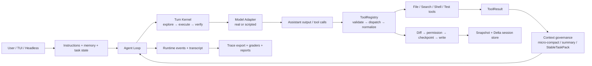

# RepoTerm

<p align="center">
  <strong>A local terminal AI Coding Agent with an observable, recoverable, and evaluable runtime.</strong>
</p>

<p align="center">
  <a href="./README.zh-CN.md">中文</a>
  ·
  <a href="#core-highlights">Highlights</a>
  ·
  <a href="#quick-start">Quick Start</a>
  ·
  <a href="#architecture">Architecture</a>
  ·
  <a href="#implementation-index">Implementation</a>
  ·
  <a href="#evaluation">Evaluation</a>
  ·
  <a href="#runtime-flow">Runtime Flow</a>
  ·
  <a href="#trace">Trace</a>
  ·
  <a href="#failure-recovery">Failure Recovery</a>
  ·
  <a href="#reproduce">Reproduce</a>
</p>

<p align="center">
  
  
  
</p>

RepoTerm is a Python terminal Coding Agent for local repositories. Inspired by the core interaction model of Claude Code, it focuses on five engineering problems: turn control, context governance, tool execution, safe editing and session recovery, and layered AgentOps evaluation.

> The numbers in this README refer to checked-in, controlled task sets. The deterministic and live-model layers test different failure surfaces and are not presented as an open-world repository success rate.

AgentOps evaluation snapshot: [`agentops-2026-07-28`](https://github.com/llyyyq/RepoTerm/tree/agentops-2026-07-28).

## Core Highlights

- **Phase-aware Agent Turn:** routes work through `explore → execute → verify`, widens stalled searches, rejects evidence-free completion, and stops safely at the configured step limit.
- **Layered context governance:** combines provider usage with local token estimation, compacts old tool output, summarizes history under pressure, and protects task-critical state in `StableTaskPack`.
- **Structured tool runtime:** uses JSON Schema and Python validators for tool arguments, normalizes failures into `ToolResult`, and preserves head/error/tail evidence from oversized output.
- **Controlled writes and durable recovery:** enforces Diff review, permission decisions, checkpoints, snapshot/Delta persistence, session replay, resume, and managed-file rewind.
- **Layered AgentOps evaluation:** separates deterministic Runtime regression from live-model end-to-end behavior, with checked-in reports and sanitized execution traces.

## Quick Start

Requirements: Python 3.11+ and Git.

```bash
git clone https://github.com/llyyyq/RepoTerm.git
cd RepoTerm
python -m pip install -e ".[dev]"
```

Configure a live provider through the interactive installer, then launch RepoTerm:

```bash
repoterm --install
repoterm
```

The installer writes the selected model, endpoint, and credential to `~/.repoterm/settings.json`. To inspect the product without a provider, start it in mock mode:

```bash
# PowerShell
$env:REPOTERM_MODEL_MODE="mock"
repoterm

# macOS / Linux
REPOTERM_MODEL_MODE=mock repoterm
```

Inside the TUI, use `/help` for commands and `/readiness` to inspect provider configuration.

## Architecture



### 1. Agent Turn state machine

`agent_loop.py` owns one model/tool feedback loop; `turn_kernel.py` owns the recurrent state and transition policy. The runtime injects phase guidance for `explore`, `execute`, and `verify`, then routes the next step from remaining-step budget, tool errors, empty responses, progress, and verification evidence.

- A stalled path activates widening and grants a bounded search expansion.
- A premature completion without tool evidence is rejected and routed back to execution or verification.
- Empty output and recoverable thinking stops have bounded retry counters.
- Reaching the step limit terminates with an explicit stop reason instead of looping indefinitely.

### 2. Context governance

Provider usage is preferred when available and local token estimation is the fallback. Pressure levels choose between micro-compacting old tool results and summarizing older history. `StableTaskPack` is kept outside ordinary summary prose and preserves the task objective, latest tool evidence, verification state, progress, and remaining budget.

Regression cases assert that compaction still retains the error/edit evidence needed by the next model decision.

### 3. Tool runtime

`ToolDefinition` describes a tool contract; `ToolRegistry` discovers, validates, dispatches, and observes tool calls. JSON Schema constrains model-side argument generation, while Python validators enforce runtime rules. Unknown tools, invalid arguments, timeouts, non-zero exits, and ordinary exceptions are normalized into `ToolResult` so the model can reason about failure in the next turn.

Oversized output is reduced with a head/error/tail strategy, preserving the beginning, error-bearing lines, and final status rather than keeping only a blind prefix.

### 4. Safe editing and durable sessions

Managed file writes follow this order:

```text
Diff preview → permission decision → checkpoint → file write
```

Sessions persist messages, transcript events, runtime state, permissions, and checkpoints through a full snapshot plus incremental Delta records. `inspect` and `replay` expose saved state; `resume` continues the task; `rewind-preview` and `rewind` restore managed file content from checkpoints.

### 5. AgentOps evidence loop

The same Agent Loop accepts two adapters:

- `ScenarioModel` returns predefined assistant/tool-call steps for deterministic Runtime regression.
- The configured live adapter lets a real model choose tools and react to observed results.

Graders inspect tests, file content and hashes, forbidden-path access, permission outcomes, stop reasons, checkpoints, and restored session state. Reports and curated traces make the result inspectable without replaying every run.

## Implementation Index

| Capability | Main implementation | Regression tests | Reports and traces |
| --- | --- | --- | --- |
| Agent Turn state machine | [`repoterm/agent_loop.py`](./repoterm/agent_loop.py), [`repoterm/turn_kernel.py`](./repoterm/turn_kernel.py), [`repoterm/runtime_profiles.py`](./repoterm/runtime_profiles.py) | [`tests/test_agentops_scenarios.py`](./tests/test_agentops_scenarios.py) | [Normal-edit Trace](./benchmarks/traces/normal-edit.md), [Runtime report](./benchmarks/runtime_regression_results.md) |
| Context governance and `StableTaskPack` | [`repoterm/context_manager.py`](./repoterm/context_manager.py), [`repoterm/micro_compact.py`](./repoterm/micro_compact.py), [`repoterm/context_compactor.py`](./repoterm/context_compactor.py), [`repoterm/turn_kernel.py`](./repoterm/turn_kernel.py) | [`tests/test_context_compactor.py`](./tests/test_context_compactor.py), [`tests/test_micro_compact.py`](./tests/test_micro_compact.py), [`tests/test_agentops_scenarios.py`](./tests/test_agentops_scenarios.py) | [Methodology: context cases](./benchmarks/eval-methodology.md) |
| Tool contracts, dispatch, and normalized results | [`repoterm/tooling.py`](./repoterm/tooling.py), [`repoterm/tools/`](./repoterm/tools/) | [`tests/test_tools.py`](./tests/test_tools.py), [`tests/test_agentops_scenarios.py`](./tests/test_agentops_scenarios.py) | [Tool-failure Trace](./benchmarks/traces/tool-failure-recovery.md) |
| Safe editing and session persistence | [`repoterm/file_review.py`](./repoterm/file_review.py), [`repoterm/permissions.py`](./repoterm/permissions.py), [`repoterm/session.py`](./repoterm/session.py), [`repoterm/tui/session_flow.py`](./repoterm/tui/session_flow.py) | [`tests/test_permissions.py`](./tests/test_permissions.py), [`tests/test_session.py`](./tests/test_session.py), [`tests/test_agentops_scenarios.py`](./tests/test_agentops_scenarios.py) | [Permission-denial Trace](./benchmarks/traces/permission-denial.md), [Session-resume Trace](./benchmarks/traces/session-resume.md) |
| Deterministic and live-model evaluation | [`benchmarks/runtime_regression_eval.py`](./benchmarks/runtime_regression_eval.py), [`repoterm/llm_e2e_eval.py`](./repoterm/llm_e2e_eval.py), [`benchmarks/llm_e2e_eval.py`](./benchmarks/llm_e2e_eval.py) | [`tests/test_agentops_scenarios.py`](./tests/test_agentops_scenarios.py), [`tests/test_agentops_proof_artifacts.py`](./tests/test_agentops_proof_artifacts.py) | [Methodology](./benchmarks/eval-methodology.md), [Runtime report](./benchmarks/runtime_regression_results.md), [Live E2E report](./benchmarks/llm_e2e_results.md) |

## Evaluation

The evaluation is split because deterministic Runtime correctness and live-model behavior answer different questions.

| Layer | Configuration | Result | What it validates |
| --- | --- | ---: | --- |
| Deterministic Runtime regression | 20 scenarios × 3 rounds; predefined `ScenarioModel` output | **60/60 passed** | State routing, schema/tool-result behavior, permission boundaries, compaction continuity, checkpoint and session recovery |
| Live-model end-to-end evaluation | 5 controlled repository task types × 3 runs; configured real model | **15/15 passed** | Tool selection, reaction to failures, file modification, permission guidance, resume, and final test evidence |
| Recovery subset | 3 recovery-related live task types × 3 runs; included in the 15 runs above | **9/9 passed** | Test-failure recovery, permission-denial recovery, and interrupted-session resume |

The recovery result is a **subset of 15**, not an additional nine runs.

Main graders:

- test command exit code and expected output;
- expected file content/hash and unchanged protected tests;
- forbidden-path access and permission-denial result;
- required tool sequence and final stop reason;
- checkpoint count, restored session state, and idempotent resume behavior.

Evidence:

- [Evaluation methodology and metric definitions](./benchmarks/eval-methodology.md)
- [Deterministic Runtime regression report](./benchmarks/runtime_regression_results.md)
- [Live-model end-to-end report](./benchmarks/llm_e2e_results.md)

## Runtime Flow

A normal repository task moves through the following observable loop:

1. The CLI/TUI creates or loads a session and records the user task.
2. Instructions, relevant memory, current phase, budget signals, and `StableTaskPack` are assembled into the model input.
3. The Model Adapter returns text or structured tool calls.
4. `ToolRegistry` validates and executes each call; file edits additionally pass through Diff review, permission control, and checkpoint creation.
5. Each `ToolResult` is appended to the transcript and fed into the next model decision.
6. The Turn Kernel updates progress, phase, widening, verification, and stop signals.
7. The task ends only with an explicit stop reason; verification commands and graders check the resulting repository and session state.

The [normal-edit Trace](./benchmarks/traces/normal-edit.md) shows this sequence from repository inspection to verified completion.

## Trace

RepoTerm uses two related observability layers:

- The **session transcript** is the durable task record: user/assistant messages, tool calls/results, permissions, checkpoints, and runtime events are persisted with the session.
- A **curated Trace** is a sanitized, task-focused export for evaluation and review. It combines the timeline, model/tool metadata, stop reason, recovery actions, and grader outcomes.

Runtime events answer “which phase changed and why”; transcript/tool events answer “what actually happened”; graders answer “did the final repository state satisfy the task”.

| Reference scenario | Observable behavior | Markdown | Machine-readable |
| --- | --- | --- | --- |
| Successful edit | read → edit → test → `done`, with checkpoint and passing graders | [normal-edit.md](./benchmarks/traces/normal-edit.md) | [normal-edit.json](./benchmarks/traces/normal-edit.json) |
| Tool failure and recovery | failing test result enters the next decision; model edits and reruns until success | [tool-failure-recovery.md](./benchmarks/traces/tool-failure-recovery.md) | [tool-failure-recovery.json](./benchmarks/traces/tool-failure-recovery.json) |
| Permission denial | protected edit is denied; guidance routes the model to an allowed alternative | [permission-denial.md](./benchmarks/traces/permission-denial.md) | [permission-denial.json](./benchmarks/traces/permission-denial.json) |
| Interrupted session recovery | checkpoint survives interruption; resume verifies state and remains idempotent | [session-resume.md](./benchmarks/traces/session-resume.md) | [session-resume.json](./benchmarks/traces/session-resume.json) |

See the [curated Trace index](./benchmarks/traces/README.md) for generation rules and sanitization boundaries.

## Failure Recovery

| Failure signal | Runtime response | Safety boundary | Evidence |
| --- | --- | --- | --- |
| Empty model response or recoverable thinking stop | Retry within a dedicated counter; record the recovery action | Retry limit and remaining-step budget | Runtime scenarios in [the deterministic report](./benchmarks/runtime_regression_results.md) |
| Test/tool failure | Normalize as failed `ToolResult`, feed it back, allow correction and re-verification | Maximum steps; tool error remains observable | [Tool-failure Trace](./benchmarks/traces/tool-failure-recovery.md) |
| Permission denial | Return denial plus user guidance; model must choose an allowed path | Denied write is not applied and creates no checkpoint | [Permission-denial Trace](./benchmarks/traces/permission-denial.md) |
| Context pressure | Micro-compact old tool output, then summarize history while preserving `StableTaskPack` | Circuit breaker and protected task evidence | Context scenarios in [the methodology](./benchmarks/eval-methodology.md) |
| Process interruption | Persist session/checkpoint, load, resume, and optionally rewind | Rewind restores managed files/session state, not arbitrary external Shell side effects | [Resume Trace](./benchmarks/traces/session-resume.md) |
| No verification evidence / exhausted steps | Reject premature `done`; return to execute/verify, then stop safely at the limit | Explicit `verification_failed` or `max_steps` stop reason | [Runtime report](./benchmarks/runtime_regression_results.md) |

## Reproduce

### Install

```bash
git clone https://github.com/llyyyq/RepoTerm.git
cd RepoTerm
python -m pip install -e ".[dev]"
```

Python 3.11+ is required. Start the interactive product with:

```bash
repoterm
```

### Reproduce deterministic Runtime evidence

No provider credential is required:

```bash
python benchmarks/runtime_regression_eval.py --rounds 3
python benchmarks/export_agentops_traces.py
python -m pytest -q tests/test_agentops_scenarios.py tests/test_agentops_proof_artifacts.py
```

Outputs:

- `benchmarks/runtime_regression_results.md`
- `benchmarks/runtime_regression_results.json`
- `benchmarks/traces/`

### Reproduce live-model evidence

Copy `.env.example`, configure one supported provider locally, and never commit the real credential. The following command makes 15 real task runs and may consume provider quota:

```bash
python benchmarks/llm_e2e_eval.py --all --runs 3 --confirm-live
```

Outputs:

- `benchmarks/llm_e2e_results.md`
- `benchmarks/llm_e2e_results.json`
- raw run artifacts under `.temp/llm_e2e/runs/`

Live-model results are provider- and model-dependent. The checked-in report records the model/task configuration used for the stated 15/15 result.

## Repository Guide

| Path | Role |
| --- | --- |
| `repoterm/` | Runtime, adapters, context, tools, permissions, memory, and session implementation |
| `tests/` | Unit, integration, and deterministic AgentOps scenarios |
| `benchmarks/` | Evaluation runners, methodology, reports, and public traces |
| `Docs/Documentation/` | Product usage and deeper engineering documentation |
| `.env.example` | Credential-free provider configuration template |

## Source and Attribution

RepoTerm is a derivative work based on the open-source [MiniCode-Python](https://github.com/QUSETIONS/MiniCode-Python), whose upstream project is [MiniCode](https://github.com/LiuMengxuan04/MiniCode). Thanks to the original authors for the foundational Agent Loop, tool-calling, and terminal-interaction implementation.

This repository extends and restructures that base around Agent Runtime state control, deterministic and live-model AgentOps evaluation, public Trace evidence, memory lifecycle, safe writes, and failure recovery. Upstream code and contributions remain attributed to their respective authors; repository-specific changes are represented by the actual Git history and file contents.

See the [MIT License](./LICENSE) and [NOTICE.md](./NOTICE.md) for license and attribution details.
