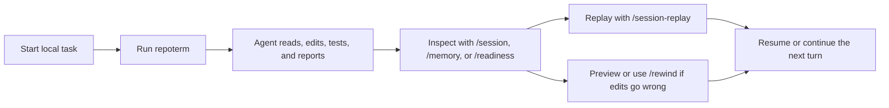
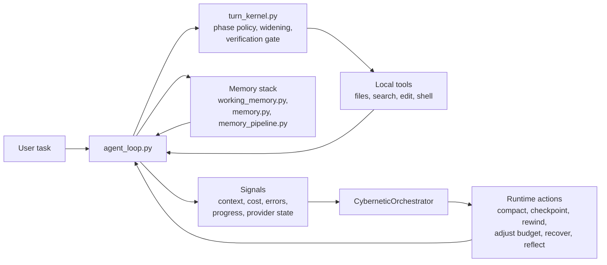

# RepoTerm

<p align="center">
  <strong>A lightweight local coding agent for developers who want durable terminal workflows, not just a chat wrapper.</strong>
</p>

<p align="center">
  <a href="./README.zh-CN.md">Chinese</a>
  |
  <a href="#source-and-attribution">Source and Attribution</a>
</p>

<p align="center">
  
  
  
</p>

RepoTerm is a Python Coding Agent for local development where the agent needs to survive long sessions, keep its state inspectable, recover from bad edits, and show what it is doing while it works.

If Claude Code represents the polished terminal-agent experience, RepoTerm is the lightweight, local-first version that leans harder into runtime transparency, durable sessions, memory-backed continuity, rewindability, and verifiable behavior.

## At a Glance

RepoTerm is for you if you want:

- a terminal coding agent that behaves like a runtime, not a chat window;
- durable sessions you can inspect, replay, resume, and summarize;
- a memory stack that can protect working context and re-inject relevant project knowledge;
- safe local editing with checkpoints, rewind preview, and recovery flows;
- explicit signals for verification, widening, provider readiness, and failures.

If you only remember one thing, remember this:

> RepoTerm is optimized for local trust: you should be able to inspect the work, recover the edits, and understand why the agent stopped.

## Why This Repo Exists

Most coding-agent READMEs lead with model access and feature lists. RepoTerm is organized around a different promise:

> the runtime should be observable, recoverable, and testable, not just clever.

That changes the product priorities:

| Priority | What it means here |
| --- | --- |
| Session-first | Sessions can be inspected, replayed, resumed, and summarized. |
| Recovery-first | File edits are checkpointed, previewable, and rewindable. |
| Runtime-first | Widening, verification, compaction, and stop reasons are explicit. |
| Local-first | The agent is built around real repos, local tools, and terminal workflows. |

## Why RepoTerm

| Area | What RepoTerm emphasizes |
| --- | --- |
| Durable sessions | Inspect, replay, resume, and summarize live or saved sessions with local commands. |
| Memory as a first-class system | Protect active task context, re-inject project knowledge, compact with memory awareness, and persist useful reflections over time. |
| Safe recovery | Automatic checkpoints, rewind preview, rewind safety groups, and saved-session rewind flows. |
| Runtime control | `single` and `single-deep` profiles, phase-aware execution, widening, verification gates, and structured stop reasons. |
| Observable behavior | Runtime timelines, readiness reports, provider diagnostics, transcript summaries, and benchmark artifacts. |
| Local product surface | CLI and TUI commands such as `/session`, `/session-replay`, `/memory`, `/checkpoints`, `/rewind`, and `/readiness`. |
| Verifiable implementation | The root package is backed by an active test suite, not aspirational docs. |

## What You Can Do Today

With the current repository state, you can already:

- run an interactive terminal agent with `repoterm`;
- run a single-shot command with `repoterm-headless`;
- run a provider/runtime readiness gate with `repoterm-readiness`;
- inspect the current session with `/session`;
- browse previous sessions with `/sessions`;
- replay a session with `/session-replay`;
- inspect memory state with `/memory`;
- inspect checkpoints with `/checkpoints`;
- preview or execute rewinds with `/rewind-preview` and `/rewind`;
- inspect provider and fallback health with `/readiness`.

## 3-Minute Demo

### 0. What you need

- Python 3.11+
- a local terminal on Windows, macOS, or Linux
- model/provider credentials if you want live model execution

### 1. Install and launch

```bash
cd RepoTerm
python -m pip install -e .[dev]
repoterm
```

### 2. Ask it to do a real repo task

```text
Explain this repository and tell me which commands matter most for day-to-day use.
```

You should expect the normal RepoTerm loop here: inspect repo state, explain findings, then let you inspect, replay, or continue the session.

### 3. Inspect what the runtime is doing

```text
/session
/memory
/readiness
```

### 4. Replay or recover if needed

```text
/session-replay
/checkpoints
/rewind-preview
```

### 5. Run one-shot headless mode

```bash
repoterm-headless "Explain what this repo does."
```

### 6. Run a readiness gate

```bash
repoterm-readiness --json --fail-on blocked
```

`--fail-on blocked` reports provider warnings without turning missing optional
fallbacks into a hard failure. Real-provider behavior is verified separately by
the end-to-end AgentOps tasks under `benchmarks/llm_e2e_eval.py`.

## Typical Workflow



The main point is simple: RepoTerm is not trying to hide the runtime. It lets you see the work, inspect the state, and recover from mistakes without manually cleaning everything up.

That same philosophy applies to memory: active task context is protected, durable project knowledge can be re-injected when it matters, and compaction is allowed to reuse memory instead of blindly dropping context.

## Everyday Commands

If you only use six commands at first, use these: `/session`, `/sessions`, `/session-replay`, `/memory`, `/rewind-preview`, and `/readiness`.

| Command | What it does |
| --- | --- |
| `/session` | Show the current live session snapshot. |
| `/sessions` | List saved sessions for the current workspace. |
| `/session-replay` | Replay the current or a saved session with transcript and runtime context. |
| `/memory` | Show memory system status for the current workspace. |
| `/checkpoints` | Show checkpoint history for the current or a saved session. |
| `/rewind-preview` | Preview what a rewind would restore before changing files. |
| `/rewind` | Rewind the latest edit group, a step count, or a checkpoint id. |
| `/readiness` | Inspect runtime/provider readiness, fallback coverage, and product surface status. |

## Current Status

This repository is past the prototype stage. It already behaves like a usable local product, but it is still being tightened into a more polished lightweight Claude Code style experience.

The active package is the root `repoterm/` package configured by `pyproject.toml` as `repoterm`.

Current local full-suite verification result after repository cleanup:

```text
1263 passed, 2 skipped
```

Verification command:

```bash
python -m compileall -q repoterm tests benchmarks Main Package
python -m repoterm.structure_check --root . --hotspots 5 --max-dependency-upstream 4 --check-material-inventory --report .temp/structure-compliance.json
python -m repoterm.readiness --json --fail-on blocked
python -m pytest -q --import-mode=importlib
```

Current state, honestly:

- core runtime, session, replay, checkpoint, rewind, readiness, and structure-compliance surfaces are in good shape;
- memory is not bolted on: working memory, project memory, memory injection, and memory-aware compaction are already in the runtime path;
- provider and fallback diagnostics include local preflight checks, structured live-smoke failure context, and a validated headless trace artifact;
- real provider availability still depends on your local credentials and configured channels;
- the project is usable today, but it is still evolving toward a more polished lightweight Claude Code experience.

Live provider readiness still depends on configured credentials and channel
availability, so the default CI readiness gate only fails when the runtime is
blocked.

## AgentOps Evidence

RepoTerm publishes two evaluation layers instead of mixing deterministic Runtime correctness with nondeterministic model behavior:

| Layer | Current result | What it validates |
| --- | ---: | --- |
| Deterministic Runtime regression | 20 scenarios × 3 rounds, 60/60 passed | State transitions, tool-result normalization, permission boundaries, context continuity, and session recovery |
| Live-model end-to-end smoke | 5 task types × 3 runs, 15/15 passed | A real model selecting tools, reacting to failures, editing files, and obtaining test evidence in controlled repositories |

Evidence entry points:

- [Evaluation methodology and metric definitions](./benchmarks/eval-methodology.md)
- [Deterministic Runtime regression report](./benchmarks/runtime_regression_results.md)
- [Live-model end-to-end report](./benchmarks/llm_e2e_results.md)
- [Curated traces: normal edit, permission denial, and session resume](./benchmarks/traces/README.md)
- [Memory conflict, update, and deletion lifecycle trace](./benchmarks/traces/memory-conflict-update-delete.md)

Reproduce the deterministic report without provider credentials:

```bash
python benchmarks/runtime_regression_eval.py --rounds 3
```

The live smoke calls the configured provider and therefore requires local credentials and explicit confirmation:

```bash
python benchmarks/llm_e2e_eval.py --all --runs 3 --confirm-live
```

These results describe the checked-in controlled task sets; they are not presented as an open-world repository success rate.

## Architecture



What matters is not the diagram itself. What matters is that runtime state is treated as something explicit:

- the loop can widen instead of silently stalling;
- verification can block a premature "done";
- memory can preserve task-critical context and re-inject project knowledge instead of relying only on the current chat window;
- session state can survive process boundaries;
- rewind can reverse local edits instead of asking you to clean them up by hand;
- readiness can tell you whether failure is local logic or provider availability.

## Repository Guide

| Path | Role |
| --- | --- |
| `repoterm/` | Canonical Python package used by install and tests. |
| `tests/` | Active test suite. |
| `benchmarks/` | AgentOps evaluation, deterministic Runtime regression, real-model tasks, and traces. |
| `Docs/Documentation/` | Focused usage, memory, integration, and engineering-boundary documentation. |
| `Main/`, `Package/` | Product entry contracts and engineering-structure support still used by the runtime. |

## Core Modules

| Module | Purpose |
| --- | --- |
| `repoterm/agent_loop.py` | Main model and tool loop, runtime event flow, and product integration. |
| `repoterm/turn_kernel.py` | Step policy, phase transitions, widening, and verification gates. |
| `repoterm/session.py` | Durable sessions, inspect and replay views, checkpoints, and rewind helpers. |
| `repoterm/cli_commands.py` | Local product commands such as session, replay, rewind, and readiness. |
| `repoterm/memory.py` | Long-term project memory manager and retrieval surface. |
| `repoterm/working_memory.py` | Protected working-memory entries that survive compaction pressure. |
| `repoterm/memory_pipeline.py` | Closed-loop memory retrieval, injection, reflection writeback, and optimization path. |
| `repoterm/product_surfaces.py` | User-facing summaries for readiness, hooks, instructions, delegation, and extensions. |
| `repoterm/readiness.py` | Standalone readiness CLI used by local checks and CI gates. |
| `repoterm/evidence_safety.py` | Path normalization and credential redaction for public Trace and evaluation evidence. |
| `repoterm/model_switcher.py` | Bounded fallback and failover selection. |
| `repoterm/runtime_profiles.py` | Runtime profiles such as `single` and `single-deep`. |
| `repoterm/cybernetic_orchestrator.py` | Runtime control lifecycle facade. |

## Source and Attribution

RepoTerm is a secondary-development project based on [MiniCode-Python](https://github.com/QUSETIONS/MiniCode-Python), whose upstream project is [MiniCode](https://github.com/LiuMengxuan04/MiniCode). We thank the original authors for the foundational Agent Loop, tool-calling, and terminal-interaction implementation.

This repository extends and restructures that foundation with Agent Runtime state control, deterministic AgentOps regression, live-model end-to-end evaluation, Trace evidence, memory lifecycle management, safe writes, and failure recovery. Rights in upstream code and contributions remain with their respective authors; additions in this repository are represented by the actual Git history and file contents.

See the preserved [MIT License](./LICENSE) and the detailed [attribution notice](./NOTICE.md).

## Documentation

Start here if you want the deeper implementation and productization record:


- [Chinese README](./README.zh-CN.md)
- [AgentOps Evaluation Methodology](./benchmarks/eval-methodology.md)
- [Curated Agent Traces](./benchmarks/traces/README.md)
- [Usage Guide](./Docs/Documentation/USAGE_GUIDE.md)
- [Integration Guide](./Docs/Documentation/INTEGRATION_GUIDE.md)
- [Memory Theory](./Docs/Documentation/memory_theory.md)
- [Source and Attribution](#source-and-attribution)

## Design Principles

- Keep the runtime inspectable.
- Treat memory as a controllable runtime subsystem, not an afterthought.
- Prefer measured signals over prompt folklore.
- Make recovery a product feature, not a manual cleanup step.
- Treat verification as part of execution, not just reporting.
- Keep docs aligned with implemented behavior, not future ambition.
