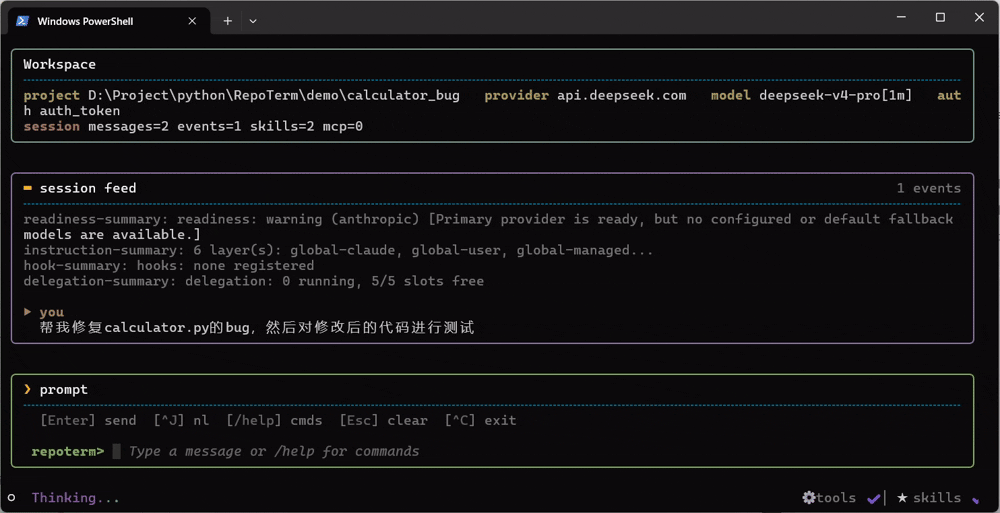
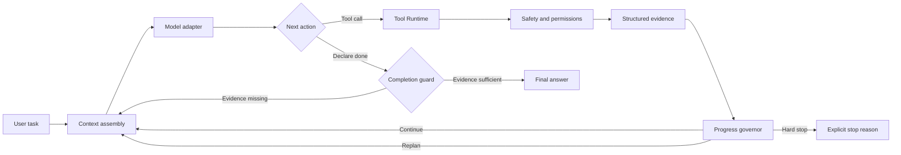

# RepoTerm

[](https://github.com/llyyyq/RepoTerm/actions/workflows/ci.yml)
[](https://www.python.org/)
[](LICENSE)

RepoTerm is a local terminal Coding Agent focused on **observable execution, evidence-based completion, controlled file edits, and resumable sessions**.

It is a secondary-development project based on [MiniCode](https://github.com/LiuMengxuan04/MiniCode) and [MiniCode-Python](https://github.com/QUSETIONS/MiniCode-Python). The current implementation reorganizes the original codebase and adds runtime governance, context management, recovery, evaluation, and a responsive terminal UI. See [NOTICE](NOTICE.md) for attribution details.

[中文说明](README.zh-CN.md) · [Package design index](Docs/Documentation/engineering/package-structure-refactor-report.md) · [Evaluation methodology](./benchmarks/eval-methodology.md)



## Why RepoTerm

A Coding Agent needs more than a model that can call tools. Long-running repository tasks introduce engineering problems that ordinary chat loops do not solve:

- the model may repeatedly search without producing new evidence;
- a natural-language “done” may arrive before the change is verified;
- large tool outputs and long histories can exhaust the context window;
- file edits need review, permission checks, checkpoints, and rollback;
- interrupted work must resume without duplicating messages or tool calls;
- capability claims need reproducible runtime and repository-level evaluation.

RepoTerm treats these as runtime responsibilities rather than leaving them entirely to the model.

## Core Highlights

### 1. Runtime progress governance and completion guard

RepoTerm observes tool-call trajectories, evidence changes, and action fingerprints to identify repeated exploration, weak evidence, and no-progress windows. Intervention escalates through:

```text
allow → nudge → require_replan → stop_stuck
```

The model still chooses concrete actions, while the runtime constrains unproductive behavior. When the model declares completion, RepoTerm checks whether successful validation evidence exists **after the latest code or configuration change**. If evidence is missing, the final answer is blocked and the model is driven back to execution or verification.

Governance decisions and recovery actions are written to the runtime trace for inspection and replay.

### 2. Layered context governance

RepoTerm combines provider-reported usage with local token estimates to classify context pressure:

- older tool results are micro-compacted first;
- longer history is summarized only at higher pressure;
- a `StableTaskPack` preserves the task objective, recent evidence, validation state, and remaining budget across compaction.

Regression assertions verify that required task state survives compression.

### 3. Typed Tool Runtime

`ToolDefinition` and `ToolRegistry` provide a common lifecycle for file, shell, test, repository, and integration tools:

- JSON Schema constrains model-visible arguments;
- Python-side validation rejects unknown tools and invalid parameters;
- timeouts, non-zero exits, and runner exceptions become structured `ToolResult` values;
- large output is bounded with a head/error/tail strategy;
- tool results return to the next model turn as explicit evidence.

### 4. Controlled edits and resumable sessions

The write path is:

```text
Diff review → Permission decision → Checkpoint → File write → Validation
```

Sessions use full snapshots plus incremental deltas. `inspect`, `replay`, `resume`, and `rewind` support diagnosis and recovery. Fault-injection tests verify that repeated resume does not duplicate messages or tool calls, while checkpoints and file hashes verify rollback results.

## Evaluation

RepoTerm uses three complementary evaluation layers:

| Layer | Purpose | Current recorded result |
|---|---|---:|
| Deterministic Runtime regression | State transitions, tool failures, recovery, permissions, and stop reasons | 20 scenarios × 3 runs = **60/60** |
| Controlled live-model E2E | Repository edits, validation, protected paths, and session recovery | 5 task classes × 3 runs = **15/15** |
| Real open-source defect tasks | Unseen fault localization, modification, and independent regression tests in Docker | 12 tasks × 3 runs = **33/36** |

For the 36 real-task trajectories, 28 triggered progress governance. Of those, 25 completed after intervention and 3 were safely stopped instead of looping indefinitely. The task set, model, and per-task limit were fixed for the reported runs; one infrastructure timeout was rerun under the same configuration.

Evaluation is graded with independent tests and file diffs rather than the model’s final statement alone.

## Runtime Flow


```mermaid
flowchart LR
    U[User task] --> C[Context assembly]
    C --> M[Model adapter]
    M --> D{Next action}
    D -->|Tool call| T[Tool Runtime]
    T --> S[Safety and permissions]
    S --> E[Structured evidence]
    E --> G[Progress governor]
    G -->|Continue| C
    G -->|Replan| C
    D -->|Declare done| V{Completion guard}
    V -->|Evidence sufficient| A[Final answer]
    V -->|Evidence missing| C
    G -->|Hard stop| X[Explicit stop reason]
```

## Quick Start

### Requirements

- Python 3.11 or 3.12
- Git
- an OpenAI-compatible or Anthropic-compatible model endpoint

### Install

```bash
git clone https://github.com/llyyyq/RepoTerm.git
cd RepoTerm

python -m venv .venv

# Windows CMD
.venv\Scripts\activate

# macOS / Linux
source .venv/bin/activate

python -m pip install -e .
```

### Configure a provider

Use `.env.example` as a template and keep real credentials out of Git. RepoTerm does **not** automatically load `.env`; load the variables in your shell/IDE or place the equivalent values in `~/.repoterm/settings.json`.

```bat
:: Windows CMD
copy .env.example .env
```

```bash
# macOS / Linux
cp .env.example .env
```

Example OpenAI-compatible configuration:

```dotenv
CUSTOM_API_KEY=replace-me
CUSTOM_API_BASE_URL=https://your-provider.example/v1
REPOTERM_MODEL=your-model-name
```

Provider names and environment variables depend on the selected adapter. Use the readiness command to inspect the resolved local configuration without making a model request:

```bash
repoterm-readiness
```

### Run

```bash
repoterm
```

Useful entry points:

```bash
repoterm --help
repoterm-headless --help
repoterm-readiness --json
```

Inside the TUI, enter `/help` to list commands. Common session operations include:

```text
/session
/session inspect
/session replay
/session resume
/session rewind
/transcript-save
```

Project-level MCP configuration is not trusted automatically. Use `--trust-project-mcp` only after reviewing the repository’s `.mcp.json`.

## Architecture

```text
repoterm/
├── app/              application entry points and dependency assembly
├── contracts/        shared types and application state
├── runtime/
│   ├── planning/     intent, routing, task planning, and prompts
│   └── control/      progress, verification, stability, and recovery control
├── providers/        model adapters, registry, retry, and fallback
├── context/          token pressure, compaction, and stable task state
├── safety/           permissions, diff review, evidence, and workspace rules
├── session/          snapshots, deltas, resume, replay, and rewind
├── memory/           evidence-gated long-term memory
├── tools/            tool definitions, registry, execution, and normalization
├── observability/    logs, metrics, cost, traces, and decision audit
├── integrations/     Skills and MCP integration
└── ui/               commands, TTY lifecycle, and TUI rendering

benchmarks/
└── evaluation/       deterministic and live-model evaluation runners
```

Every core package contains a Chinese architecture note named `README.zh-CN.md`. Start with the [package documentation index](Docs/Documentation/engineering/package-structure-refactor-report.md).

## Implementation Index

### 模块设计文档

| Package | Design document |
|---|---|
| Application | [repoterm/app/README.zh-CN.md](repoterm/app/README.zh-CN.md) |
| Contracts | [repoterm/contracts/README.zh-CN.md](repoterm/contracts/README.zh-CN.md) |
| Runtime | [repoterm/runtime/README.zh-CN.md](repoterm/runtime/README.zh-CN.md) |
| Planning | [repoterm/runtime/planning/README.zh-CN.md](repoterm/runtime/planning/README.zh-CN.md) |
| Control | [repoterm/runtime/control/README.zh-CN.md](repoterm/runtime/control/README.zh-CN.md) |
| Providers | [repoterm/providers/README.zh-CN.md](repoterm/providers/README.zh-CN.md) |
| Context | [repoterm/context/README.zh-CN.md](repoterm/context/README.zh-CN.md) |
| Safety | [repoterm/safety/README.zh-CN.md](repoterm/safety/README.zh-CN.md) |
| Session | [repoterm/session/README.zh-CN.md](repoterm/session/README.zh-CN.md) |
| Memory | [repoterm/memory/README.zh-CN.md](repoterm/memory/README.zh-CN.md) |
| Observability | [repoterm/observability/README.zh-CN.md](repoterm/observability/README.zh-CN.md) |
| Tools | [repoterm/tools/README.zh-CN.md](repoterm/tools/README.zh-CN.md) |
| Integrations | [repoterm/integrations/README.zh-CN.md](repoterm/integrations/README.zh-CN.md) |
| UI | [repoterm/ui/README.zh-CN.md](repoterm/ui/README.zh-CN.md) |
| TUI | [repoterm/ui/tui/README.zh-CN.md](repoterm/ui/tui/README.zh-CN.md) |
| Evaluation | [benchmarks/evaluation/README.zh-CN.md](benchmarks/evaluation/README.zh-CN.md) |

## Trace

Public evidence includes the recorded [runtime regression report](./benchmarks/runtime_regression_results.md), [controlled live-model E2E report](./benchmarks/llm_e2e_results.md), and [evaluation methodology](./benchmarks/eval-methodology.md). Representative curated traces are indexed in [benchmarks/traces/README.md](./benchmarks/traces/README.md):

- [Normal edit](./benchmarks/traces/normal-edit.md)
- [Tool-failure recovery](./benchmarks/traces/tool-failure-recovery.md)
- [Permission denial](./benchmarks/traces/permission-denial.md)
- [Session resume](./benchmarks/traces/session-resume.md)

## Failure Recovery

Recoverable tool failures are returned to the next model turn as structured evidence. Repeated low-progress behavior can trigger a nudge or required replan; missing post-change validation reopens execution; and exhausted or persistently stuck runs stop with an explicit reason. Session snapshots, deltas, checkpoints, replay, resume, and rewind provide recovery across process interruption without treating external shell or network side effects as reversible.

## Reproduce

```bash
python -m compileall -q repoterm
python -m pytest -q
python -m repoterm.app.structure_check --root . --hotspots 5 --max-dependency-upstream 4 --check-material-inventory
```

The GitHub Actions matrix runs Python 3.11 and 3.12 on Ubuntu, Windows, and macOS, including compilation, structure checks, readiness checks, Ruff, typing baseline checks, mirror tests, and the full Pytest suite.

Recorded evaluation artifacts:

- [Runtime regression report](benchmarks/runtime_regression_results.md)
- [Controlled live-model E2E report](benchmarks/llm_e2e_results.md)
- [Evaluation methodology](benchmarks/eval-methodology.md)
- [Live-model evaluation guide](benchmarks/llm_e2e_guide_zh.md)

## Engineering boundaries

- RepoTerm is a local process-based agent, not a complete OS or container sandbox.
- Shell commands remain subject to the permissions of the host process.
- Progress governance recognizes observable trajectory patterns; it does not prove that a change is semantically correct.
- A recovery signal means that new edit or validation evidence appeared, not that the final solution is guaranteed correct.
- Live-model results are stochastic and should be compared only under a recorded task set, model, limits, and environment.
- Never commit API keys, tokens, credentials, or private repository contents.

## Documentation

- [Code wiki](Docs/Documentation/CODE_WIKI.md)
- [Integration guide](Docs/Documentation/INTEGRATION_GUIDE.md)
- [Usage guide](Docs/Documentation/USAGE_GUIDE.md)
- [Runtime progress governance contract](Docs/Documentation/engineering/runtime-progress-governance-contract.md)

## License and attribution

RepoTerm is distributed under the [MIT License](LICENSE).

This repository is a secondary-development project based on MiniCode and MiniCode-Python. Upstream copyright and attribution are preserved in [NOTICE](NOTICE.md).
