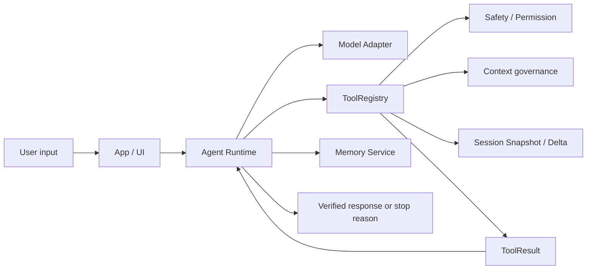

# RepoTerm

RepoTerm is a local terminal AI Coding Agent for working with a checked-out code repository. It combines model reasoning, structured tools, context governance, controlled file editing, session recovery, and task verification in one bounded Agent Turn.

It is a local development tool and an engineering/research practice project. Its current runtime is inspired by the interaction model of terminal coding agents; it is not presented as a complete replacement for Claude Code or any other product.

[中文文档](./README.zh-CN.md)

## Navigation

- [Core Highlights](#core-highlights)
- [Quick Start](#quick-start)
- [Runtime Flow](#runtime-flow)
- [Architecture](#architecture)
- [Evaluation](#evaluation)
- [Trace](#trace)
- [Failure Recovery](#failure-recovery)
- [Reproduce](#reproduce)
- [Documentation Index](#documentation-index)

## Core Highlights

- **Bounded Agent Turn:** routes work through `explore → execute → verify`, handles recoverable errors and empty responses, and stops with an explicit reason when the step budget is exhausted.
- **Structured Tool Runtime:** `ToolDefinition` and `ToolRegistry` discover, validate, execute, observe, and dispose tools. JSON Schema and Python validators protect tool arguments, while failures become structured `ToolResult` values.
- **Controlled editing:** file changes follow `Diff → permission decision → checkpoint → write`, so a rejected edit does not create a checkpoint or modify the target file.
- **Context governance:** provider usage and local token estimation feed context budgets, micro-compaction, history summarization, and `StableTaskPack` preservation.
- **Recoverable sessions:** full Snapshot plus incremental Delta records support session listing, inspect/replay, resume, and managed-file rewind.
- **Persistent memory:** the SQLite-backed Memory Service separates active memories, pending candidates, evidence gates, deterministic retrieval, and lifecycle operations.
- **Evidence-based evaluation:** deterministic Runtime regression and controlled real-model E2E evaluation are reported separately, with sanitized Trace artifacts and explicit graders.

## Quick Start

### Requirements

- Python 3.11 or newer
- Git
- A configured model and provider credential for live mode

### Install with a virtual environment

```bash
git clone https://github.com/llyyyq/RepoTerm.git
cd RepoTerm
python -m venv .venv
```

Activate the environment:

```powershell
# Windows PowerShell
.\.venv\Scripts\Activate.ps1

# Windows CMD
.venv\Scripts\activate.bat
```

```bash
# macOS / Linux
source .venv/bin/activate
```

Install the package and development dependencies:

```bash
python -m pip install -e ".[dev]"
```

### Install with Conda

```bash
conda create -n repoterm python=3.11
conda activate repoterm
python -m pip install -e ".[dev]"
```

### Configure a provider

The interactive installer is the shortest path for an Anthropic-compatible setup:

```bash
repoterm --install
```

It asks for a model, `ANTHROPIC_BASE_URL`, and `ANTHROPIC_AUTH_TOKEN`, then saves the selected settings under `~/.repoterm/settings.json`. The runtime also accepts provider settings from process environment variables or the settings file. For Anthropic-compatible providers, `ANTHROPIC_API_KEY` and `ANTHROPIC_AUTH_TOKEN` are alternative authentication variables; configure the one required by your endpoint.

`.env.example` is a local configuration template. Copy it before editing, but note that this repository does not load `.env` automatically; export the values into the current shell or place them in `~/.repoterm/settings.json`.

```powershell
# Windows PowerShell
Copy-Item .env.example .env
$env:ANTHROPIC_MODEL = "your-model"
$env:ANTHROPIC_API_KEY = "your-local-key"
```

```cmd
:: Windows CMD
copy .env.example .env
set ANTHROPIC_MODEL=your-model
set ANTHROPIC_API_KEY=your-local-key
```

```bash
# macOS / Linux
cp .env.example .env
export ANTHROPIC_MODEL="your-model"
export ANTHROPIC_API_KEY="your-local-key"
```

Supported configuration variables include:

| Provider or behavior | Variables |
| --- | --- |
| Anthropic-compatible | `ANTHROPIC_MODEL`, `ANTHROPIC_BASE_URL`, `ANTHROPIC_API_KEY` or `ANTHROPIC_AUTH_TOKEN` |
| OpenAI | `OPENAI_API_KEY`, `OPENAI_BASE_URL`, `OPENAI_MODEL_FALLBACKS` |
| OpenRouter | `OPENROUTER_API_KEY`, `OPENROUTER_BASE_URL`, `OPENROUTER_MODEL_FALLBACKS` |
| Custom OpenAI-compatible | `CUSTOM_API_KEY`, `CUSTOM_API_BASE_URL`, `CUSTOM_MODEL_FALLBACKS` |
| Runtime | `REPOTERM_MODEL`, `REPOTERM_RUNTIME_PROFILE`, `REPOTERM_TOOL_PROFILE`, `REPOTERM_LOG_LEVEL` |
| Limits | `REPOTERM_MODEL_TIMEOUT`, `REPOTERM_TOOL_TIMEOUT`, `REPOTERM_MAX_RETRIES`, `REPOTERM_MAX_OUTPUT_TOKENS` |

Do not commit `.env`, API keys, tokens, or settings containing credentials.

### Start RepoTerm

Interactive TTY mode:

```bash
repoterm
```

The same entry can be started directly from the source tree:

```bash
python -m repoterm.app.interactive
```

For a single non-interactive prompt:

```bash
repoterm-headless "Explain the structure of this repository"
```

`repoterm-headless --allow-edits "..."` opts into automatic approval for edits, commands, and out-of-workspace access for that run. Use this flag only when that behavior is intended.

For a provider-free local smoke run, the model adapter can be forced into mock mode:

```powershell
# PowerShell
$env:REPOTERM_MODEL_MODE = "mock"
repoterm
```

```bash
# macOS / Linux
REPOTERM_MODEL_MODE=mock repoterm
```

Inside the TUI, type `/help` to list commands. Type `/exit` or press `Ctrl+C` to leave; the TTY cleanup path restores terminal modes on normal and exceptional exits.

Useful entry commands include:

```bash
repoterm --readiness
repoterm --readiness-json
repoterm --validate-config
repoterm --list-sessions
repoterm --resume latest
```

## Runtime Flow

1. The user enters a task in the TTY UI or supplies one to the headless entry.
2. The App layer creates or resumes the Session and composes Runtime, Provider, Tool, Permission, Context, and Memory services.
3. Runtime selects the current `explore`, `execute`, or `verify` phase within the remaining-step budget.
4. The Model Adapter returns text or structured tool calls.
5. `ToolRegistry` validates arguments, executes the selected tool, normalizes the result, and returns a `ToolResult`.
6. Runtime records tool evidence, updates context and control state, and decides whether to continue, recover, widen, verify, or stop.
7. The task ends with a final response, a pause/error state, or an explicit safe stop reason.

## Architecture


```mermaid
flowchart LR
    User[User input] --> App[App / UI]
    App --> Runtime[Agent Runtime]
    Runtime --> Provider[Model Adapter]
    Runtime --> Registry[ToolRegistry]
    Registry --> Safety[Safety / Permission]
    Registry --> Context[Context governance]
    Registry --> Session[Session Snapshot / Delta]
    Runtime --> Memory[Memory Service]
    Registry --> Result[ToolResult]
    Result --> Runtime
    Runtime --> Answer[Verified response or stop reason]
```

## Implementation Index

| Module | Current path | Responsibility |
| --- | --- | --- |
| Application entry | `repoterm/app/` | CLI, interactive TTY, headless, readiness, and structure-check entry points |
| Contracts | `repoterm/contracts/` | Shared types plus `AppState`/`Store` state contract |
| Runtime | `repoterm/runtime/` | Agent Turn orchestration, phase transitions, evidence, and stop reasons |
| Planning | `repoterm/runtime/planning/` | Intent parsing, task planning, prompt composition, routing, and worktree isolation helper |
| Control | `repoterm/runtime/control/` | Verification, progress, stability, context/cost control, and selected Provider/Memory wiring |
| Providers | `repoterm/providers/` | Model registry, adapters, retry classification, and model switching |
| Tools | `repoterm/tools/` | Tool definitions, validation, execution, result normalization, truncation, and disposal |
| Context | `repoterm/context/` | Token budgets, layered context, compaction, and working memory |
| Safety | `repoterm/safety/` | Workspace boundaries, permissions, Diff review, checkpoints, and evidence redaction |
| Session | `repoterm/session/` | Snapshot, Delta, resume, inspect/replay, and managed-file rewind |
| Memory | `repoterm/memory/` | SQLite-backed memories, deterministic search, evidence gates, and lifecycle transitions |
| Observability | `repoterm/observability/` | Logging, metrics, cost accounting, and decision audit |
| UI | `repoterm/ui/` | Slash commands, history, TTY lifecycle, and TUI interaction |
| Integrations | `repoterm/integrations/` | Optional Skills and MCP discovery/communication, exposed through Tools |
| Evaluation | `benchmarks/evaluation/` | Deterministic Runtime regression and controlled real-model evaluation |

The detailed Chinese Package documents are indexed in the [package structure report](./Docs/Documentation/engineering/package-structure-refactor-report.md) and in each Package directory.

## Key execution mechanisms

### Agent Turn

`repoterm/runtime/loop.py` coordinates a bounded feedback loop, while `turn_kernel.py` tracks phase and verification state.

- `explore` gathers repository and task evidence.
- `execute` performs the selected tool actions.
- `verify` checks whether the requested change has supporting evidence.
- Tool errors and empty/recoverable responses can return to the next bounded step.
- A stalled path can use widening to grant a limited search expansion.
- A natural-language “done” response without required verification evidence is not sufficient to open the completion gate.
- When the configured maximum is reached, Runtime emits an explicit stop reason instead of looping indefinitely.

Runtime Events record phase changes, recovery actions, widening, compaction, verification guards, and stop reasons. They are distinct from logs, Session persistence, and TUI rendering events.

### Tool Runtime

`ToolDefinition` describes a tool name, description, schema, validator, runner, and metadata. `ToolRegistry` discovers the core or optional full tool profile, validates a model call, dispatches it with `ToolContext`, and normalizes the result.

Unknown tools, invalid arguments, timeouts, non-zero command exits, and ordinary runner exceptions become structured failures in `ToolResult`. Large output is reduced with a head/error/tail strategy so the next model step receives bounded but useful evidence.

JSON Schema constrains the argument shape exposed to the model; Python validators and Safety/Permission checks enforce runtime rules. `run_command` is permission-aware, but RepoTerm is not described as a complete OS/container sandbox.

### Controlled editing and recovery

Managed file edits follow one explicit order:

```text
Diff review → permission decision → file checkpoint → file write
```

Session persistence uses a full Snapshot plus incremental Delta records. `inspect` and `replay` expose saved state; `resume` loads the same session; `rewind-preview` and `rewind` restore managed file contents recorded by checkpoints.

Rewind is not a universal undo system. It can restore managed files and Session state, but it cannot undo arbitrary network requests, external shell side effects, or changes made by another process.

### Context and Memory

Context governance manages the model window: provider usage is preferred when available, local estimation is the fallback, and pressure can trigger micro-compaction or history summarization. `StableTaskPack` and working memory preserve the task objective, recent evidence, verification state, progress, and remaining budget.

Memory is a separate SQLite-backed lifecycle. Active memories can be searched and injected deterministically; model-generated experience candidates enter `pending` until approved. Ordinary conversation, source text, raw tool output, and unverified model claims do not automatically become permanent memory.

### UI and terminal lifecycle

`repoterm/ui/` adapts slash commands, history, TTY lifecycle, approvals, and TUI rendering. The TUI parser separates text, key, and wheel events; the main thread owns visible state while workers publish events. Bracketed paste is atomic and does not auto-submit. Terminal cleanup covers alternate screen, mouse, paste, focus, and sync-output modes.

## Evaluation

RepoTerm keeps deterministic Runtime correctness and real-model behavior as separate evidence layers.

### Deterministic Runtime regression

- Uses a scripted `ScenarioModel`/Model Adapter; it does not call a real Provider.
- Covers 20 controlled scenarios, repeated for 3 rounds: 60 runs total.
- Exercises tool validation and failure normalization, permission denial, context pressure, verification evidence, checkpoints, session recovery, and bounded termination.
- The checked-in report records **60/60 passed** in [`benchmarks/runtime_regression_results.md`](./benchmarks/runtime_regression_results.md).

Run it with:

```bash
python benchmarks/runtime_regression_eval.py --rounds 3
```

### Real-model end-to-end evaluation

- Uses 5 controlled repository task types, each repeated 3 times: 15 task runs.
- Runs in an isolated temporary repository and checks independent Pytest results, file hashes, protected paths, permission outcomes, checkpoints, and resume state.
- The recovery subset covers test-failure recovery, permission-denial recovery, and interrupted-session resume: 9 runs.
- The checked-in report records **15/15 task runs** and **9/9 recovery runs** in [`benchmarks/llm_e2e_results.md`](./benchmarks/llm_e2e_results.md).
- Results depend on the selected model, Prompt, provider endpoint, network, and local configuration; these numbers are not an open-world success rate.

Use the zero-cost fixture preflight first:

```bash
python benchmarks/llm_e2e_eval.py --dry-run --all
```

A live run requires explicit confirmation and may consume provider quota:

```bash
python benchmarks/llm_e2e_eval.py --all --runs 3 --confirm-live
```

Reports are written to `benchmarks/llm_e2e_results.md` and `.json`; run artifacts go under `.temp/llm_e2e/` by default.

Read the [evaluation methodology](./benchmarks/eval-methodology.md) before interpreting the metrics.

## Trace

Session Transcript and curated Trace are related but different:

- **Session Transcript:** durable task record containing messages, tool events, permissions, checkpoints, and Runtime events.
- **Curated Trace:** sanitized, task-focused evidence export containing the timeline, tool/model metadata, stop reason, recovery actions, and grader outcomes.
- **Snapshot/Delta:** Session persistence records used for loading and resume, not a replacement for Trace or an audit log.

| Scenario | What it demonstrates | Evidence |
| --- | --- | --- |
| Normal edit | Repository inspection, controlled edit, test, and verified stop | [normal-edit.md](./benchmarks/traces/normal-edit.md) · [normal-edit.json](./benchmarks/traces/normal-edit.json) |
| Tool failure recovery | A failed tool/test result is returned to the next decision before correction | [tool-failure-recovery.md](./benchmarks/traces/tool-failure-recovery.md) · [tool-failure-recovery.json](./benchmarks/traces/tool-failure-recovery.json) |
| Permission denial | A protected edit is denied and the run receives an alternative path | [permission-denial.md](./benchmarks/traces/permission-denial.md) · [permission-denial.json](./benchmarks/traces/permission-denial.json) |
| Interrupted session | A checkpoint survives interruption and the same session resumes | [session-resume.md](./benchmarks/traces/session-resume.md) · [session-resume.json](./benchmarks/traces/session-resume.json) |

The [Trace index](./benchmarks/traces/README.md) describes the available artifacts and sanitization boundary.

## Failure Recovery

The scenarios above show how tool failures, permission denials, and interrupted sessions are surfaced before the run continues or stops safely.

| Failure | Runtime behavior | Observable evidence |
| --- | --- | --- |
| Empty response or recoverable pause | Bounded retry and continuation into the next turn | Runtime Event |
| Tool failure | Normalize to `ToolResult` and return the failure to the model | `ToolResult`, Trace |
| Permission denial | Block the write and do not create a checkpoint | Permission record, file hash |
| Interrupted write | Reload the same Session and continue verification | Snapshot, Delta, resume Trace |

## Reproduce

Run the full test suite:

```bash
python -m pytest -q --tb=short
```

Run package contracts only:

```bash
python -m pytest tests/contracts -q
```

Compile the product and evaluation sources:

```bash
python -m compileall -q repoterm benchmarks Main Package
```

Run the current structure checker without changing the repository:

```bash
python -m repoterm.app.structure_check \
  --root . \
  --hotspots 5 \
  --max-dependency-upstream 4 \
  --check-material-inventory \
  --report .temp/structure-compliance.json
```

The repository also contains the CI workflow at [`.github/workflows/ci.yml`](./.github/workflows/ci.yml). Its matrix covers Python 3.11/3.12 on Ubuntu, Windows, and macOS; local commands above are the direct entry points for the current package layout.

## Configuration and safety notes

- Keep `.env` and `~/.repoterm/settings.json` local; never commit keys or tokens.
- `.env.example` is a template, not an automatic dotenv loader.
- Project-level `.mcp.json` is optional and disabled by default; enabling it is an explicit trust decision. Use `repoterm --trust-project-mcp` only when you explicitly trust the project configuration.
- File edits and command execution pass through workspace and permission checks, but these checks are not a claim of complete container or OS sandboxing.
- Evidence and logs are intended to be bounded and redacted; do not paste secrets into prompts or tool arguments.
- Rewind restores managed files and Session state only; external shell and network side effects may be irreversible.

## Project structure

```text
repoterm/                 # Product packages and the stable config entry
benchmarks/               # Evaluation scripts, reports, and Trace artifacts
tests/                    # Unit, integration, contract, UI, and AgentOps tests
Docs/                     # Usage, engineering, and design documentation
Main/                     # Architecture projection and mirror validation code
Package/                  # Engineering structure and compliance code
.github/                  # CI workflow
```

`Main/` and `Package/` are architecture projection/validation code, not the Agent Runtime. `__pycache__/`, `.pytest_cache/`, `.temp/`, and `*.egg-info/` are local generated artifacts, not product source directories.

## Documentation index

The following module design documents（模块设计文档）describe the current Package boundaries and maintenance contracts:

| Topic | Document |
| --- | --- |
| Application | [Application package design](./repoterm/app/README.zh-CN.md) |
| Contracts | [Contracts package design](./repoterm/contracts/README.zh-CN.md) |
| Package architecture map | [Package structure report](./Docs/Documentation/engineering/package-structure-refactor-report.md) |
| Runtime design | [Runtime package design](./repoterm/runtime/README.zh-CN.md) |
| Planning | [Planning package design](./repoterm/runtime/planning/README.zh-CN.md) |
| Control | [Control package design](./repoterm/runtime/control/README.zh-CN.md) |
| Providers | [Providers package design](./repoterm/providers/README.zh-CN.md) |
| Context | [Context package design](./repoterm/context/README.zh-CN.md) |
| Tool design | [Tools package design](./repoterm/tools/README.zh-CN.md) |
| Safety and permissions | [Safety package design](./repoterm/safety/README.zh-CN.md) |
| Sessions | [Session package design](./repoterm/session/README.zh-CN.md) |
| Memory | [Memory package design](./repoterm/memory/README.zh-CN.md) |
| Observability | [Observability package design](./repoterm/observability/README.zh-CN.md) |
| Integrations | [Integrations package design](./repoterm/integrations/README.zh-CN.md) |
| UI and TUI | [UI design](./repoterm/ui/README.zh-CN.md) · [TUI design](./repoterm/ui/tui/README.zh-CN.md) |
| Evaluation | [Evaluation package design](./benchmarks/evaluation/README.zh-CN.md) · [Methodology](./benchmarks/eval-methodology.md) · [Live evaluation guide](./benchmarks/llm_e2e_guide_zh.md) |
| Trace artifacts | [Trace index](./benchmarks/traces/README.md) |

## License and attribution

RepoTerm is released under the [MIT License](./LICENSE). Attribution and upstream notices are recorded in [`NOTICE.md`](./NOTICE.md).

The repository notice identifies RepoTerm as a secondary-development project based on [MiniCode](https://github.com/LiuMengxuan04/MiniCode) and [MiniCode-Python](https://github.com/QUSETIONS/MiniCode-Python). The original notices and rights remain with their respective authors; RepoTerm-specific changes are represented by the repository history and current files.
