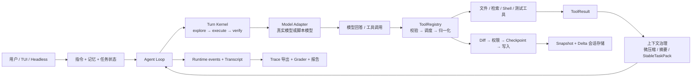

# RepoTerm

<p align="center">
  <strong>面向本地代码仓库的终端 AI Coding Agent：运行过程可追踪，任务中断可恢复，工程行为可评测。</strong>
</p>

<p align="center">
  <a href="./README.md">English</a>
  ·
  <a href="#core-highlights">核心亮点</a>
  ·
  <a href="#quick-start">快速开始</a>
  ·
  <a href="#architecture">Architecture</a>
  ·
  <a href="#implementation-index">实现索引</a>
  ·
  <a href="#evaluation">Evaluation</a>
  ·
  <a href="#runtime-flow">运行链路</a>
  ·
  <a href="#trace">Trace</a>
  ·
  <a href="#failure-recovery">Failure Recovery</a>
  ·
  <a href="#reproduce">Reproduce</a>
</p>

<p align="center">
  
  
  
</p>

<p align="center">
  
</p>

RepoTerm 是一个面向本地代码仓库的 Python 终端 Coding Agent。项目参考 Claude Code 的核心交互模式，重点解决五类工程问题：Agent Turn 控制、上下文治理、工具运行时、安全编辑与会话恢复，以及分层 AgentOps 评测。

> README 中的数字只描述仓库内固定的受控任务集。确定性回归与真实模型评测验证的是不同故障面，不代表开放世界代码仓库任务成功率。

AgentOps 评测快照：[`agentops-2026-07-28`](https://github.com/llyyyq/RepoTerm/tree/agentops-2026-07-28)。

## Core Highlights

- **分阶段 Agent Turn：** 以 `explore → execute → verify` 路由任务；检索停滞时扩大范围，缺少证据时拒绝结束，达到步数上限后安全终止——20 场景确定性回归（60/60）验证状态路由与安全检查逻辑。
- **分层上下文治理：** 结合 Provider usage 与本地 Token 估算，对旧工具结果微压缩、对历史消息摘要压缩，并通过 `StableTaskPack` 保护任务关键状态——回归断言验证压缩后关键证据仍被保留。
- **结构化工具运行时：** 使用 JSON Schema 与 Python validator 校验参数，将失败统一为 `ToolResult`，并从超长输出中保留 head/error/tail 证据——全部 26 个工具共享同一套 validate→dispatch→normalize→truncate 管道。
- **受控写入与持久化恢复：** Diff 审查 → 权限决策 → Checkpoint → 文件写入；以全量 Snapshot + 增量 Delta 持久化会话——重复 resume 无状态漂移，rewind 可恢复受管文件。
- **分层 AgentOps 评测：** 确定性 Runtime 回归（20 场景 × 3 轮 = 60/60）与真实模型端到端评测（5 类任务 × 3 轮 = 15/15，含 9/9 异常恢复），报告与脱敏 Trace 随仓库检入。

## Quick Start

运行环境：Python 3.11+、Git。

```bash
git clone https://github.com/llyyyq/RepoTerm.git
cd RepoTerm
python -m pip install -e ".[dev]"
```

通过交互式安装向导配置真实模型，然后启动 RepoTerm：

```bash
repoterm --install
repoterm
```

安装向导会把模型、API 地址和密钥保存到 `~/.repoterm/settings.json`。如果暂时没有模型凭据，可以用 mock 模式检查产品界面：

```bash
# PowerShell
$env:REPOTERM_MODEL_MODE="mock"
repoterm

# macOS / Linux
REPOTERM_MODEL_MODE=mock repoterm
```

进入 TUI 后，可以使用 `/help` 查看命令，使用 `/readiness` 检查 Provider 配置。

## Architecture



### 1. Agent Turn 状态机

`agent_loop.py` 负责一轮任务中的模型—工具反馈循环，`turn_kernel.py` 负责可变状态和阶段路由。Runtime 会向 Prompt 注入 `explore`、`execute`、`verify` 的阶段提示，再结合剩余步数、工具异常、空响应、任务进展和验证证据决定下一步。

- 路径停滞时进入 widening，在受限范围内扩大检索路径和步数预算。
- 模型没有工具证据就请求结束时，verification guard 会拒绝完成并回到执行或验证阶段。
- 空响应和可恢复 thinking stop 使用独立计数器进行有限重试。
- 达到最大步数后以明确 stop reason 终止，避免无效循环。

每次阶段变化、停止原因、扩宽触发和恢复动作都会产生一条 `RuntimeEvent`，持久化在 Session Transcript 中并导出为精选 Trace 证据。详见 [Trace](#trace) 与 [Failure Recovery](#failure-recovery) 章节。

### 2. 上下文治理

Token 统计优先使用 Provider usage，缺失时使用本地估算。系统根据上下文压力选择对旧工具结果做微压缩，或对更早历史做摘要压缩。`StableTaskPack` 不依赖普通摘要文本，单独保留任务目标、最新工具证据、验证状态、任务进展和剩余预算。

回归场景会断言压缩后仍保留下一轮决策需要的错误信息和编辑证据。

### 3. 工具运行时

`ToolDefinition` 定义工具契约，`ToolRegistry` 完成工具发现、参数校验、调度和观测。JSON Schema 约束模型侧的参数生成，Python validator 负责运行时校验。未知工具、参数错误、超时、非零退出码和普通异常都会归一化为 `ToolResult`，作为下一轮模型决策的观察结果。

超长输出采用 head/error/tail 截断：同时保留开头、包含错误的关键行和末尾状态，而不是只保留固定前缀。

### 4. 安全编辑与持久化会话

受管文件写入严格遵循：

```text
Diff 预览 → 权限决策 → 创建 Checkpoint → 文件写入
```

会话通过全量 Snapshot 与增量 Delta 保存消息、Transcript 事件、Runtime 状态、权限和 Checkpoint。`inspect`、`replay` 用于查看保存状态，`resume` 用于继续任务，`rewind-preview` 和 `rewind` 根据 Checkpoint 恢复受管文件。

### 5. AgentOps 证据闭环

同一个 Agent Loop 可以注入两类 Model Adapter：

- `ScenarioModel` 按预设顺序返回模型回答与工具调用，用于确定性 Runtime 回归。
- 真实模型 Adapter 让模型自主选择工具，并根据实际工具结果继续决策。

Grader 根据测试结果、文件内容与 Hash、禁止路径、权限结果、停止原因、Checkpoint 和恢复后的会话状态判分。评测报告与精选 Trace 可以在不重跑全部任务的情况下直接检查运行证据。

## Implementation Index

| 能力 | 核心实现 | 回归测试 | 报告与 Trace |
| --- | --- | --- | --- |
| **Agent Turn 状态机** — `explore → execute → verify` 阶段路由，widening 扩宽，verification guard 证据守卫，stop reasons 停止原因，`RuntimeEvent` 追踪 | [`repoterm/agent_loop.py`](./repoterm/agent_loop.py)、[`repoterm/turn_kernel.py`](./repoterm/turn_kernel.py)、[`repoterm/runtime_profiles.py`](./repoterm/runtime_profiles.py) | [`tests/test_agentops_scenarios.py`](./tests/test_agentops_scenarios.py) | [正常修改 Trace](./benchmarks/traces/normal-edit.md)、[Runtime 报告](./benchmarks/runtime_regression_results.md) |
| **上下文治理** — provider usage + 本地 token 估算，微压缩，历史摘要压缩，`StableTaskPack` | [`repoterm/context_manager.py`](./repoterm/context_manager.py)、[`repoterm/micro_compact.py`](./repoterm/micro_compact.py)、[`repoterm/context_compactor.py`](./repoterm/context_compactor.py)、[`repoterm/turn_kernel.py`](./repoterm/turn_kernel.py) | [`tests/test_context_compactor.py`](./tests/test_context_compactor.py)、[`tests/test_micro_compact.py`](./tests/test_micro_compact.py)、[`tests/test_agentops_scenarios.py`](./tests/test_agentops_scenarios.py) | [评测方法中的上下文场景](./benchmarks/eval-methodology.md) |
| **工具运行时** — `ToolDefinition` + `ToolRegistry`，JSON Schema 校验，`ToolResult` 归一化，head/error/tail 截断 | [`repoterm/tooling.py`](./repoterm/tooling.py)、[`repoterm/tools/`](./repoterm/tools/) | [`tests/test_tools.py`](./tests/test_tools.py)、[`tests/test_agentops_scenarios.py`](./tests/test_agentops_scenarios.py) | [工具失败恢复 Trace](./benchmarks/traces/tool-failure-recovery.md) |
| **安全编辑与会话持久化** — Diff → 权限 → checkpoint → 写入管道，Snapshot + Delta 持久化，resume/replay/rewind | [`repoterm/file_review.py`](./repoterm/file_review.py)、[`repoterm/permissions.py`](./repoterm/permissions.py)、[`repoterm/session.py`](./repoterm/session.py)、[`repoterm/tui/session_flow.py`](./repoterm/tui/session_flow.py) | [`tests/test_permissions.py`](./tests/test_permissions.py)、[`tests/test_session.py`](./tests/test_session.py)、[`tests/test_agentops_scenarios.py`](./tests/test_agentops_scenarios.py) | [权限拒绝 Trace](./benchmarks/traces/permission-denial.md)、[中断恢复 Trace](./benchmarks/traces/session-resume.md) |
| **AgentOps 评测** — `ScenarioModel` adapter 注入，确定性回归（60/60）+ 真实模型 E2E（15/15，9/9 恢复），多维 Grader 判分 | [`benchmarks/runtime_regression_eval.py`](./benchmarks/runtime_regression_eval.py)、[`repoterm/llm_e2e_eval.py`](./repoterm/llm_e2e_eval.py)、[`benchmarks/llm_e2e_eval.py`](./benchmarks/llm_e2e_eval.py) | [`tests/test_agentops_scenarios.py`](./tests/test_agentops_scenarios.py)、[`tests/test_agentops_proof_artifacts.py`](./tests/test_agentops_proof_artifacts.py) | [评测方法](./benchmarks/eval-methodology.md)、[Runtime 报告](./benchmarks/runtime_regression_results.md)、[真实模型报告](./benchmarks/llm_e2e_results.md) |

## Evaluation

评测分层的原因是：Runtime 控制逻辑是否正确，与真实模型在不确定输出下能否完成任务，是两个不同问题。

| 层级 | 配置 | 结果 | 验证内容 |
| --- | --- | ---: | --- |
| 确定性 Runtime 回归 | 20 个场景 × 3 轮；`ScenarioModel` 输出预先设定 | **60/60 通过** | 状态路由、Schema/ToolResult、权限边界、压缩连续性、Checkpoint 与 Session 恢复 |
| 真实模型端到端评测 | 5 类受控仓库任务 × 3 轮；使用已配置真实模型 | **15/15 通过** | 工具选择、失败纠正、文件修改、权限引导、恢复执行和最终测试证据 |
| 异常恢复子集 | 3 类恢复任务 × 3 轮；包含在上述 15 次之中 | **9/9 通过** | 测试失败恢复、权限拒绝恢复和中断会话恢复 |

其中 **9/9 是 15 次真实模型运行的子集**，不是额外增加的 9 次。

主要 Grader：

- 测试命令退出码与预期输出；
- 目标文件内容/Hash，以及受保护测试文件是否保持不变；
- 禁止路径访问与权限拒绝结果；
- 必需工具序列与最终 stop reason；
- Checkpoint 数量、恢复后的 Session 状态和重复 resume 幂等性。

证据入口：

- [评测方法、场景与指标口径](./benchmarks/eval-methodology.md)
- [确定性 Runtime 回归报告](./benchmarks/runtime_regression_results.md)
- [真实模型端到端评测报告](./benchmarks/llm_e2e_results.md)

## Runtime Flow

一次正常的仓库任务会经过下面这条可观察链路：

1. CLI/TUI 创建或加载 Session，并记录用户任务。
2. 系统把指令、相关记忆、当前阶段、预算信号和 `StableTaskPack` 组装为模型输入。
3. Model Adapter 返回文本回答或结构化工具调用。
4. `ToolRegistry` 校验并执行工具；文件修改还要经过 Diff 审查、权限控制和 Checkpoint。
5. `ToolResult` 写入 Transcript，并作为观察结果进入下一轮模型决策。
6. Turn Kernel 更新任务进展、阶段、widening、verification 和 stop signals。
7. 任务以明确 stop reason 结束，随后通过测试命令和 Grader 验证仓库与会话状态。

[正常修改 Trace](./benchmarks/traces/normal-edit.md) 展示了从仓库检索到验证完成的完整顺序。

## Trace

RepoTerm 的可观测性由两个相关层次组成：

- **Session Transcript** 是持久化的任务原始记录，包含用户/模型消息、工具调用与结果、权限、Checkpoint 和 Runtime events。
- **精选 Trace** 是经过脱敏和裁剪的运行记录，组合时间线、模型与工具元数据、停止原因、恢复动作和 Grader 结果。

Runtime event 回答“阶段为什么改变”，Transcript/tool event 回答“任务实际做了什么”，Grader 回答“最终仓库状态是否满足任务”。

| 参考场景 | 可观察行为 | Markdown | 机器可读 |
| --- | --- | --- | --- |
| 成功修改 | read → edit → test → `done`，包含 Checkpoint 和通过的 Grader | [normal-edit.md](./benchmarks/traces/normal-edit.md) | [normal-edit.json](./benchmarks/traces/normal-edit.json) |
| 工具失败后恢复 | 测试失败作为下一轮观察，修改后再次测试直至成功 | [tool-failure-recovery.md](./benchmarks/traces/tool-failure-recovery.md) | [tool-failure-recovery.json](./benchmarks/traces/tool-failure-recovery.json) |
| 权限拒绝 | 受保护写入被拒绝，模型根据 guidance 改走允许路径 | [permission-denial.md](./benchmarks/traces/permission-denial.md) | [permission-denial.json](./benchmarks/traces/permission-denial.json) |
| 中断恢复 | Checkpoint 跨中断保留，resume 后验证状态且重复恢复无漂移 | [session-resume.md](./benchmarks/traces/session-resume.md) | [session-resume.json](./benchmarks/traces/session-resume.json) |

Trace 的生成规则和脱敏边界见[精选 Trace 索引](./benchmarks/traces/README.md)。

## Failure Recovery

| 失败信号 | Runtime 如何处理 | 安全边界 | 证据 |
| --- | --- | --- | --- |
| 模型空响应或可恢复 thinking stop | 使用独立计数器有限重试，并记录恢复动作 | 重试上限与剩余步数预算 | [确定性回归报告](./benchmarks/runtime_regression_results.md)中的 Runtime 场景 |
| 测试/工具失败 | 归一化为失败 `ToolResult`，回传模型后允许纠正并重新验证 | 最大步数限制，错误结果不会被隐藏 | [工具失败恢复 Trace](./benchmarks/traces/tool-failure-recovery.md) |
| 权限拒绝 | 返回拒绝结果和用户 guidance，由模型选择允许路径 | 被拒绝的写入不会落盘，也不会创建 Checkpoint | [权限拒绝 Trace](./benchmarks/traces/permission-denial.md) |
| 上下文压力 | 先微压缩旧工具输出，再摘要历史，同时保留 `StableTaskPack` | 熔断保护和关键任务证据 | [评测方法](./benchmarks/eval-methodology.md)中的上下文场景 |
| 进程中断 | 保存 Session/Checkpoint，重载并 resume，必要时 rewind | 只恢复受管文件与会话状态，无法撤销任意外部 Shell 副作用 | [中断恢复 Trace](./benchmarks/traces/session-resume.md) |
| 缺少验证证据或步数耗尽 | 拒绝过早 `done`，回到 execute/verify；到上限后安全停止 | 显式 `verification_failed` 或 `max_steps` | [确定性回归报告](./benchmarks/runtime_regression_results.md) |

## Reproduce

### 安装并启动

```bash
git clone https://github.com/llyyyq/RepoTerm.git
cd RepoTerm
python -m pip install -e ".[dev]"
repoterm
```

需要 Python 3.11+。

### 复现确定性 Runtime 证据

这一层不需要模型凭据：

```bash
python benchmarks/runtime_regression_eval.py --rounds 3
python benchmarks/export_agentops_traces.py
python -m pytest -q tests/test_agentops_scenarios.py tests/test_agentops_proof_artifacts.py
```

输出：

- `benchmarks/runtime_regression_results.md`
- `benchmarks/runtime_regression_results.json`
- `benchmarks/traces/`

### 复现真实模型证据

复制 `.env.example`，在本地配置一种受支持的 Provider，不要提交真实密钥。下面的命令会真实调用模型 15 次，可能消耗额度：

```bash
python benchmarks/llm_e2e_eval.py --all --runs 3 --confirm-live
```

输出：

- `benchmarks/llm_e2e_results.md`
- `benchmarks/llm_e2e_results.json`
- `.temp/llm_e2e/runs/` 下的原始运行材料

真实模型结果受 Provider 和模型版本影响。仓库内报告记录了当前 15/15 指标对应的模型与任务配置。

## Repository Guide

| 路径 | 作用 |
| --- | --- |
| `repoterm/` | Runtime、Adapter、上下文、工具、权限、记忆和会话实现 |
| `tests/` | 单元测试、集成测试和确定性 AgentOps 场景 |
| `benchmarks/` | 评测脚本、方法说明、报告和公开 Trace |
| `Docs/Documentation/` | 使用说明与更深入的工程文档 |
| `.env.example` | 不含真实凭据的 Provider 配置模板 |

## Source and Attribution

RepoTerm 基于开源项目 [MiniCode-Python](https://github.com/QUSETIONS/MiniCode-Python) 进行二次开发，其上游主项目为 [MiniCode](https://github.com/LiuMengxuan04/MiniCode)。感谢原作者提供 Agent Loop、工具调用和终端交互等基础实现与学习参考。

本仓库在此基础上重点补充和重构 Agent Runtime 状态控制、确定性与真实模型 AgentOps 评测、公开 Trace 证据、记忆生命周期、安全写入和失败恢复。上游代码与贡献的权利归原作者所有，本仓库的新增修改以实际 Git 历史和文件内容为准。

许可证与详细来源说明见 [MIT License](./LICENSE) 和 [NOTICE.md](./NOTICE.md)。
