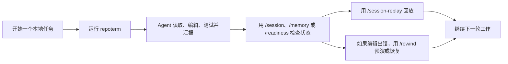
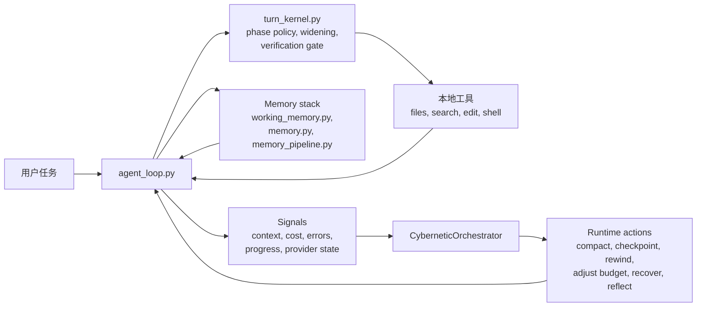

# RepoTerm

<p align="center">
  <strong>一个面向本地开发的轻量级 coding agent：不只是聊天壳子，而是可恢复、可回放、可检查的终端工作流。</strong>
</p>

<p align="center">
  <a href="./README.md">English</a>
  |
  <a href="#来源与致谢">来源与致谢</a>
</p>

<p align="center">
  
  
  
</p>

RepoTerm 是一个面向真实本地开发场景的 Python Coding Agent：agent 不只是能调模型和工具，还要能跨长会话保留状态、回看历史、撤销错误编辑，并把自己的运行状态说清楚。

如果把 Claude Code 看成成熟的终端 agent 产品体验，那么 RepoTerm 更像它的轻量级、本地优先版本：更强调运行时透明性、可持续会话、记忆连续性、可回退编辑，以及可验证行为。

## At a Glance

如果你想要的是下面这些体验，这个仓库就是给你的：

- 一个更像运行时而不是聊天窗口的终端 coding agent；
- 可 inspect、可 replay、可 resume、可总结的持久会话；
- 能保护工作上下文、并在需要时回注项目知识的记忆系统；
- 带 checkpoint、rewind preview 和恢复路径的安全本地编辑；
- 对 verification、widening、provider readiness 和失败原因都有显式信号。

如果只记住一句话，可以记这个：

> RepoTerm 的核心目标是本地可信度：你应该能看清它做了什么、把改动撤回来，也能理解它为什么停在这里。

## Why This Repo Exists

很多 coding-agent README 会先讲模型接入和功能清单。RepoTerm 想解决的是另一类问题：

> 运行时应该是可观察、可恢复、可测试的，而不只是“聪明”。

这会直接改变产品优先级：

| 优先级 | 在这个仓库里的含义 |
| --- | --- |
| Session-first | 会话可以 inspect、replay、resume 和 summary。 |
| Recovery-first | 文件编辑默认带 checkpoint、可 preview、可 rewind。 |
| Runtime-first | widening、verification、compaction 和 stop reason 都是显式的。 |
| Local-first | agent 围绕真实仓库、本地工具和终端工作流构建。 |

## Why RepoTerm

| 维度 | RepoTerm 的侧重点 |
| --- | --- |
| Durable sessions | 可以用本地命令 inspect、replay、resume 和 summary 当前或已保存会话。 |
| Memory as a first-class system | 保护活跃任务上下文、回注项目知识、在压缩时保持记忆感知、并持续沉淀有价值反思。 |
| Safe recovery | 自动 checkpoint、rewind preview、rewind safety group，以及 saved-session rewind。 |
| Runtime control | `single` / `single-deep` profile、phase-aware 执行、widening、verification gate 和结构化 stop reason。 |
| Observable behavior | runtime timeline、readiness report、provider 诊断、transcript summary 和 benchmark artifact。 |
| Local product surface | CLI/TUI 命令已经包括 `/session`、`/session-replay`、`/memory`、`/checkpoints`、`/rewind`、`/readiness`。 |
| Verifiable implementation | 根包由活跃测试套件兜底，不是“文档先行”的空壳。 |

## What You Can Do Today

以当前仓库状态，你已经可以：

- 用 `repoterm` 跑交互式终端 agent；
- 用 `repoterm-headless` 跑单次命令；
- 用 `repoterm-readiness` 跑 provider/runtime readiness 门禁；
- 用 `/session` 查看当前会话快照；
- 用 `/sessions` 浏览当前工作区历史会话；
- 用 `/session-replay` 回放会话；
- 用 `/memory` 查看记忆层状态；
- 用 `/checkpoints` 查看 checkpoint 历史；
- 用 `/rewind-preview` 和 `/rewind` 预演或执行回退；
- 用 `/readiness` 检查 provider 和 fallback 是否就绪。

## 3-Minute Demo

### 0. 你需要什么

- Python 3.11+
- Windows、macOS 或 Linux 上的本地终端
- 如果要真实跑模型，需要可用的 provider/model 凭据

### 1. 安装并启动

```bash
cd RepoTerm
python -m pip install -e .[dev]
repoterm
```

### 2. 让它做一个真实仓库任务

```text
Explain this repository and tell me which commands matter most for day-to-day use.
```

这里你应该看到标准的 RepoTerm 工作流：先读仓库、解释发现，再让你 inspect、replay 或继续会话。

### 3. 检查运行时在做什么

```text
/session
/memory
/readiness
```

### 4. 需要时回放或恢复

```text
/session-replay
/checkpoints
/rewind-preview
```

### 5. 跑一次 headless 单轮模式

```bash
repoterm-headless "Explain what this repo does."
```

### 6. 跑 readiness 门禁

```bash
repoterm-readiness --json --fail-on blocked
```

`--fail-on blocked` 会报告 provider warning，但不会把缺少可选 fallback 误判为硬失败。真实模型行为由 `benchmarks/llm_e2e_eval.py` 下的端到端 AgentOps 任务单独验证。

## Typical Workflow



核心点很简单：RepoTerm 不想把运行时藏起来。它让你看见工作过程、检查状态，并在出错时直接恢复，而不是自己手工善后。

这套思路同样适用于 memory：活跃任务上下文会被保护，耐久项目知识会在需要时回注，compaction 也可以利用记忆而不是盲目丢上下文。

## Everyday Commands

如果一开始只记六个命令，先记这几个：`/session`、`/sessions`、`/session-replay`、`/memory`、`/rewind-preview`、`/readiness`。

| 命令 | 作用 |
| --- | --- |
| `/session` | 查看当前 live session 快照。 |
| `/sessions` | 列出当前 workspace 的已保存会话。 |
| `/session-replay` | 回放当前或已保存会话，包括 transcript 和 runtime 上下文。 |
| `/memory` | 查看当前 workspace 的记忆系统状态。 |
| `/checkpoints` | 查看当前或已保存会话的 checkpoint 历史。 |
| `/rewind-preview` | 在真正改文件前，先看 rewind 会恢复什么。 |
| `/rewind` | 按最新 edit group、步数或 checkpoint id 执行回退。 |
| `/readiness` | 检查 runtime/provider readiness、fallback coverage 和产品面状态。 |

## Current Status

这个仓库已经过了纯 prototype 阶段。它现在更像一个可用的本地产品，但仍在继续朝“更成熟的轻量级 Claude Code 体验”收紧。

当前生效的主包是根目录 `repoterm/`，由 `pyproject.toml` 里的 `repoterm` 配置驱动。

仓库清理后的最近一次本地完整测试结果：

```text
1263 passed, 2 skipped
```

验证命令：

```bash
python -m compileall -q repoterm tests benchmarks Main Package
python -m repoterm.structure_check --root . --hotspots 5 --max-dependency-upstream 4 --check-material-inventory --report .temp/structure-compliance.json
python -m repoterm.readiness --json --fail-on blocked
python -m pytest -q --import-mode=importlib
```

实话实说，当前状态是：

- runtime、session、replay、checkpoint、rewind、readiness 和结构合规门禁这些产品面已经比较稳；
- memory 不是外挂：working memory、project memory、memory injection 和 memory-aware compaction 已经进了主运行路径；
- provider 和 fallback 诊断已经包含 local preflight 清单、结构化 live-smoke 失败上下文和已校验的 headless trace artifact；
- 真实 provider 是否可用，仍然取决于你本地的凭据和通道配置；
- 这个项目今天已经能用，但还在继续往更完整的轻量级 Claude Code 体验走。

真实 provider readiness 仍然取决于本地凭据和通道可用性，所以默认 CI readiness 门禁只在 runtime blocked 时失败。

## AgentOps 可验证证据

RepoTerm 将确定性的 Runtime 正确性与非确定性的模型行为拆成两层评测，避免把两类指标混为一谈：

| 层级 | 当前结果 | 主要验证内容 |
| --- | ---: | --- |
| 确定性 Runtime 回归 | 20 个场景 × 3 轮，60/60 通过 | 状态流转、工具错误归一化、权限边界、上下文连续性与会话恢复 |
| 真实模型端到端冒烟 | 5 类任务 × 3 次，15/15 通过 | 真实模型在受控仓库中选择工具、处理失败、修改文件并取得测试证据 |

证据入口：

- [评测方法、判分规则与统计口径](./benchmarks/eval-methodology.md)
- [确定性 Runtime 回归报告](./benchmarks/runtime_regression_results.md)
- [真实模型端到端评测报告](./benchmarks/llm_e2e_results.md)
- [正常修改、权限拒绝与会话恢复 Trace](./benchmarks/traces/README.md)
- [错误记忆冲突、更新与删除生命周期 Trace](./benchmarks/traces/memory-conflict-update-delete.md)

无需 Provider 凭据即可复现确定性回归：

```bash
python benchmarks/runtime_regression_eval.py --rounds 3
```

真实模型冒烟会调用本地配置的 Provider，因此需要有效凭据并显式确认：

```bash
python benchmarks/llm_e2e_eval.py --all --runs 3 --confirm-live
```

上述数字只描述仓库内固定的受控任务集，不等同于开放世界仓库任务成功率。

## Architecture



重点不是这张图本身，而是运行时状态在这里是显式对象：

- loop 可以 widen，而不是静默卡死；
- verification 可以拦住过早的 “done”；
- memory 可以保护任务关键上下文，并在需要时回注项目知识，而不是只依赖当前 chat window；
- session 状态可以跨进程存在；
- rewind 可以撤销本地编辑，而不是让你手工收拾残局；
- readiness 可以告诉你失败到底是本地逻辑还是 provider availability。

## Repository Guide

| 路径 | 作用 |
| --- | --- |
| `repoterm/` | 安装和测试使用的规范 Python 包。 |
| `tests/` | 活跃测试套件。 |
| `benchmarks/` | AgentOps 评测、Runtime 回归、Trace 与发布验证证据。 |
| `Docs/Documentation/` | 精简后的使用、记忆、集成与工程边界文档。 |
| `Main/`、`Package/` | 当前 Runtime 仍在使用的产品入口契约与工程结构支持。 |

## Core Modules

| 模块 | 作用 |
| --- | --- |
| `repoterm/agent_loop.py` | 主 model/tool loop、runtime event flow 和产品集成。 |
| `repoterm/turn_kernel.py` | step policy、phase transition、widening 和 verification gate。 |
| `repoterm/session.py` | durable session、inspect/replay 视图、checkpoint 和 rewind helper。 |
| `repoterm/cli_commands.py` | `/session`、`/replay`、`/rewind`、`/readiness` 这类本地产品命令。 |
| `repoterm/memory.py` | 长期项目记忆管理和检索入口。 |
| `repoterm/working_memory.py` | 在 compaction 压力下仍会保留的 working memory 条目。 |
| `repoterm/memory_pipeline.py` | memory retrieval、injection、reflection writeback 和优化闭环。 |
| `repoterm/product_surfaces.py` | readiness、hooks、instructions、delegation、extensions 等用户可见摘要。 |
| `repoterm/readiness.py` | 独立 readiness CLI，用于本地检查和 CI 门禁。 |
| `repoterm/evidence_safety.py` | 对公开 Trace 与评测证据执行路径归一化和凭据脱敏。 |
| `repoterm/model_switcher.py` | 有界 fallback 和 failover 选择逻辑。 |
| `repoterm/runtime_profiles.py` | `single`、`single-deep` 等 runtime profile。 |
| `repoterm/cybernetic_orchestrator.py` | runtime control 生命周期总控。 |

## 来源与致谢

RepoTerm 基于开源项目 [MiniCode-Python](https://github.com/QUSETIONS/MiniCode-Python) 进行二次开发；其上游主项目为 [MiniCode](https://github.com/LiuMengxuan04/MiniCode)。感谢原作者提供 Agent Loop、工具调用、终端交互等基础实现与学习参考。

本仓库在此基础上重点补充和重构了 Agent Runtime 状态控制、AgentOps 确定性回归、真实模型端到端评测、Trace 证据、记忆生命周期、安全写入与异常恢复等工程能力。上游代码及贡献的权利归原作者所有，本仓库中的新增修改以实际 Git 历史和文件内容为准。

许可证与详细来源说明见 [MIT License](./LICENSE) 和 [NOTICE.md](./NOTICE.md)。

## Documentation

如果你想继续看更深的实现与产品化记录，可以从这里开始：

- [English README](./README.md)
- [AgentOps 评测方法](./benchmarks/eval-methodology.md)
- [精选 Agent Trace](./benchmarks/traces/README.md)
- [使用指南](./Docs/Documentation/USAGE_GUIDE.md)
- [集成指南](./Docs/Documentation/INTEGRATION_GUIDE.md)
- [Memory Theory](./Docs/Documentation/memory_theory.md)
- [来源与致谢](#来源与致谢)

## Design Principles

- 让运行时保持可检查。
- 把 memory 当成可控的 runtime 子系统，而不是事后补丁。
- 用可测量信号替代“prompt 玄学”。
- 把恢复能力做成产品特性，而不是手工清理步骤。
- 把 verification 视为执行路径的一部分，而不只是汇报。
- 让文档描述已实现行为，而不是未来愿景。
