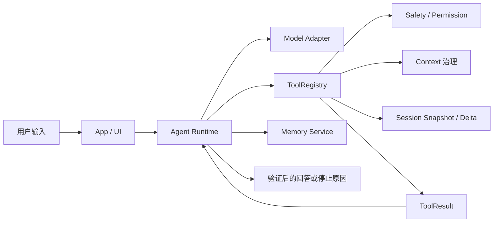

# RepoTerm

RepoTerm 是一个面向本地代码仓库的终端 AI Coding Agent。它把模型推理、结构化工具、上下文治理、受控文件编辑、会话恢复和任务验证组合到一个有边界的 Agent Turn 中。

它定位为本地开发工具以及工程/研究实践项目。当前 Runtime 借鉴了终端 Coding Agent 的交互方式，不宣称可以完整替代 Claude Code 或其他同类产品。

[English README](./README.md)

## 快速导航

- [核心能力](#core-highlights)
- [快速开始](#quick-start)
- [运行流程](#runtime-flow)
- [架构](#architecture)
- [评测](#evaluation)
- [Trace](#trace)
- [故障恢复](#failure-recovery)
- [复现与验证](#reproduce)
- [文档索引](#documentation-index)

<a id="core-highlights"></a>
## Core Highlights（核心能力）

- **有界 Agent Turn：** 按 `explore → execute → verify` 推进任务，对可恢复错误和空响应进行有限处理，在步数耗尽时给出明确停止原因。
- **结构化工具运行时：** `ToolDefinition` 和 `ToolRegistry` 负责发现、校验、执行、观察和释放工具；JSON Schema 与 Python validator 约束参数，失败统一为结构化 `ToolResult`。
- **受控编辑：** 文件变更遵循 `Diff → 权限决策 → Checkpoint → 写入`，被拒绝的编辑不会创建 Checkpoint 或修改目标文件。
- **上下文治理：** 优先使用 Provider usage，并在缺失时使用本地估算；根据压力执行微压缩、历史摘要和 `StableTaskPack` 保留。
- **可恢复会话：** 通过完整 Snapshot 和增量 Delta 支持会话列表、inspect/replay、resume 以及受管文件 rewind。
- **持久化记忆：** SQLite Memory Service 区分 active 记录、pending 候选、证据门禁、确定性检索和生命周期操作。
- **证据化评测：** 确定性 Runtime 回归与受控真实模型 E2E 分开报告，并提供脱敏 Trace 和明确的 Grader。

<a id="quick-start"></a>
## Quick Start（快速开始）

### 环境要求

- Python 3.11 或更高版本
- Git
- Live 模式需要配置模型和对应 Provider 凭据

### 使用 venv 安装

```bash
git clone https://github.com/llyyyq/RepoTerm.git
cd RepoTerm
python -m venv .venv
```

激活环境：

```powershell
# Windows PowerShell
.\.venv\Scripts\Activate.ps1

# Windows CMD
.venv\Scripts\activate.bat
```

```bash
# macOS / Linux
source .venv/bin/activate
```

安装项目和开发依赖：

```bash
python -m pip install -e ".[dev]"
```

### 使用 Conda 安装

```bash
conda create -n repoterm python=3.11
conda activate repoterm
python -m pip install -e ".[dev]"
```

### 配置 Provider

Anthropic-compatible 配置可以直接使用交互式安装向导：

```bash
repoterm --install
```

向导会询问模型、`ANTHROPIC_BASE_URL` 和 `ANTHROPIC_AUTH_TOKEN`，并将选择写入 `~/.repoterm/settings.json`。Runtime 也支持从当前进程环境变量或该 settings 文件读取 Provider 配置。对于 Anthropic-compatible Provider，`ANTHROPIC_API_KEY` 和 `ANTHROPIC_AUTH_TOKEN` 是两种可选认证变量，请根据服务端要求配置其中一种。

`.env.example` 是本地配置模板。可以先复制后编辑，但本仓库不会自动加载 `.env`；请将需要的值导出到当前 Shell，或写入 `~/.repoterm/settings.json`。

```powershell
# Windows PowerShell
Copy-Item .env.example .env
$env:ANTHROPIC_MODEL = "your-model"
$env:ANTHROPIC_API_KEY = "your-local-key"
```

```cmd
:: Windows CMD
copy .env.example .env
set ANTHROPIC_MODEL=your-model
set ANTHROPIC_API_KEY=your-local-key
```

```bash
# macOS / Linux
cp .env.example .env
export ANTHROPIC_MODEL="your-model"
export ANTHROPIC_API_KEY="your-local-key"
```

常用配置变量：

| Provider 或行为 | 变量 |
| --- | --- |
| Anthropic-compatible | `ANTHROPIC_MODEL`、`ANTHROPIC_BASE_URL`、`ANTHROPIC_API_KEY` 或 `ANTHROPIC_AUTH_TOKEN` |
| OpenAI | `OPENAI_API_KEY`、`OPENAI_BASE_URL`、`OPENAI_MODEL_FALLBACKS` |
| OpenRouter | `OPENROUTER_API_KEY`、`OPENROUTER_BASE_URL`、`OPENROUTER_MODEL_FALLBACKS` |
| 自定义 OpenAI-compatible | `CUSTOM_API_KEY`、`CUSTOM_API_BASE_URL`、`CUSTOM_MODEL_FALLBACKS` |
| Runtime | `REPOTERM_MODEL`、`REPOTERM_RUNTIME_PROFILE`、`REPOTERM_TOOL_PROFILE`、`REPOTERM_LOG_LEVEL` |
| 限制参数 | `REPOTERM_MODEL_TIMEOUT`、`REPOTERM_TOOL_TIMEOUT`、`REPOTERM_MAX_RETRIES`、`REPOTERM_MAX_OUTPUT_TOKENS` |

不要提交 `.env`、API Key、Token 或包含凭据的 settings 文件。

### 启动 RepoTerm

交互式 TTY 模式：

```bash
repoterm
```

也可以直接从源码启动：

```bash
python -m repoterm.app.interactive
```

单次无界面任务：

```bash
repoterm-headless "请解释这个仓库的结构"
```

`repoterm-headless --allow-edits "..."` 会在本次运行中自动批准编辑、命令和工作区外访问。只有明确需要这种非交互行为时才使用该参数。

不配置真实 Provider 时，可以强制使用 Mock Adapter 做本地冒烟：

```powershell
# PowerShell
$env:REPOTERM_MODEL_MODE = "mock"
repoterm
```

```bash
# macOS / Linux
REPOTERM_MODEL_MODE=mock repoterm
```

进入 TUI 后输入 `/help` 查看命令。输入 `/exit` 或按 `Ctrl+C` 退出；TTY 清理路径会在正常退出和异常退出时恢复终端模式。

常用入口命令：

```bash
repoterm --readiness
repoterm --readiness-json
repoterm --validate-config
repoterm --list-sessions
repoterm --resume latest
```

<a id="runtime-flow"></a>
## Runtime Flow（基本使用流程）

1. 用户在 TTY UI 输入任务，或将任务作为 Headless 参数/标准输入提供。
2. App 层创建或恢复 Session，并组合 Runtime、Provider、Tool、Permission、Context 和 Memory 服务。
3. Runtime 在剩余步数预算内选择当前 `explore`、`execute` 或 `verify` 阶段。
4. Model Adapter 返回文本或结构化工具调用。
5. `ToolRegistry` 校验参数、执行工具、归一化结果并返回 `ToolResult`。
6. Runtime 记录工具证据，更新上下文和控制状态，决定继续、恢复、widen、验证或停止。
7. 任务以最终回答、暂停/错误状态或明确的安全停止原因结束。

<a id="architecture"></a>
## Architecture（架构）


```mermaid
flowchart LR
    User[用户输入] --> App[App / UI]
    App --> Runtime[Agent Runtime]
    Runtime --> Provider[Model Adapter]
    Runtime --> Registry[ToolRegistry]
    Registry --> Safety[Safety / Permission]
    Registry --> Context[Context 治理]
    Registry --> Session[Session Snapshot / Delta]
    Runtime --> Memory[Memory Service]
    Registry --> Result[ToolResult]
    Result --> Runtime
    Runtime --> Answer[验证后的回答或停止原因]
```

## Implementation Index（实现索引）

| 模块 | 当前路径 | 核心责任 |
| --- | --- | --- |
| 应用入口 | `repoterm/app/` | CLI、交互式 TTY、Headless、readiness 和结构检查入口 |
| Contracts | `repoterm/contracts/` | 公共类型以及 `AppState`/`Store` 状态契约 |
| Runtime | `repoterm/runtime/` | Agent Turn 编排、阶段推进、证据和停止原因 |
| Planning | `repoterm/runtime/planning/` | 意图解析、任务规划、Prompt 组合、路由和 worktree 隔离辅助 |
| Control | `repoterm/runtime/control/` | 验证、进度、稳定性、上下文/成本控制及部分 Provider/Memory wiring |
| Providers | `repoterm/providers/` | 模型目录、Adapter、重试分类和模型切换 |
| Tools | `repoterm/tools/` | 工具定义、校验、执行、结果归一化、截断和释放 |
| Context | `repoterm/context/` | Token 预算、分层上下文、压缩和工作记忆 |
| Safety | `repoterm/safety/` | 工作区边界、权限、Diff 审查、Checkpoint 和证据脱敏 |
| Session | `repoterm/session/` | Snapshot、Delta、resume、inspect/replay 和受管文件 rewind |
| Memory | `repoterm/memory/` | SQLite 记忆、确定性检索、证据门禁和生命周期 |
| Observability | `repoterm/observability/` | 日志、指标、成本统计和决策审计 |
| UI | `repoterm/ui/` | Slash command、历史、TTY 生命周期和 TUI 交互 |
| Integrations | `repoterm/integrations/` | 可选 Skills/MCP 发现与通信，并通过 Tools 暴露 |
| Evaluation | `benchmarks/evaluation/` | 确定性 Runtime 回归和受控真实模型评测 |

详细的中文 Package 设计文档见[包结构重构报告](./Docs/Documentation/engineering/package-structure-refactor-report.md)以及各 Package 目录。

## 关键执行机制

### Agent Turn

`repoterm/runtime/loop.py` 负责有界反馈循环，`turn_kernel.py` 维护阶段和验证状态。

- `explore` 收集仓库和任务证据。
- `execute` 执行选定的工具动作。
- `verify` 检查请求变更是否有支持性证据。
- 工具错误以及空响应/可恢复响应可以在有限步数内回到下一步决策。
- 停滞路径可以使用 widening，获得有限的搜索扩展。
- 只有自然语言“完成”而没有要求的验证证据，不足以打开完成门禁。
- 达到配置的最大步数后，Runtime 发出明确停止原因，不会无限循环。

Runtime Event 记录阶段变化、恢复动作、widening、compaction、验证守卫和停止原因；它与日志、Session 持久化和 TUI 渲染事件不同。

### Tool Runtime

`ToolDefinition` 描述工具名称、说明、schema、validator、runner 和 metadata。`ToolRegistry` 按 core 或可选 full profile 发现工具，校验模型调用，通过 `ToolContext` 分发并归一化结果。

未知工具、参数错误、超时、命令非零退出和普通 runner 异常都会转为 `ToolResult` 中的结构化失败。过长输出采用 head/error/tail 策略，向下一步模型决策提供有界但仍可用的证据。

JSON Schema 约束暴露给模型的参数形状；Python validator 和 Safety/Permission 规则负责运行时约束。`run_command` 受权限控制，但 RepoTerm 不将其描述为完整的操作系统或容器沙箱。

### 受控编辑与恢复

受管文件编辑遵循：

```text
Diff 审查 → 权限决策 → 文件 Checkpoint → 文件写入
```

Session 使用完整 Snapshot 和增量 Delta 持久化。`inspect` 和 `replay` 展示保存状态；`resume` 加载同一会话；`rewind-preview` 和 `rewind` 根据 Checkpoint 恢复受管文件内容。

Rewind 不是通用撤销系统。它可以恢复受管文件和 Session 状态，但不能撤销任意网络请求、外部 Shell 副作用或其他进程的修改。

### Context 与 Memory

Context 治理模型窗口：优先使用 Provider usage，缺失时使用本地估算；压力升高时可以微压缩或摘要历史。`StableTaskPack` 与工作记忆保留任务目标、近期证据、验证状态、进度和剩余预算。

Memory 是独立的 SQLite 生命周期系统。Active 记忆可以被确定性检索和注入；模型生成的经验候选先进入 `pending`，经批准后才成为 active。普通对话、源码正文、原始工具输出和未经验证的模型判断不会自动成为永久记忆。

### UI 与终端生命周期

`repoterm/ui/` 负责 Slash command、历史、TTY 生命周期、审批和 TUI 渲染。TUI Parser 区分文本、按键和滚轮事件；主线程拥有可见状态，Worker 只发布事件。Bracketed paste 以原子文本处理且不会自动提交。终端清理覆盖 alternate screen、mouse、paste、focus 和 sync-output 模式。

<a id="evaluation"></a>
## Evaluation

RepoTerm 将确定性 Runtime 正确性与真实模型行为作为两层独立证据。

### 确定性 Runtime 回归

- 使用脚本化 `ScenarioModel`/Model Adapter，不调用真实 Provider。
- 覆盖 20 个受控场景，重复 3 轮，共 60 次运行。
- 覆盖工具校验与失败归一化、权限拒绝、上下文压力、验证证据、Checkpoint、Session 恢复和有界终止。
- 当前仓库报告记录为 **60/60 passed**：[`benchmarks/runtime_regression_results.md`](./benchmarks/runtime_regression_results.md)。

运行：

```bash
python benchmarks/runtime_regression_eval.py --rounds 3
```

### 真实模型端到端评测

- 采用 5 类受控仓库任务，每类重复 3 次，共 15 次任务运行。
- 每次在隔离临时仓库执行，并检查独立 Pytest、文件 Hash、保护路径、权限结果、Checkpoint 和恢复状态。
- 异常恢复子集包括测试失败恢复、权限拒绝恢复和中断 Session 恢复，共 9 次运行。
- 当前仓库报告记录 **15/15 次任务运行**、**9/9 次恢复运行**：[`benchmarks/llm_e2e_results.md`](./benchmarks/llm_e2e_results.md)。
- 结果受模型、Prompt、Provider endpoint、网络和本地配置影响，不能外推为开放仓库成功率。

先运行不调用模型的夹具预检：

```bash
python benchmarks/llm_e2e_eval.py --dry-run --all
```

真实运行需要显式确认，并可能消耗 Provider 配额：

```bash
python benchmarks/llm_e2e_eval.py --all --runs 3 --confirm-live
```

报告默认写入 `benchmarks/llm_e2e_results.md` 和 `.json`，单次运行材料默认位于 `.temp/llm_e2e/`。

解释指标前请先阅读[评测方法](./benchmarks/eval-methodology.md)。

<a id="trace"></a>
## Trace（Trace 与失败恢复）

Session Transcript 和精选 Trace 相关但不同：

- **Session Transcript：** 持久化的任务记录，包含消息、工具事件、权限、Checkpoint 和 Runtime 事件。
- **精选 Trace：** 脱敏的任务证据导出，包含时间线、工具/模型元数据、停止原因、恢复动作和 Grader 结果。
- **Snapshot/Delta：** 用于加载和恢复的 Session 持久化记录，不是 Trace 或审计日志的替代品。

| 场景 | 说明 | 证据 |
| --- | --- | --- |
| 正常修改 | 仓库检索、受控编辑、测试和验证停止 | [normal-edit.md](./benchmarks/traces/normal-edit.md) · [normal-edit.json](./benchmarks/traces/normal-edit.json) |
| 工具失败恢复 | 工具/测试失败先回传下一步决策，再进行修复 | [tool-failure-recovery.md](./benchmarks/traces/tool-failure-recovery.md) · [tool-failure-recovery.json](./benchmarks/traces/tool-failure-recovery.json) |
| 权限拒绝 | 受保护编辑被拒绝，运行获得替代路径 | [permission-denial.md](./benchmarks/traces/permission-denial.md) · [permission-denial.json](./benchmarks/traces/permission-denial.json) |
| 中断恢复 | Checkpoint 跨中断保留，同一 Session 可以恢复 | [session-resume.md](./benchmarks/traces/session-resume.md) · [session-resume.json](./benchmarks/traces/session-resume.json) |

[Trace 索引](./benchmarks/traces/README.md)说明现有材料和脱敏边界。

<a id="failure-recovery"></a>
## Failure Recovery（失败恢复）

上面的场景展示了工具失败、权限拒绝和中断会话如何在继续运行或安全停止前被显式记录。

| 故障 | Runtime 行为 | 可观察证据 |
| --- | --- | --- |
| 空响应/可恢复暂停 | 有界重试并继续下一轮 | Runtime Event |
| 工具失败 | 转为 `ToolResult` 并回传模型 | `ToolResult`、Trace |
| 权限拒绝 | 阻止写入，不创建 Checkpoint | 权限记录、文件 Hash |
| 写入中断 | 重新加载同一 Session 并继续验证 | Snapshot、Delta、Resume Trace |

<a id="reproduce"></a>
## Reproduce（测试与验证）

运行全量测试：

```bash
python -m pytest -q --tb=short
```

只运行 Package Contracts：

```bash
python -m pytest tests/contracts -q
```

编译产品和评测源码：

```bash
python -m compileall -q repoterm benchmarks Main Package
```

运行当前结构检查器：

```bash
python -m repoterm.app.structure_check \
  --root . \
  --hotspots 5 \
  --max-dependency-upstream 4 \
  --check-material-inventory \
  --report .temp/structure-compliance.json
```

仓库还包含 [`.github/workflows/ci.yml`](./.github/workflows/ci.yml)。它定义了 Python 3.11/3.12、Ubuntu/Windows/macOS 的 CI 矩阵；上面的命令是当前包结构下直接可调用的本地入口。

## 配置与安全说明

- `.env` 和 `~/.repoterm/settings.json` 只保存在本地，不要提交 Key 或 Token。
- `.env.example` 是模板，不是自动加载的 dotenv 文件。
- 项目级 `.mcp.json` 是可选配置，默认不启用；启用它需要明确的信任决定。只有明确信任项目配置时，才使用 `repoterm --trust-project-mcp`。
- 文件编辑和命令执行经过工作区与权限检查，但这不等于完整的容器或操作系统沙箱。
- 证据和日志设计为有界并进行脱敏；不要在 Prompt 或工具参数中粘贴秘密。
- Rewind 只恢复受管文件和 Session 状态，外部 Shell 与网络副作用可能不可逆。

## 项目结构

```text
repoterm/                 # 产品 Package 与稳定 config 入口
benchmarks/               # 评测脚本、报告和 Trace 材料
tests/                    # 单元、集成、契约、UI 和 AgentOps 测试
Docs/                     # 使用、工程和设计文档
Main/                     # 架构投影与镜像验证代码
Package/                  # 工程结构与合规检查代码
.github/                  # CI 工作流
```

`Main/` 和 `Package/` 是架构投影/验证代码，不是 Agent Runtime。`__pycache__/`、`.pytest_cache/`、`.temp/` 和 `*.egg-info/` 是本地生成物，不属于产品源码目录。

<a id="documentation-index"></a>
## 文档索引

以下模块设计文档（module design documents）说明当前各 Package 的边界、依赖方向和维护约束：

| 主题 | 文档 |
| --- | --- |
| Application | [Application Package 文档](./repoterm/app/README.zh-CN.md) |
| Contracts | [Contracts Package 文档](./repoterm/contracts/README.zh-CN.md) |
| 包结构总览 | [包结构重构报告](./Docs/Documentation/engineering/package-structure-refactor-report.md) |
| Runtime 设计 | [Runtime Package 文档](./repoterm/runtime/README.zh-CN.md) |
| Planning | [Planning Package 文档](./repoterm/runtime/planning/README.zh-CN.md) |
| Control | [Control Package 文档](./repoterm/runtime/control/README.zh-CN.md) |
| Providers | [Providers Package 文档](./repoterm/providers/README.zh-CN.md) |
| Context | [Context Package 文档](./repoterm/context/README.zh-CN.md) |
| Tool 设计 | [Tools Package 文档](./repoterm/tools/README.zh-CN.md) |
| Safety 与权限 | [Safety Package 文档](./repoterm/safety/README.zh-CN.md) |
| Session | [Session Package 文档](./repoterm/session/README.zh-CN.md) |
| Memory | [Memory Package 文档](./repoterm/memory/README.zh-CN.md) |
| Observability | [Observability Package 文档](./repoterm/observability/README.zh-CN.md) |
| Integrations | [Integrations Package 文档](./repoterm/integrations/README.zh-CN.md) |
| UI 与 TUI | [UI 文档](./repoterm/ui/README.zh-CN.md) · [TUI 文档](./repoterm/ui/tui/README.zh-CN.md) |
| Evaluation | [Evaluation Package 文档](./benchmarks/evaluation/README.zh-CN.md) · [评测方法](./benchmarks/eval-methodology.md) · [真实模型评测指南](./benchmarks/llm_e2e_guide_zh.md) |
| Trace 材料 | [Trace 索引](./benchmarks/traces/README.md) |

## 许可证与来源说明

RepoTerm 使用 [MIT License](./LICENSE)。上游来源和归属说明见 [`NOTICE.md`](./NOTICE.md)。

NOTICE 将 RepoTerm 说明为基于 [MiniCode](https://github.com/LiuMengxuan04/MiniCode) 和 [MiniCode-Python](https://github.com/QUSETIONS/MiniCode-Python) 的二次开发项目。原始通知和权利归各自作者所有；RepoTerm 的新增修改以仓库历史和当前文件为准。
