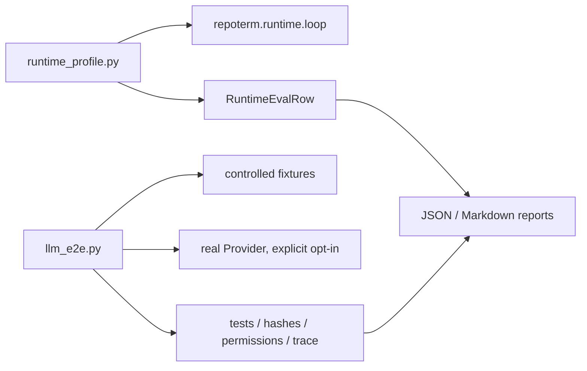

# Evaluation 包架构设计

`benchmarks/evaluation/` 是评测实现层，不是 RepoTerm 生产 Runtime 的一部分。它把确定性 Runtime profile 回归和真实 Provider 的仓库任务端到端评测放在独立目录，生成可审查的行、汇总和报告。

## 1. 设计目标与非目标

目标是回答两类不同问题：

- Runtime 在固定 ModelAdapter、工具和场景下是否按预期路由、验证、恢复并停止。
- 真实 Provider 驱动的 Agent 是否能在受控 Fixture 中选择工具、处理失败、遵守权限并给出测试证据。

非目标：不让 Benchmark 代码成为生产入口依赖，不把一次 live 评测结果当作 Runtime 的永久保证，也不在默认测试中隐式发起付费 API 调用。

## 2. 模块架构

## 3. 核心文件与对象

| 文件/对象 | 当前职责 | 使用范围 |
| --- | --- | --- |
| `runtime_profile.py` | `RuntimeEvalCondition/Scenario/Row`、RuntimeEvent 计数、完成/guard/widening 汇总和 Markdown/JSON 输出 | 确定性回归与测试 |
| `llm_e2e.py` | Fixture、TaskDefinition、TraceRecorder、权限策略、实时运行、grader、结果聚合和中文报告 | 显式 live/evaluation |
| `RuntimeEvalScenario` | 固定消息、ModelAdapter 工厂、ToolRegistry 工厂和步数边界 | 离线场景 |
| `GradeContext`/`GraderCheck` | 保存前后快照、事件、工具、权限、Pytest 和恢复信息 | E2E 判分 |

`benchmarks/llm_e2e_eval.py` 是稳定的用户包装器；当前实现位于本目录。`fallback_simulation` 在 [`repoterm/providers/README.zh-CN.md`](../../repoterm/providers/README.zh-CN.md) 中说明，它是 Provider readiness/评测支持而非 live 调用。

## 4. 评测流程

Runtime profile 逐场景、逐条件创建独立 Model/Tools，调用 `run_agent_turn`，收集模型调用数、工具开始/结果、Runtime Event、最终消息、stop reason、widening 和验证 guard，再生成 `RuntimeEvalRow` 和按条件汇总。

LLM E2E 先建立受控 Fixture，记录工作区快照和任务约束；运行前后通过 TraceRecorder 捕捉工具/Runtime/权限事件，必要时运行独立 Pytest。grader 检查文件哈希、受保护测试、工具顺序、拒绝后恢复、checkpoint/session resume 和最终 stop reason，最后输出 JSON/Markdown。

正式 live 路径要求显式 `--confirm-live`，dry-run/preflight 不调用真实 Provider。评测脚本不改当前 RepoTerm 工作区作为副作用目标。

## 5. 关键机制与决策

- 离线 Runtime 回归使用脚本化 Adapter，重复性优先，不代表真实模型质量。
- E2E 的 five task types 覆盖检索、修改、测试失败恢复、权限拒绝恢复和 Session resume；恢复任务使用独立 grader 检查前后证据。
- Snapshot 忽略 `.git`、缓存、Session/Memory 临时目录等运行噪声，只比较任务允许变化的路径。
- Provider 错误单独分类为认证、限流、服务不可用、超时、空响应等，报告 recovery action 和 ownership，而不是只报失败。
- 输出报告对路径、消息和失败原因做展示级裁剪；原始敏感内容不应进入 artifact。

## 6. 失败处理与已知边界

- Runtime 回归失败应保留 Scenario/Condition/stop reason/事件计数，避免把耗时或最终文本单独当作判据。
- Live Provider 失败可能来自外部服务、凭据或网络；报告要区分环境失败与 Agent 行为失败。
- Grader 只能检查已定义的 Fixture 约束，不能证明任意真实仓库任务都成功。
- 评测实现依赖产品能力，但生产代码不能反向导入 `benchmarks.evaluation`；这是结构契约的一部分。

## 7. 依赖方向

Evaluation 可以依赖 Runtime、Tools、Providers、Session、Safety、Contracts 和配置；生产 `repoterm/` 不得依赖 Evaluation。评测脚本可读写其报告/临时 Fixture，但不应修改产品持久化格式或 Prompt。

## 8. 测试与可观测性

- Runtime profile：[`tests/test_runtime_profile_eval.py`](../../tests/test_runtime_profile_eval.py)、[`tests/test_runtime_profile_benchmark.py`](../../tests/test_runtime_profile_benchmark.py)。
- LLM E2E 结构/任务：[`tests/test_llm_e2e_eval.py`](../../tests/test_llm_e2e_eval.py)、[`tests/test_agentops_scenarios.py`](../../tests/test_agentops_scenarios.py)。
- 评测包契约：[`tests/contracts/test_evaluation_package_contract.py`](../../tests/contracts/test_evaluation_package_contract.py)。
- 运行结果和方法说明：[`../runtime_regression_eval.py`](../runtime_regression_eval.py)、[`../eval-methodology.md`](../eval-methodology.md)。

评测报告是结果快照，不是新的运行时真值；需要定位单次回合时优先查看 Runtime Event、Trace 和 grader 的结构化字段。

## 9. 阅读与维护

先读 `runtime_profile.py` 的行模型和汇总，再读 `llm_e2e.py` 的 Fixture/Trace/Grader，最后读 CLI 参数与报告格式。增加场景时先定义可观察判据、允许修改范围和失败分类，再添加测试；不要为了让报告通过而放宽业务断言。
