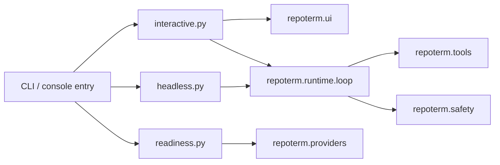

# App 包架构设计

本文描述 `repoterm/app/` 当前实现。App 是 RepoTerm 的应用装配层，负责把配置、Runtime、Provider、工具、权限、Session 和 UI 组合成可执行入口；它不定义 Agent 的决策规则，也不保存另一套运行时状态。

## 1. 设计目标与非目标

设计目标：

- 为交互式 TTY、无界面 Headless、readiness 检查和安装/结构检查提供稳定入口。
- 在入口处创建依赖并传递给下层，保持 `Runtime → Provider/Tools/Context/Safety` 的方向。
- 让 CLI 参数、环境变量和运行配置在进入 Agent Loop 前完成归一化。

非目标：

- 不在 App 中实现模型决策、工具权限判定、记忆注入或 TUI 渲染。
- 不把 `ScreenState`、`SessionData` 或 Runtime 的当前 Turn 状态混成一个对象。
- 不承诺 readiness 检查等同于真实模型调用；它只报告配置和可用性。

## 2. 模块架构

`app/__init__.py` 保持轻量公共出口，不批量导入入口实现。真正的装配发生在具体入口函数中，避免仅导入包就启动 TTY、读取凭据或创建数据库。

## 3. 核心文件与对象

| 文件 | 当前职责 | 使用时机 |
| --- | --- | --- |
| `interactive.py` | 解析交互入口并启动 `run_tty_app` | 默认终端会话 |
| `headless.py` | 运行无 TTY 的 Agent 回合、输出结果和事件 | CI、脚本或管道 |
| `readiness.py` | 汇总 Provider、扩展、权限和证据相关的 readiness 诊断 | `/readiness` 或独立检查 |
| `install.py` | 安装/初始化相关辅助命令 | 安装流程 |
| `structure_check.py` | 调用工程结构检查器并格式化报告 | 结构验收 |
| `engineering_structure.py` | 提供工程结构检查的适配入口 | 结构检查实现 |

入口依赖的公共数据类型来自 `repoterm/contracts/types.py`；Session 与 Memory 通过自己的服务接口接入，不由 App 直接操作底层表或文件格式。

## 4. 运行流程

交互式入口通常按以下顺序工作：解析参数 → 读取配置 → 准备 workspace → 创建或恢复 Session → 创建 Provider/Tool/Permission/Memory 服务 → 交给 `repoterm/ui/tty.py` 驱动主循环。Headless 入口复用同一 Runtime 能力，但不创建 TUI。

readiness 入口走较短路径：读取配置和环境 → 检查模型供应商、Fallback Simulation、扩展与工作区边界 → 生成结构化诊断。它不会把诊断结果伪装成模型回答。

## 5. 关键机制与决策

- 入口使用显式参数传递；需要延迟或可选的能力时，在函数内部导入，避免普通 `import repoterm.app` 产生副作用。
- 交互和 Headless 共用 Runtime 的回合语义，差异集中在输出和事件消费方式。
- CLI 层保留退出码和用户可读错误；下层的 `ToolResult`、`RuntimeEvent` 和 Provider 诊断仍保持结构化。
- 入口的 readiness/fallback 分支是配置检查与评测支持，不等于启用真实 Provider。

## 6. 失败处理与已知边界

- 参数、配置或 Provider 不能建立时，入口应输出诊断并以非零状态结束，不绕过权限或工具校验。
- Headless 不能依赖终端尺寸、光标控制或鼠标模式；TTY 的终端恢复由 `repoterm/ui/tty.py` 与 TUI 层负责。
- 结构检查依赖 `Package.EngineeringStructure` 的当前规则，报告可能指出仓库外部工程约束；App 只负责适配和展示。
- 交互入口的最终清理需要覆盖异常和 Ctrl+C，不能只依赖正常返回路径。

## 7. 依赖方向

App 可以依赖 Runtime、Provider、Tools、Safety、Session、Memory、Contracts、UI 和 Integrations。下层 Package 不应反向依赖 `repoterm.app`。尤其是 `runtime/planning`、`runtime/control`、`providers`、`context` 和 `safety` 不应为了 CLI 展示导入 App。

## 8. 测试与可观测性

- 入口行为：[`tests/test_main.py`](../../tests/test_main.py)、[`tests/test_headless.py`](../../tests/test_headless.py)。
- CLI、readiness 与入口：[`tests/test_cli_commands.py`](../../tests/test_cli_commands.py)、[`tests/test_headless.py`](../../tests/test_headless.py)。
- 结构契约：[`tests/contracts/test_app_package_contract.py`](../../tests/contracts/test_app_package_contract.py)。

入口本身不重复记录完整模型上下文；Runtime Event、Session transcript、日志和评测 Trace 分别由对应 Package 管理。

## 9. 阅读与维护

建议阅读顺序：`interactive.py`/`headless.py` → `repoterm/ui/tty.py` 或 `repoterm/runtime/loop.py` → 具体 Provider、Tool、Safety 和 Session 服务。新增入口能力时先确定它是默认路径、可选路径还是仅 readiness/evaluation 路径，再决定放在 App 还是下层 Package；不要把业务规则复制到 CLI 分支。
