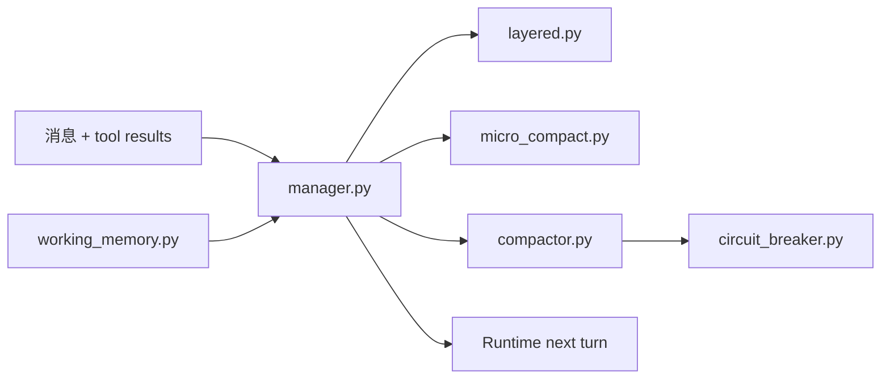

# Context 包架构设计

`repoterm/context/` 负责模型上下文预算、估算、压缩、分层和工作记忆。它在消息进入下一次模型调用前减少不可控增长，同时保留任务目标、工具证据和连续性信息；它不负责模型选择、权限判定或 TUI 布局。

## 1. 设计目标与非目标

目标是以可解释的预算和边界管理上下文：优先使用 Provider usage，缺失时使用本地估算；根据压力选择微压缩、摘要或更强的 compaction；保留后续决策所需的稳定任务信息。

非目标：

- 不把压缩后的文本当成事实验证或 Memory active 记录。
- 不在 Context 层执行工具、修改文件或直接调用 Provider API。
- 不用 UI 显示行数代替模型 token 预算。

## 2. 模块架构

## 3. 核心文件与对象

| 文件 | 当前职责 |
| --- | --- |
| `manager.py` | 模型窗口、token 估算、ContextStats、自动 compact 和状态保存 |
| `layered.py` | SYSTEM/PROJECT/SESSION/SCRATCHPAD 层及预算比例 |
| `micro_compact.py` | 对可压缩工具结果做本地、无 API 的成组压缩 |
| `compactor.py` | ToolResult 预算、读取去重、Session/Reactive/Auto compact 引擎 |
| `working_memory.py` | 有 TTL/重要性的工作记忆和 Conversation Continuity |
| `circuit_breaker.py` | 连续压缩失败后的熔断与 reset |

## 4. 运行流程

Runtime/Provider 提供消息和 usage（若有）给 `ContextManager`。Manager 计算 token、窗口占用和压力；低压力原样保留，进入压力阈值后优先微压缩旧的可读工具结果，必要时对较早历史做摘要/compaction。`LayeredContext` 和 `WorkingMemory` 负责把系统约束、项目内容、会话信息和临时工作内容分别放入预算。

压缩结果返回给 Runtime，下一次模型调用使用新的消息集合；压缩本身不改变源文件、Session 事务或 Memory 数据库。

## 5. 关键机制与决策

- `AUTOCOMPACT_THRESHOLD`、保留消息数、模型输出预留和层预算比例是当前代码的配置边界，不由调用方临时改写。
- Provider usage 优先；没有 usage 时记录 estimate-only/stale 原因，而不是伪造精确计数。
- `micro_compact` 对 read-only 结果较宽松，对 write/task/memory 等不可压缩或高风险内容保留更多信息。
- `StableTaskPack`/工作记忆保存目标、最新证据、验证状态、进度和剩余预算，避免摘要抹掉控制信息。
- 熔断器在连续失败后阻止重复压缩，需明确 reset 或新状态恢复。

## 6. 失败处理与已知边界

- token 估算是近似值；不同模型 tokenizer 的实际窗口仍由 Provider/模型返回和配置约束。
- 摘要/压缩失败时保留未压缩内容或进入有界降级，不能静默丢失失败/编辑/验证证据。
- 读结果去重只减少上下文，不代表文件内容未改变；下一次读取仍由工具决定。
- Context 层不保证模型理解摘要，也不保证压缩后任务一定完成。

## 7. 依赖方向

Context 可依赖 Contracts、配置、Provider usage 类型、Runtime 控制数据和 Observability 辅助；不依赖 App、UI 或 Benchmark。Runtime 调用 Context，Context 不反向调用 `runtime.loop`。

## 8. 测试与可观测性

- 压缩和预算：[`tests/test_context_compactor.py`](../../tests/test_context_compactor.py)、[`tests/test_micro_compact.py`](../../tests/test_micro_compact.py)、[`tests/test_compaction_robustness.py`](../../tests/test_compaction_robustness.py)。
- 分层/连续性/熔断：[`tests/test_circuit_breaker.py`](../../tests/test_circuit_breaker.py)、[`tests/test_context_cybernetics.py`](../../tests/test_context_cybernetics.py)。
- Runtime 保留证据：[`tests/test_agentops_scenarios.py`](../../tests/test_agentops_scenarios.py)。

Context 统计可进入 Runtime Event、Metrics 或控制器；完整原始工具输出仍不应因为统计而被写进长期 Memory。

## 9. 阅读与维护

先读 `manager.py` 的窗口/估算和 `micro_compact.py` 的保留规则，再读 `compactor.py` 的引擎，最后看 layered/working memory。修改阈值或保留策略必须同步压力、失败恢复和证据保留测试；不要通过 UI 快速修补 Context 语义。
