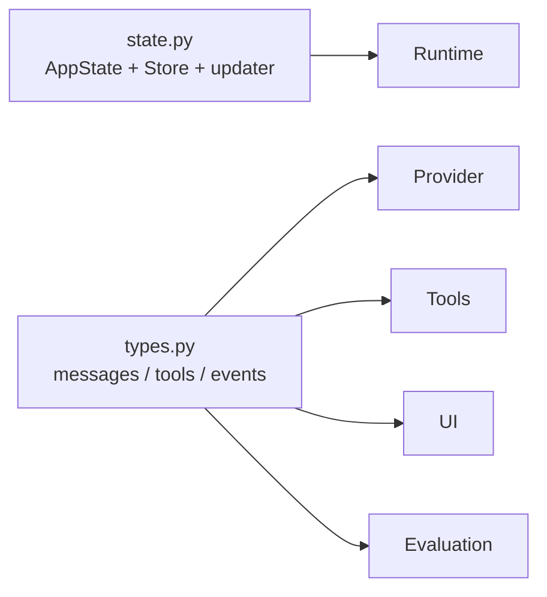

# Contracts 包架构设计

`repoterm/contracts/` 是 RepoTerm 的低层数据契约包。当前只包含 `state.py` 与 `types.py`，用于在 Runtime、Provider、Tools、Session、UI 和评测之间传递稳定的数据形状。

## 1. 设计目标与非目标

设计目标是提供低副作用、可导入、可测试的公共类型和状态更新器。该包不创建文件、不读取配置、不启动 Provider、不执行工具，也不承担业务编排。

它刻意不包含：Prompt 拼接、权限决策、持久化 schema、UI 展示格式和模型重试策略。调用方必须在自己的边界内解释这些类型。

## 2. 模块架构

`contracts` 是叶子层：生产代码只依赖标准库和类型声明所需的轻量模块，不依赖其他 `repoterm` Package。这样可以让循环导入在结构测试阶段暴露，而不是运行到某个入口才出现。

## 3. 核心文件与对象

| 文件 | 主要对象/内容 | 作用 |
| --- | --- | --- |
| `types.py` | `ChatMessage`、`ModelAdapter`、`AgentStep`、`ToolCall`、`ToolResult`、`RuntimeEvent` 等 | 连接模型、工具、Runtime、评测的值对象和 Protocol |
| `state.py` | `AppState`、泛型 `Store`、`create_app_store`、`update_*` updater | 保存应用级共享状态，并以 updater 表达改变 |
| `__init__.py` | 轻量包入口 | 避免导入时批量加载实现 |

其中 `RuntimeEvent` 描述可供 transcript/Trace 消费的运行时事件；它不是日志记录，也不等于 TUI 的 `UiEvent`。`AppState` 是应用运行状态，也不是 Session 快照，不能直接当作持久化格式。

## 4. 运行流程

App 或 TUI 通过 `create_app_store()` 创建 `Store[AppState]`，再用 `get_state()` 读取状态、用 `set_state(update_message_count(3))` 等 updater 写入新状态。模型适配器返回 `AgentStep`，工具层生成结构化 `ToolResult`，Runtime 通过 `RuntimeEvent` 报告阶段变化；这些对象随后由 App、UI 或 Evaluation 消费。

类型契约不负责决定事件何时发出，也不负责把消息写入 Session。它只保证字段、枚举/字面量和调用协议稳定。

## 5. 关键机制与决策

- `Store[AppState]` 通过 updater 统一改变状态，并可通知 subscriber，避免调用方绕过状态容器更新共享值。
- 类型尽量使用标准库 dataclass、Protocol、TypedDict 和 Literal，降低底层导入成本。
- `ToolResult` 同时表达成功、错误、后台任务和等待用户等结果，工具注册器负责规范化具体异常。
- `ModelAdapter` 隔离真实 Provider 与 `MockModelAdapter`，Runtime 不需要知道供应商 SDK 细节。

## 6. 失败处理与已知边界

- 类型契约不会替调用方校验外部 JSON；Provider、工具和 Session 仍需在各自边界做解析与降级。
- 状态更新器表达的是内存中的一次更新，不提供并发锁、磁盘事务或跨进程一致性。
- `RuntimeEvent` 的字段可能为空；消费者必须按事件类别处理，而不能假设所有事件都有 phase、step 或 stop reason。

## 7. 依赖方向

方向固定为 `contracts → 无 RepoTerm 下层`，其他 Package 依赖 `contracts`。禁止 `contracts` 反向导入 `runtime`、`tools`、`ui`、`app` 或 `benchmarks`。

## 8. 测试与可观测性

- 公共符号、叶子依赖和 updater 行为：[`tests/contracts/test_contracts_package_contract.py`](../../tests/contracts/test_contracts_package_contract.py)。
- Runtime 事件与状态使用：[`tests/test_agent_loop.py`](../../tests/test_agent_loop.py)、[`tests/test_turn_kernel.py`](../../tests/test_turn_kernel.py)。
- 工具/Provider 适配：[`tests/contracts/test_runtime_core_package_contract.py`](../../tests/contracts/test_runtime_core_package_contract.py)。

该包不产生日志或 Trace。需要审计决策时使用 [`repoterm/observability/README.zh-CN.md`](../observability/README.zh-CN.md)，需要保存快照时使用 [`repoterm/session/README.zh-CN.md`](../session/README.zh-CN.md)。

## 9. 阅读与维护

先读 `types.py` 的 Protocol 和值对象，再读 `state.py` 的 updater/Store，最后查看调用方。新增字段时优先考虑兼容默认值与契约测试；不要把某个具体 Provider、TUI 或持久化实现塞进本包。
