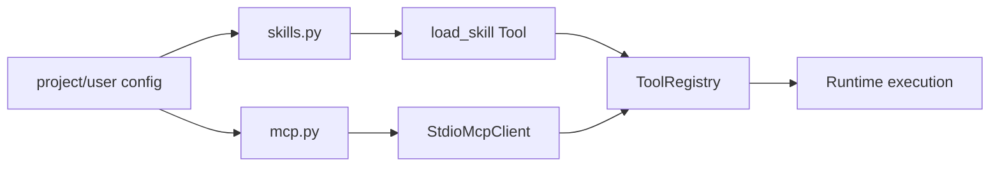

# Integrations 包架构设计

`repoterm/integrations/` 连接 RepoTerm 与外部 Skills、MCP Server。它负责发现、配置校验、受限启动和结果转换，最终把外部能力包装成 Tools；它不直接改变 Runtime 或 Permission 的决策语义。

## 1. 设计目标与非目标

目标是让外部扩展以显式、可列举、可释放的方式进入 ToolRegistry，并对命令、参数、载荷大小和通信格式设置边界。

非目标：不默认执行任意 shell，不把 MCP/Skill 能力当作可信代码，也不绕过 workspace、PermissionManager、Tool validator 或 Runtime 验证。

## 2. 模块架构

## 3. 核心文件与对象

| 文件 | 当前职责 |
| --- | --- |
| `skills.py` | `SkillSummary`/`LoadedSkill`、项目/用户 roots 的发现、加载、安装和删除 |
| `mcp.py` | `McpServerSummary`、命令白名单、参数/载荷校验、stdio JSON 通信、MCP tool 包装与 dispose |
| `__init__.py` | 轻量包入口 |

Skills 会从项目/用户 `.repoterm/skills` 以及兼容的 `.claude/skills` roots 发现，并按名称去重。MCP 客户端采用延迟启动，支持 content-length 或 newline JSON 响应，并将结果归一化成工具结果。

## 4. 加载与调用流程

创建 ToolRegistry 时，Tools 组合入口根据 workspace 和 runtime 配置调用 `discover_skills` 与 `create_mcp_backed_tools`。只有显式可发现、通过校验的能力会加入 Registry。模型调用时仍经过 Registry 的 schema、validator、ToolContext 和权限边界；会话结束由 disposer 关闭 MCP 客户端。

Skill 安装/删除和 MCP 配置管理由 UI/App 命令触发，Integrations 只完成其对应的文件/协议操作，不替 UI 决定用户是否确认。

## 5. 关键机制与决策

- MCP server 命令使用允许列表并检查危险 shell 字符；协议 payload 有大小上限。
- 外部客户端按请求 ID/队列等待响应，通信超时和格式错误转换为可解释失败。
- Skills 的优先级由项目/用户 roots 和名称去重规则决定；同名能力不重复注入。
- 外部工具进入 ToolRegistry 后，与内置工具共享参数、权限、输出截断和生命周期规范。

## 6. 失败处理与已知边界

- server 不存在、命令不允许、进程启动失败、响应损坏、超时或 payload 过大都必须失败返回并释放资源。
- Skill 文档/脚本不是自动可信；加载失败不应让模型得到一个不存在的工具。
- Integrations 无法保证外部服务本身可用；readiness/诊断和实际调用结果要分开记录。
- PermissionManager 仍是文件/命令边界，Integrations 不能通过 MCP 旁路获得额外权限。

## 7. 依赖方向

Integrations 可以依赖配置、标准库、Contracts、Tools 的公共定义和安全辅助；Tools/Runtime/App/UI 调用它。它不应依赖 TUI 渲染、具体 Provider 或 Benchmark，也不能反向导入 Runtime Loop 来执行任务。

## 8. 测试与可观测性

- MCP 协议和校验：[`tests/test_mcp.py`](../../tests/test_mcp.py)。
- Skills 发现和生命周期：[`tests/test_skills.py`](../../tests/test_skills.py)。
- 工具注册接线：[`tests/contracts/test_tool_package_imports.py`](../../tests/contracts/test_tool_package_imports.py)。

启动、通信和释放可以写日志/指标，但不要记录完整 secret、MCP payload 或用户 Skill 内容；需要 Trace 时由 Runtime/评测层消费结构化 ToolResult。

## 9. 阅读与维护

先读 `skills.py` 的 roots/dedup，再读 `mcp.py` 的命令校验、协议读取和 disposer，最后看 Tools 组合入口。新增外部集成时必须明确默认是否加载、权限入口、资源释放、大小/超时边界和离线测试替代方案。
