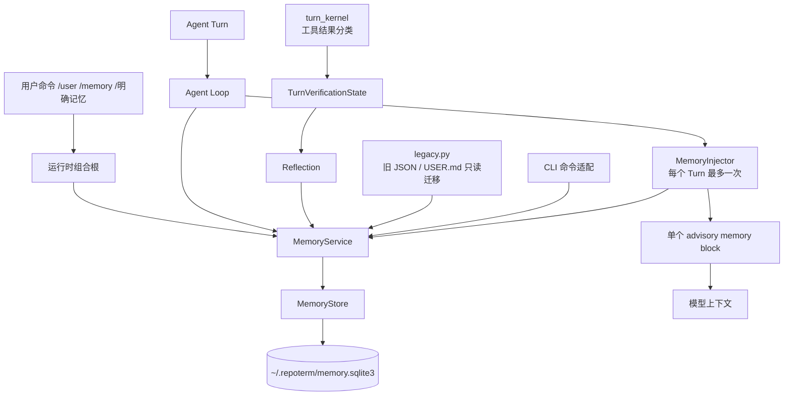
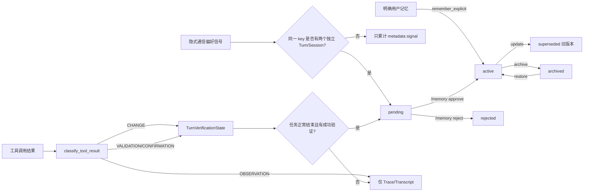
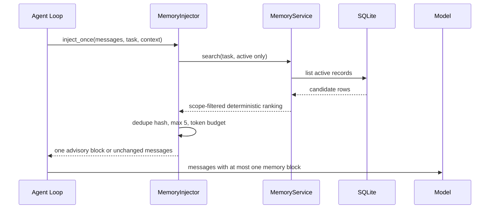
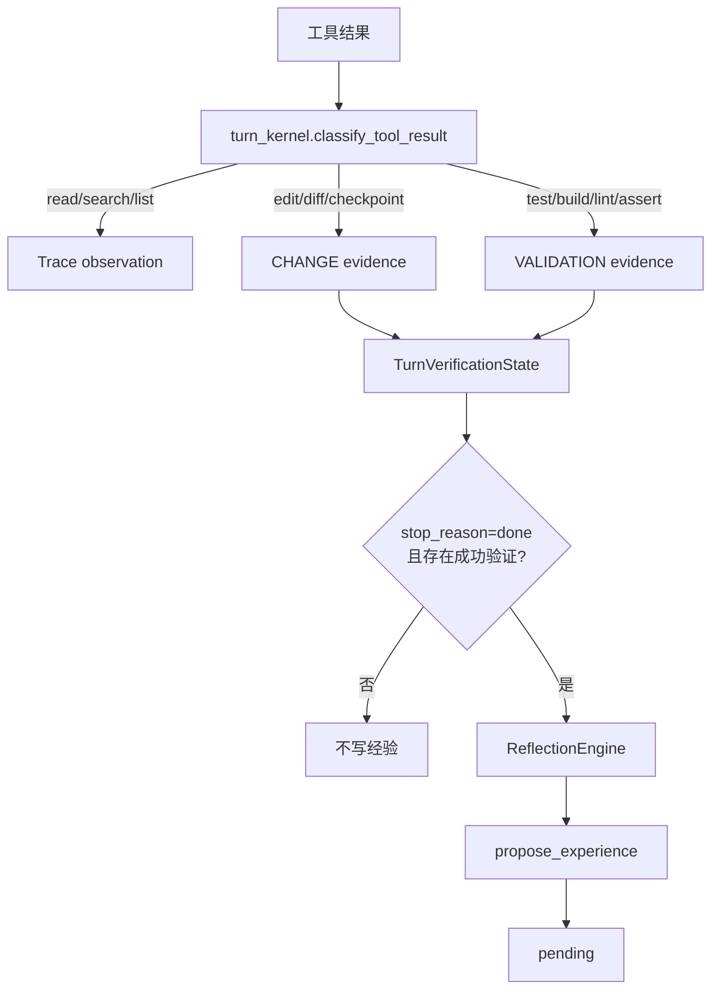

# RepoTerm 记忆系统设计文档

本文是 `repoterm/memory/` 当前实现的设计说明。它描述代码已经执行的边界和数据流，不是旧版 `memory.py`、Pipeline、Vector 或 Reranker 的设计，也不定义一套与代码分离的“理想行为”。阅读本目录代码时，建议先看本文，再按“模型 → 存储 → 服务 → 注入 → 运行时接线”的顺序阅读。

## 1. 设计目标与非目标

记忆系统的核心目标是：把少量、可复用、可审计的用户事实或经验保存到一个 SQLite 数据库，并在每个 Agent Turn 开始时以确定性的方式提供给模型。

它坚持以下边界：

- SQLite 是唯一的新记忆真值源；`USER.md` 和旧 JSON 只能作为迁移输入或只读展示来源。
- 用户明确要求记住的内容可以直接成为 `active`；模型或系统生成的内容必须先成为 `pending`，等待用户批准。
- 普通对话、源码正文、搜索结果、原始工具输出、Diff 和模型推测留在 Transcript/Trace，不自动进入长期记忆。
- 记忆检索不使用向量库、Embedding、LLM Reranker 或隐藏的第二条注入链路；检索排序、条数和预算均可重复。
- 证据只保存有界摘要和来源引用，不保存完整 stdout/stderr、源码、Diff 或凭据。

## 2. 总体架构



各层的责任只有一条主线：

| 层 | 主要文件 | 责任 | 不负责的事情 |
| --- | --- | --- | --- |
| 数据模型 | `models.py` | 枚举、`MemoryEntry`、`MemoryContext`、`VerificationEvidence`、规范化和敏感信息检查 | SQLite 查询、Prompt 拼接 |
| 持久化 | `store.py` | schema、连接生命周期、事务、行映射和基础查询 | 业务授权、检索排序、Agent 状态 |
| 业务服务 | `service.py` | 写入门禁、生命周期、scope、查重、冲突、迁移事务和确定性搜索 | 直接操作模型消息、解析完整工具输出 |
| Prompt 注入 | `injector.py` | 从 Service 选择 active 记忆、限条数/Token、生成单一安全块、幂等注入 | 写入记忆、判断经验是否已验证 |
| 运行时证据 | `turn_kernel.py` | 把工具结果分类并维护当前 Turn 的验证状态 | 把观察结果直接写成长久记忆 |
| 反思 | `agent_reflection.py` | 根据共享验证状态生成最多一个 pending 经验候选 | 自己从 assistant 文本推断验证成功 |
| 迁移 | `legacy.py` | 读取旧文件、整源安全扫描、原子导入和 marker | 修改或删除旧文件 |

## 3. 两条数据流：写入和读取

### 3.1 写入流



写入统一经过 `MemoryService._create()`。它按以下顺序执行：

1. 检查内容是否像 API key、token、密码、Cookie 等敏感信息。
2. 规范化 scope、kind、key 和 workspace/branch context。
3. 创建候选 `MemoryEntry`，计算 `content_hash`。
4. 在同一个 SQLite 事务中处理来源 Turn 去重、同内容去重、同 key 的 pending 冲突和 active 冲突。
5. 记录 `last_write_decision`，返回最终记录。

同一个 scope/context/key 的冲突规则是：

- 同内容：`NOOP`，已有记录的 `signal_count` 加一，不增加重复行。
- 不同内容且已有 pending：旧 pending 变为 `superseded`，新内容成为唯一 pending。
- 已有 active 时：active 保持不变；新内容仍是 pending，只有批准后才替换 active。
- 用户批准 pending：旧 active（若有）变为 `superseded`，批准项成为 active。

### 3.2 读取和注入流



注入块明确标记为 advisory。它不能覆盖系统指令、权限边界、工具安全规则或当前用户的新指令。`inject_once()` 先检测块标记，已有块时直接返回，从而防止 Main、TUI、ContextCompactor 和 Agent Loop 重复注入。

## 4. 核心数据模型

### 4.1 作用域、类型和状态

`Scope` 只有三种实际语义：

- `global`：跨项目的用户偏好；
- `project`：当前 workspace 的项目记忆；
- `branch`：当前项目和 Git branch 的记忆。

`user` 是 `global` 的兼容别名，`local` 是 `project` 的兼容别名，不代表另一套存储。

`Kind` 被限制为 `preference`、`decision`、`constraint`、`lesson`。`Status` 描述生命周期：

```text
pending -> active -> archived -> active
   |         |
   v         v
rejected  superseded
```

`superseded` 表示它被更新版本替代，`rejected` 表示用户拒绝候选；这两种状态不会被检索为 active 记忆。

### 4.2 `MemoryEntry`

持久化字段包括：

| 字段 | 用途 |
| --- | --- |
| `id` | 记录身份；新记录使用 UUID |
| `scope/project_key/branch_name` | 隔离可见范围 |
| `kind/key/content` | 业务含义、规范化业务 key 和正文 |
| `status` | pending/active 等生命周期状态 |
| `source_type` | explicit user、verified task 或 migration |
| `source_session_id/source_turn_id` | 回到运行时来源的审计引用 |
| `version/supersedes_id` | 版本关系 |
| `content_hash` | 同 scope/context 下的确定性去重键 |
| `signal_count` | 同内容独立信号累计次数 |
| `evidence` | 最多三条结构化、有界证据摘要 |
| `created_at/updated_at/expires_at` | 生命周期和过期控制 |

旧接口中的 `category/tags/domains/tier` 只作为兼容输入或展示字段，不参与新 SQLite schema 的检索决策。

### 4.3 `VerificationEvidence`

证据有四个层级：

- `OBSERVATION`：读取、搜索、列目录等观察；只进 Trace，不创建证据对象。
- `CHANGE`：编辑、写入、Diff、checkpoint；用于判断失败后是否发生修复，不能单独证明完成。
- `VALIDATION`：测试、构建、lint、类型检查、schema/file assert 等验证。
- `CONFIRMATION`：用户明确确认结果。

只有成功的 `VALIDATION` 或 `CONFIRMATION` 满足 `supports_experience`，才可进入经验候选。摘要会压缩空白、替换敏感模式并限制长度；完整工具输出不进入记忆数据库。

## 5. SQLite 设计与生命周期

生产数据库路径由 `repoterm.config.REPOTERM_DIR` 决定，默认是：

```text
~/.repoterm/memory.sqlite3
```

核心表：

```sql
metadata(key TEXT PRIMARY KEY, value TEXT NOT NULL)

memory_entries(
  id TEXT PRIMARY KEY,
  scope TEXT NOT NULL,
  kind TEXT NOT NULL,
  key TEXT,
  content TEXT NOT NULL,
  status TEXT NOT NULL,
  project_key TEXT,
  branch_name TEXT,
  source_type TEXT NOT NULL,
  source_session_id TEXT,
  source_turn_id TEXT,
  version INTEGER NOT NULL,
  supersedes_id TEXT,
  content_hash TEXT NOT NULL,
  signal_count INTEGER NOT NULL,
  evidence_json TEXT NOT NULL,
  created_at REAL NOT NULL,
  updated_at REAL NOT NULL,
  expires_at REAL
)
```

`MemoryStore._connection()` 负责普通查询的“打开—使用—关闭”；`transaction()` 负责 `BEGIN IMMEDIATE`、成功提交、异常回滚和最终关闭。不能把 `sqlite3.Connection` 的上下文管理器误认为 close 管理器：因此代码显式包了一层 `_connection()`，避免 Windows 下数据库文件被未关闭连接占用。

schema 初始化和 v1→v2 升级也在事务内完成。`evidence_json` 由 `VerificationEvidence.to_dict()` 序列化，读回时由 `MemoryStore._entry_from_row()` 还原为模型对象。

## 6. 证据门禁和反思



`TurnVerificationState` 是当前 Turn 的唯一验证真值。Reflection 可以使用执行 trace 生成用户可见的诊断，但不能用 assistant 输出或原始 trace 自己“推断”验证成功。经验正文必须同时包含可复用的条件、动作和验证结果，并且只保存证据摘要与 session/turn 引用。

失败恢复还要求：失败验证之后确实发生 CHANGE，且后续又有成功验证。仅有一次失败测试、一次编辑，或只有“任务完成”的 assistant 文本，都不能生成经验候选。

## 7. 迁移和安全边界

`legacy.migrate_legacy()` 读取：

- 全局 `~/.repoterm/memory/memory.json`；
- 全局 `~/.repoterm/USER.md`；
- workspace 下的旧 project/local JSON；
- workspace 下的旧 `USER.md`。

迁移是非破坏性的：不修改、不删除旧文件。每个来源是不可分割的迁移单元：

1. 先读取原始 bytes，计算 source hash。
2. 对整个原始来源做敏感信息扫描；出现 credential-looking 内容时整源拒绝。
3. 解析和校验每条记录；二次检查转换后的正文。
4. 在一次事务中插入所有新记录并写 migration marker。
5. 任一插入或 marker 写入失败，整个事务回滚且不写 marker，下一次仍可重试。

marker 只表示“该 source hash 已完整迁移”，不是“曾经尝试过”。因此部分失败不会阻塞修复后的重试。

## 8. 运行时接线约定

组合根创建一个 `MemoryService` 实例，并把同一对象传给 Agent Loop、CLI 和 Reflection：

```python
memory_service = create_memory_service(workspace=cwd, runtime=runtime)
```

Agent Loop 负责唯一注入点；CLI 只调用 Service 生命周期 API，不自己拼 Prompt；Reflection 只通过 `propose_experience()` 写 pending；`user_profile.py` 只读旧 `USER.md`，`/user set` 写 `global + preference` 的 SQLite 记录。任何新调用方都应遵循：

- 需要长期保存 → 调用 `remember_explicit()` 或 `propose_experience()`；
- 需要显示候选 → 调用 `list_pending()`；
- 需要改变生命周期 → 调用 `approve/reject/update/archive/restore/purge`；
- 需要上下文 → 调用 `search()` 或 `build_prompt_context()`，不要直接读数据库；
- 需要工具证据 → 使用共享 `TurnVerificationState`，不要从原始字符串重建门禁。

## 9. 命令与常见示例

```text
/memory status
/memory list
/memory pending
/memory approve <id>
/memory reject <id>
/memory update <id> <new content>
/memory archive <id>
/memory restore <id>
/memory delete <id> --confirm

/user show
/user pending
/user set preferences.language Chinese
```

示例：明确偏好直接 active：

```python
service.remember_explicit(
    "preferences.language = Chinese",
    scope=Scope.GLOBAL,
    kind=Kind.PREFERENCE,
    key="preferences.language",
)
```

示例：经验必须带同一 Turn 的成功验证证据：

```python
evidence = VerificationEvidence.create(
    level=EvidenceLevel.VALIDATION,
    kind=EvidenceKind.TEST,
    tool_name="pytest",
    ok=True,
    summary="pytest: 12 passed",
    source_session_id=session_id,
    source_turn_id=turn_id,
)
service.propose_experience(
    "Applicable condition: ... Effective action: ... Verification result: ...",
    evidence=(evidence,),
)
```

## 10. 阅读代码和维护准则

推荐阅读顺序：

1. `models.py`：理解合法值、规范化和敏感信息边界；
2. `store.py`：理解连接必须关闭、事务必须原子；
3. `service.py`：理解每种来源如何进入不同状态；
4. `injector.py`：理解检索排序、预算和幂等注入；
5. `turn_kernel.py` / `agent_loop.py` / `agent_reflection.py`：理解证据从工具到 pending 的路径；
6. `legacy.py`：理解旧数据如何安全迁移。

修改时不要重新引入：

- workspace 下第二个 memory.sqlite3 或 `.repoterm-memory` 真值库；
- USER.md 写入路径；
- 第二个 Injector、Reranker、Pipeline 或隐式 Prompt 拼接点；
- 用 assistant 文本、read_file 成功或普通 shell 成功代替 VALIDATION/CONFIRMATION；
- 在逐条导入后提前写 migration marker。

建议至少运行：

```powershell
python -B -m pytest -q --tb=short -p no:cacheprovider tests/memory tests/contracts
python -B -m pytest -q --tb=short -p no:cacheprovider
```

本文只记录设计和维护规则；验收数字以当前测试运行结果为准。
