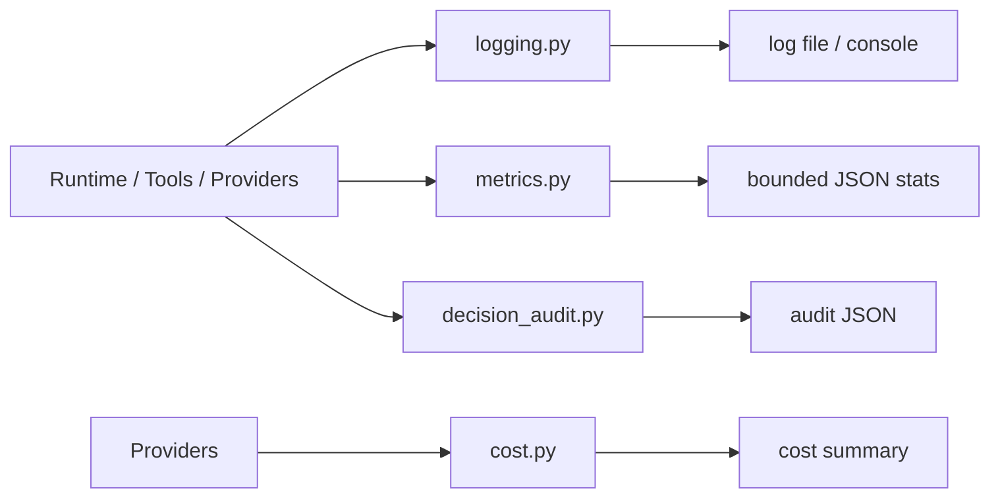

# Observability 包架构设计

`repoterm/observability/` 提供日志、指标、成本和决策审计四类运行辅助。它们记录不同粒度的事实，不能互相替代：Runtime Event/Trace 是回合事件流，Session 是会话持久化，Observability 是诊断与统计层。

## 1. 设计目标与非目标

目标是让 Provider 调用、工具执行、权限/Session 事件、回合耗时、成本和重要决策可被结构化记录，并在失败时提供有限的诊断信息。

非目标：不改变 Agent 决策、不保存完整 Prompt/工具输出、不替代 Session/Memory，也不在包初始化时自动配置全局 logger 或打开文件。

## 2. 模块架构

## 3. 核心文件与对象

| 文件 | 当前职责 |
| --- | --- |
| `logging.py` | `setup_logging`、`StructuredFormatter`、logger 和 API/tool/permission/session 事件辅助 |
| `metrics.py` | `AgentMetricsCollector`、Turn/Tool 记录、统计与有限历史存储 |
| `cost.py` | 模型价格表、`ModelUsage`、Decimal 成本计算和汇总格式化 |
| `decision_audit.py` | `DecisionRecord`、`DecisionAuditor`、决策链、统计、保存/导出 |
| `__init__.py` | 空公共出口，避免导入副作用 |

## 4. 数据流

Provider/Tool/Runtime 在明确边界调用日志和指标辅助；Provider usage 与模型信息进入 `CostTracker` 计算成本；路由、工具、模型、权限、Memory、Context、重试和 fallback 等决策可以写入 `DecisionAuditor`。日志面向诊断，指标面向聚合，成本面向用量，审计面向单项决策链。

日志默认写入 `REPOTERM_DIR / "repoterm.log"`（配置启用文件时），指标保存有界的 JSON 历史，Decision Audit 默认保存到 `.repoterm/audit` 目录。具体启用方式由调用方/配置决定，不是导入包时自动发生。

## 5. 关键机制与决策

- `StructuredFormatter` 保持结构化字段，敏感信息由调用边界控制，不把完整消息/响应直接打印。
- Metrics 以 Turn 和 Tool 为单位，保留有限历史，避免统计文件无限增长。
- Cost 使用 Decimal 和当前模型价格表计算，记录 usage/error/code change 等维度。
- Audit 记录 decision type、outcome、上下文和链关系，可更新、导出和清理；它不替代 Runtime Event。

## 6. 失败处理与已知边界

- 日志/指标/审计写入属于诊断辅助；存储失败不能改变主流程的权限、工具或验证语义。
- 成本是基于可用 usage/价格配置的估算；缺少价格或 token 时不能宣称精确账单。
- 审计记录不是不可抵赖的安全日志，也不包含完整凭据；需要安全证据时遵守 Safety 的脱敏规则。
- Console/file logging 的级别、路径和轮转由现有配置保持，新增调用不得顺手改变格式。

## 7. 依赖方向

Observability 可依赖配置、Contracts 和标准库；Runtime、Provider、Tools、Session、UI 调用它。它不应依赖 App、TUI、Benchmark 或具体业务决策模块，也不应从日志回调反向驱动 Runtime。

## 8. 测试与可观测性

- 日志行为与敏感字段：[`tests/test_logging_hardening.py`](../../tests/test_logging_hardening.py)。
- 成本：[`tests/test_cost_tracker.py`](../../tests/test_cost_tracker.py)。
- Agent/Provider/控制器的使用：[`tests/test_agent_intelligence.py`](../../tests/test_agent_intelligence.py)、[`tests/test_cluster_stress.py`](../../tests/test_cluster_stress.py)。
- 目录与导入：[`tests/contracts/test_package_architecture_contract.py`](../../tests/contracts/test_package_architecture_contract.py)。

维护时要先判断记录属于 Runtime Trace、Session transcript、日志、指标、成本还是决策审计，再选择接口；不要把同一份大文本复制到所有通道。

## 9. 阅读与维护

先读 `logging.py` 的配置和字段，再读 Metrics/Cost 的生命周期，最后读 Audit 的链与持久化。新增事件时明确数据敏感性、生命周期和是否默认启用，并为写入失败、边界长度和格式稳定性补测试。
