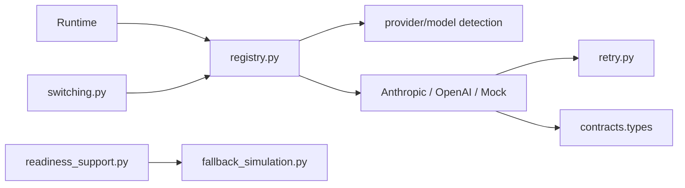

# Providers 包架构设计

`repoterm/providers/` 隔离模型供应商、Adapter、重试、切换和 readiness/fallback 支持。Runtime 只依赖 `ModelAdapter` 等公共契约，不需要知道 Anthropic/OpenAI 的请求格式。

## 1. 设计目标与非目标

设计目标：统一模型选择和调用接口、把供应商错误分类并进行有界重试、支持真实 Adapter 与确定性 Mock Adapter 共存。

非目标：不在 Provider 内实现 Agent Loop、工具权限、Prompt 业务逻辑或 Session 持久化；Fallback Simulation 也不表示真实模型可用。

## 2. 模块架构

## 3. 核心文件与对象

| 文件 | 当前职责 | 默认/可选 |
| --- | --- | --- |
| `registry.py` | `Provider`、模型目录、选择信号/决策、Adapter 工厂和配置构建 | 默认装配入口 |
| `anthropic.py`、`openai.py` | 真实供应商 HTTP Adapter | 按配置可选 |
| `mock.py` | 确定性 `MockModelAdapter` | 测试/离线回归 |
| `retry.py` | 错误分类、退避和最大重试 | Adapter 辅助 |
| `switching.py` | 模型候选切换和 fallback 选择 | 配置/运行时可选 |
| `fallback_simulation.py` | 凭据/URL 诊断与模拟 fallback 预览 | readiness/评测支持 |
| `readiness_support.py` | Provider readiness 诊断辅助 | readiness 路径 |

## 4. 调用流程

应用根据配置调用 `registry` 解析 Provider 和模型，生成 `ModelAdapter`。Runtime 传入 `ChatMessage` 并接收 `AgentStep`；Adapter 负责请求/响应转换，`retry.py` 只对可重试类别做有界退避。发生不可恢复错误时，`switching.py` 可以根据候选和 readiness 选择下一模型，最终由 Runtime 处理停止原因。

Mock Adapter 使用脚本化响应和工具结果，服务于确定性测试，不访问真实 API。Fallback Simulation 只产生诊断/预览，不隐式读取密钥并发起真实调用。

## 5. 关键机制与决策

- `registry.py` 是 Provider 的公共组合入口；Adapter 内部细节不泄漏给 Runtime。
- 错误分类区分认证、限流、服务端、网络、输入等类别；重试次数、退避和超时有边界。
- 响应转换保留 Runtime 需要的工具调用、文本和停止信息；Provider 特有字段不改变公共契约。
- readiness 与 live call 分开，防止“配置看起来可用”被误报为“已成功调用模型”。

## 6. 失败处理与已知边界

- 认证错误通常不可重试；限流/服务不可用可能重试或切换，具体以 `classify_error` 和切换策略为准。
- Provider 不能绕过 ToolRegistry、PermissionManager 或 Runtime 的验证门禁。
- 网络响应解析失败不能伪造成空的成功回答；应返回结构化错误给 Runtime。
- `switching.py` 的候选是否可用依赖当前配置；它不负责安装密钥或修改用户配置。

## 7. 依赖方向

Providers 依赖 Contracts、配置、标准库和必要的 Observability；不依赖 `runtime.loop`、App、UI、Session 或 Benchmark。Runtime 和 App 依赖 Provider，而不是相反。

## 8. 测试与可观测性

- 目录和反向依赖：[`tests/contracts/test_package_architecture_contract.py`](../../tests/contracts/test_package_architecture_contract.py)。
- Adapter：[`tests/test_anthropic_adapter.py`](../../tests/test_anthropic_adapter.py)、[`tests/test_openai_adapter.py`](../../tests/test_openai_adapter.py)、[`tests/test_mock_model.py`](../../tests/test_mock_model.py)。
- 选择/重试/切换：[`tests/test_model_selection_controller.py`](../../tests/test_model_selection_controller.py)、[`tests/test_model_switching.py`](../../tests/test_model_switching.py)。
- Fallback：[`tests/test_fallback_simulation.py`](../../tests/test_fallback_simulation.py)。

API 调用、成本和错误的记录由 [`repoterm/observability/README.zh-CN.md`](../observability/README.zh-CN.md) 说明；敏感响应不得完整写入日志或 Memory。

## 9. 阅读与维护

先读 `registry.py` 的公共模型和工厂，再读 `retry.py`/`switching.py`，最后读具体 Adapter。新增 Provider 时先实现 Contracts 兼容的 Adapter，再补错误分类、readiness 和不调用真实网络的测试；不要把 Provider 特有分支扩散到 Runtime。
