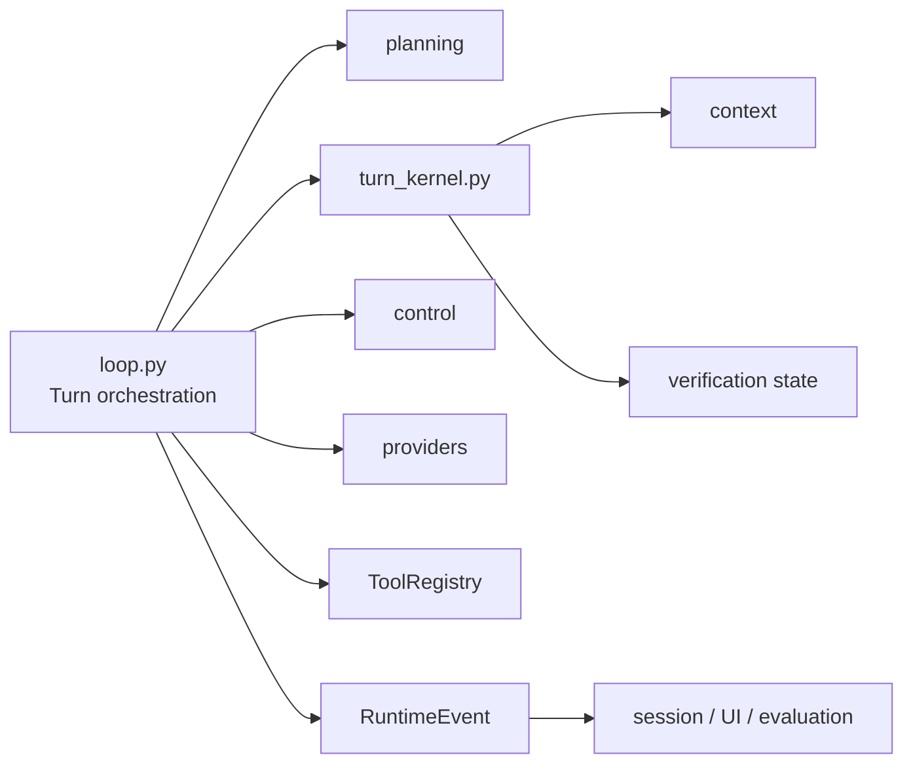

# Runtime 包架构设计

`repoterm/runtime/` 是 Agent 回合的执行层。它把规划结果、模型适配器、ToolRegistry、上下文治理、安全检查和验证状态组织成有限步骤的 Turn，并对外发布 `RuntimeEvent`。它不负责终端绘制、CLI 参数解析或 SQLite 记忆表操作。

## 1. 设计目标与非目标

当前实现的目标是让一次 Agent Turn 可恢复、可观察、可验证：模型产生步骤，工具执行并返回结构化结果，Runtime 根据证据和预算决定继续、重试、扩大搜索或停止。

非目标包括：

- 不把 Runtime 当作 TUI 主线程；TUI 只消费 Runtime/Worker 事件。
- 不让 assistant 的自然语言单独打开完成门禁或经验写入门禁。
- 不把 Provider 重试、Context 压缩、Permission 决策和 Session 存储重新实现一遍。

## 2. 模块架构

核心层级是 `loop.py` 的编排、`turn_kernel.py` 的回合状态与证据分类、`planning/` 的意图/任务信息、`control/` 的预算和反馈控制。`reflection.py` 使用共享验证状态生成候选，但不替代 Runtime 的验证门禁。

## 3. 核心文件与对象

| 文件/目录 | 当前责任 |
| --- | --- |
| `loop.py` | `run_agent_turn`、模型调用、工具调用、停止/恢复、事件回调和一次性 Runtime 组装 |
| `turn_kernel.py` | `TurnVerificationState`、工具结果分类、阶段状态和完成证据 |
| `planning/` | 意图解析、Prompt 组合、路由、任务对象与能力目录；见 [`planning/README.zh-CN.md`](planning/README.zh-CN.md) |
| `control/` | 验证、进度、稳定性、反馈和上下文控制器；见 [`control/README.zh-CN.md`](control/README.zh-CN.md) |
| `surfaces.py` | Runtime 可供 App/UI 查询的产品表面摘要，不导入 UI |
| `hooks.py` | Hook 注册/执行等运行时扩展点 |
| `reflection.py` | 根据共享验证结果提出 pending 经验候选 |
| `runtime_profiles.py` | Runtime profile 配置和边界 |

## 4. 一次 Turn 的流程

入口收到消息后，Runtime 准备 `ChatMessage`、工具注册器、workspace 和运行配置；随后按 explore/execute/verify 等阶段调用模型。模型的工具调用经过 `ToolRegistry` 校验与执行，结果回到消息历史和 `TurnVerificationState`。

每一步都受最大步数、空响应/错误重试和控制器反馈约束。成功验证、失败恢复、widening、compaction、stop reason 等状态以 `RuntimeEvent` 发布；当停止条件满足时返回消息集合和结构化事件，而不是无限等待。

## 5. 关键机制与决策

- 工具结果分为观察、变更、验证/确认等证据层级；读取源码不能伪造任务完成证据。
- 完成门禁需要任务结束语义和成功验证证据；只出现“已完成”的 assistant 文本不会让 Runtime 直接通过。
- 默认配置下，代码或配置文件发生变更后也必须取得针对最新变更的成功验证证据；明显的纯文档/媒体修改不被强制要求运行代码测试。证据不足时 Runtime 要求执行聚焦验证或明确报告阻塞原因，而不是接受模型自行宣布完成。
- 进展治理器的有界计数、指纹、恢复窗口和共享验证状态写入 Session checkpoint；恢复同一消息轨迹时继续原治理段，新增用户消息则开启新段。
- Context 压力由 `repoterm/context` 处理，Runtime 只协调何时使用其结果并保留 StableTaskPack 所需状态。
- 单个 Turn 的 Memory 注入由 Runtime 统一接线；Main/Headless/UI 不应另外拼接同一记忆块。
- 运行失败走有界恢复：重试、widening、错误回传或明确 stop reason，不能静默吞异常。

## 6. 失败处理与已知边界

- Provider 错误、工具错误、空输出和超步数会形成不同 stop/recovery 事件；上层应展示或记录原因，而不是只显示空答案。
- Runtime 不可能验证任意外部副作用；它依赖工具返回的验证结果和权限系统的记录。
- `tools/task.py` 仍是一个工具入口到 Runtime 的既有跨层点，结构报告将其作为已知边界保留。
- Runtime Event 是事件流，不是完整审计日志、Session 快照或 TUI 绘制指令。

## 7. 依赖方向

Runtime 可以依赖 Contracts、Planning、Control、Provider、Context、Safety、Tools、Observability、Memory 和 Session 接口；不应依赖 `repoterm.app`、`repoterm.ui` 或 `benchmarks.evaluation`。`providers`、`context`、`safety` 和低层 Planning/Control 不得反向导入 `runtime.loop`。

## 8. 测试与可观测性

- Runtime 主循环和契约：[`tests/contracts/test_runtime_loop_package_contract.py`](../../tests/contracts/test_runtime_loop_package_contract.py)、[`tests/contracts/test_runtime_core_package_contract.py`](../../tests/contracts/test_runtime_core_package_contract.py)。
- 状态与证据：[`tests/test_turn_kernel.py`](../../tests/test_turn_kernel.py)、[`tests/test_agent_loop.py`](../../tests/test_agent_loop.py)。
- 确定性回归：[`tests/test_agentops_scenarios.py`](../../tests/test_agentops_scenarios.py)。
- 评测消费 Runtime 事件：[`benchmarks/evaluation/runtime_profile.py`](../../benchmarks/evaluation/runtime_profile.py)。

日志、指标、成本与决策审计由 [`repoterm/observability/README.zh-CN.md`](../observability/README.zh-CN.md) 说明；Trace 导出由 App/评测侧消费，不应在 Loop 内复制一份展示格式。

## 9. 阅读与维护

建议顺序：`loop.py` → `turn_kernel.py` → `planning/` → `control/`，再根据调用点阅读 Context、Tools、Safety 和 Provider。改动 Runtime 时先写清楚它影响的是阶段、证据、预算、事件还是停止原因，并用确定性 ScenarioModel 覆盖；不要借 UI 测试证明 Runtime 语义。
