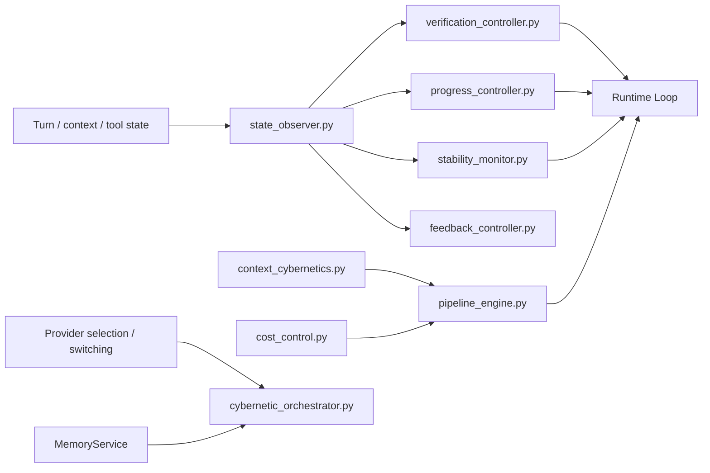

# Runtime Control 包架构设计

`repoterm/runtime/control/` 是 Runtime 的控制器集合。它们围绕进度、验证、稳定性、上下文压力、成本和反馈提供有界的控制信号；最终的模型调用、工具执行和 stop reason 仍由 `repoterm/runtime/loop.py` 统一编排。`cybernetic_orchestrator.py` 还负责接入 Provider 选择/切换和 `MemoryService`，因此整个 Control 包不是 Provider/Memory 无关层。

## 1. 设计目标与非目标

设计目标是把复杂控制策略拆成可观察、可替换的控制器，输入当前回合状态，输出建议或更新，不直接拥有 Agent 主循环。

非目标：

- 不在控制器里拥有独立的 Agent 模型请求循环；Provider 选择/切换和 Memory 接入集中由 `CyberneticOrchestrator` 的 wiring 完成。
- 不把控制信号当成成功验证证据；完成门禁仍由 Turn Kernel 和验证控制器协同。
- 不持久化一套独立于 Session/Memory 的 Runtime 真值。

## 2. 模块架构

## 3. 核心文件与对象

| 组件 | 当前关注点 |
| --- | --- |
| `verification_controller.py` | 结合工具结果/验证状态判断是否具备完成条件 |
| `progress_controller.py` | 估计任务进展并生成阶段性建议 |
| `state_observer.py` | 从回合状态抽取控制器可用的观察量 |
| `feedback_controller.py`、`feedforward_controller.py` | 根据当前/预期状态产生调节信号 |
| `stability_monitor.py`、`self_healing_engine.py` | 发现停滞、异常和可恢复状态 |
| `pipeline_engine.py` | 组合多个控制阶段 |
| `cybernetic_orchestrator.py` | 装配控制器，并按需连接 `ModelSelectionController`、`ModelSwitcher`、`MemoryService` 和 Reflection |
| `context_cybernetics.py`、`cost_control.py` | 处理 Context 压力和成本边界 |
| 其余 `cybernetic_*`、`adaptive_pid_tuner.py`、`predictive_controller.py`、`decoupling_controller.py` | 为实验/运行时控制提供具体策略和诊断 |

这些控制器既有默认 Runtime 路径使用的验证/进度组件，也有由特定场景或测试驱动的控制策略；不能把所有文件都描述成每个 Turn 必然运行。

## 4. 运行流程

Runtime 先收集当前消息、工具结果、Context 统计和阶段状态，再由 `state_observer` 形成观察值。验证、进度、稳定性和成本控制器分别计算建议，Pipeline 或 Loop 按优先级采用这些信号，最后决定继续调用、压缩上下文、widening、恢复或停止。

控制器输出不会直接修改模型消息。需要改变 Prompt/Context 时通过 Context 服务，需要改变执行阶段时回到 Loop，需要记录结果时发布 `RuntimeEvent` 或交给 Observability。

## 5. 关键机制与决策

- 控制器按输入快照计算，避免跨控制器共享隐藏可变全局状态。
- 验证控制器区分观察、变更、验证和确认，不能用“有工具调用”替代成功验证。
- 稳定性和自愈策略有最大尝试/步数边界，避免在错误状态下无限自我修复。
- Context/成本控制用于预算治理；预算信号不能越过 Safety 或 Permission。

## 6. 失败处理与已知边界

- 控制器异常应被 Runtime 记录并采用安全降级；不能静默把失败当成任务成功。
- 部分控制器是实验/回归覆盖的策略，不代表默认入口必然启用。
- 控制器通常不直接写 Session/Memory；但 `cybernetic_orchestrator.py` 会持有并 wiring `MemoryService`，长期经验仍必须经过 Memory 的证据门禁。
- 复杂控制器之间的组合顺序是运行契约的一部分，修改时必须同步场景回归。

## 7. 依赖方向

Control 由 Runtime 调用，可以使用 Contracts、Context、Planning、Observability、Provider Registry/ModelSwitcher 和 Memory；不应依赖 App、UI、Benchmark，也不应反向导入 `runtime.loop`。Provider/Memory 依赖集中在少数编排/实验模块，并非所有控制器都拥有这些依赖。

## 8. 测试与可观测性

- 包结构和反向导入：[`tests/contracts/test_runtime_control_package_contract.py`](../../../tests/contracts/test_runtime_control_package_contract.py)。
- 验证/进度/反馈：[`tests/test_verification_controller.py`](../../../tests/test_verification_controller.py)、[`tests/test_progress_controller.py`](../../../tests/test_progress_controller.py)、[`tests/test_feedback_controller.py`](../../../tests/test_feedback_controller.py)。
- Cybernetic 组合：[`tests/test_advanced_cybernetics.py`](../../../tests/test_advanced_cybernetics.py)、[`tests/test_cybernetics_e2e.py`](../../../tests/test_cybernetics_e2e.py)。

控制决策的事件由 Runtime 发布；成本与决策记录见 [`repoterm/observability/README.zh-CN.md`](../../../repoterm/observability/README.zh-CN.md)。

## 9. 阅读与维护

先读 `state_observer.py`、`verification_controller.py` 和 `pipeline_engine.py`，再按实际调用点阅读其他控制器。新增策略时明确它是默认、可选还是仅测试/评测使用，并为预算、异常和重复调用写确定性测试。
