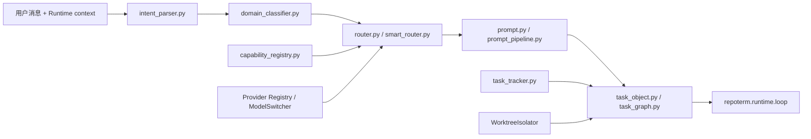

# Runtime Planning 包架构设计

`repoterm/runtime/planning/` 负责把用户输入和运行上下文转换为可供 Runtime 使用的意图、Prompt、路由和任务结构。它不拥有模型请求循环，也不直接调用 ToolRegistry 执行模型工具；但路由实现会读取 Provider Registry/ModelSwitcher，任务图还包含执行 git worktree 隔离的辅助对象。

## 1. 设计目标与非目标

设计目标是把“用户想做什么、当前有哪些能力、任务如何分段、当前回合应关注什么”表达成稳定对象，同时保留 Runtime 对最终执行和验证的控制权。

非目标：

- 不在 Planning 中实现 `run_agent_turn` 或模型请求重试；Provider 选择和切换由 `router.py`/`smart_router.py` 通过 Provider 模块完成。
- 不把 `task_graph.WorktreeIsolator` 误解为普通规划数据：它会通过 `git worktree` 子进程创建和清理风险操作的隔离目录。
- 不把规划文本当成已验证事实；任务目标和完成证据仍由 Runtime/Turn Kernel 管理。
- 不从 UI/TUI 读取界面状态来决定业务路由。

## 2. 模块架构

## 3. 核心文件与对象

| 文件 | 当前职责 |
| --- | --- |
| `intent_parser.py` | 从输入中识别命令/意图和参数 |
| `domain_classifier.py` | 对任务领域和风险特征做分类 |
| `router.py`、`smart_router.py` | 根据意图、能力和运行配置选择处理路径，并使用 Provider Registry/ModelSwitcher 做模型路由 |
| `prompt.py`、`prompt_pipeline.py` | 组合系统、阶段、任务和上下文提示 |
| `capability_registry.py` | 描述可用能力及其元数据 |
| `task_object.py`、`task_graph.py` | 表达任务、依赖和阶段结构；`WorktreeIsolator` 为风险任务创建/清理 git worktree |
| `task_tracker.py` | 跟踪任务进展和已观察的状态 |
| `intelligence.py` | 提供规划所需的启发式/结构化辅助 |

## 4. 运行流程

输入先经过解析和领域分类，再由 Router 选择 prompt/task 组织方式，并在需要时根据 Provider Registry/ModelSwitcher 选择模型。Prompt Pipeline 把当前任务和运行上下文交给 Runtime；后续模型输出、工具结果和验证状态仍回到 `runtime/loop.py` 与 `turn_kernel.py`，Planning 不绕过这条回路。风险任务可由 `WorktreeIsolator` 在执行前建立临时 git worktree。

任务图和 tracker 可以表达多步工作，但它们不会自动执行节点。执行顺序、每步最大数量和停止条件由 Runtime 控制器与 Loop 决定。

## 5. 关键机制与决策

- 路由使用结构化意图和能力元数据，避免 UI 命令字符串直接散落在多个执行模块。
- Prompt 组合区分系统约束、任务目标、阶段提示和可验证上下文；它不是 Memory 或 Session 的替代品。
- 任务对象保存目标/依赖/进展等规划信息，验证证据以 `TurnVerificationState` 为准。
- 当能力不可用或输入不完整时，规划层返回可解释的未决/降级信息，由上层决定继续询问还是结束。

## 6. 失败处理与已知边界

- 意图解析失败不能自动执行危险工具；应交回 Runtime 或 UI 进行澄清。
- 能力目录和 Provider 路由描述的是候选能力，不保证 Provider、MCP 或工具在当前环境一定可用；模型切换失败仍需回到 Runtime 的错误处理。
- Worktree 创建使用外部 git 命令，失败/清理异常必须由调用方核查，不能把目录创建成功误认为任务执行成功。
- 任务图不是持久化 Session schema；需要恢复时使用 [`repoterm/session/README.zh-CN.md`](../../session/README.zh-CN.md)。
- Prompt 文本的正确性不能替代工具验证；规划层不会把回答中的断言提升为完成状态。

## 7. 依赖方向

Planning 可以依赖 Contracts、配置、Observability、Provider Registry/ModelSwitcher 和标准库；由 Runtime 调用它。Planning 不应导入 UI、App、Session 存储、`runtime.loop` 或 ToolRegistry 执行器，以保持计划与执行解耦；`WorktreeIsolator` 是规划包内明确的 git 隔离辅助边界。

## 8. 测试与可观测性

- 目录与反向导入：[`tests/contracts/test_runtime_planning_package_contract.py`](../../../tests/contracts/test_runtime_planning_package_contract.py)。
- 意图、Prompt 与路由：[`tests/test_prompt.py`](../../../tests/test_prompt.py)、[`tests/test_agent_intelligence.py`](../../../tests/test_agent_intelligence.py)。
- 任务和 Runtime 行为：[`tests/test_agent_flow.py`](../../../tests/test_agent_flow.py)、[`tests/test_agentops_scenarios.py`](../../../tests/test_agentops_scenarios.py)。

Planning 自身不写日志/指标；发生路由或阶段变化时由 Runtime 以 `RuntimeEvent` 记录，决策审计由 Observability 负责。

## 9. 阅读与维护

先读 `task_object.py`、`intent_parser.py` 和 `router.py`，再读 Prompt Pipeline 与 tracker，最后沿调用点回到 Runtime。增加新的路由能力时应同步能力元数据和契约/场景测试，不要在 Planning 中复制工具执行或权限判断。
