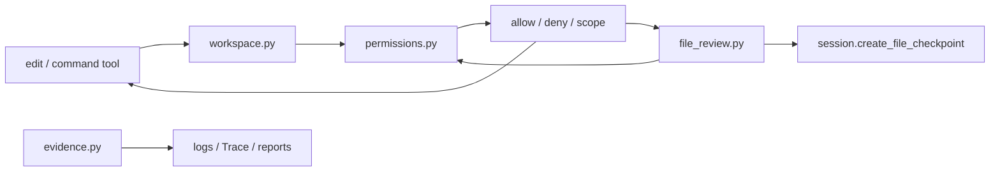

# Safety 包架构设计

`repoterm/safety/` 管理工具写入、命令执行和证据输出的安全边界。它把路径解析、权限决策、Diff 审查、checkpoint 和敏感信息清理拆开，供 Tools、Runtime 和 App 调用；它不负责模型意图，也不替代操作系统权限。

## 1. 设计目标与非目标

设计目标是让受管文件变更可审查、可拒绝、可恢复，让工具输出中的凭据和敏感内容在进入日志/证据前得到清理。

非目标：

- 不把应用内 PermissionManager 当成容器或操作系统沙箱。
- 不把 redaction 当成访问控制；隐藏输出不会允许未授权写入。
- 不由 Safety 决定 Agent 是否完成任务；验证门禁在 Runtime/Turn Kernel。

## 2. 模块架构

## 3. 核心文件与对象

| 文件 | 当前职责 |
| --- | --- |
| `permissions.py` | `PermissionManager`、命令/路径/编辑判定、持久化的授权范围和交互决策 |
| `workspace.py` | 将工具路径解析到允许的 workspace 边界 |
| `file_review.py` | 生成 unified diff，取得编辑权限，创建 checkpoint 后写入文件 |
| `evidence.py` | 规范化证据路径、敏感文本/载荷清理和泄漏检测 |
| `__init__.py` | 轻量公共包入口 |

## 4. 受管编辑流程

文件变更通常走：解析/校验路径 → 计算 Diff → `PermissionManager.ensure_edit` → 调用 Session 的 `create_file_checkpoint` → 写入文件。任何一个步骤失败都应阻止后续写入。checkpoint 保存受管文件的既有内容和存在性，供 Session 的 restore/rewind 使用。

命令工具则先用 workspace/command 规则判断，再按 allow_once、always、turn、all_turn 或 deny 等决策范围执行。权限结果回到 ToolResult/Runtime，不直接修改模型消息。

## 5. 关键机制与决策

- 路径检查与敏感信息清理是两条独立链路，先后不能互相替代。
- Permission store 以原子方式保存授权信息，并区分一次性、当前 Turn 和持久范围。
- `file_review` 在写入前保留 Diff 和 checkpoint，允许用户在实际变更前确认。
- Evidence 只输出有界、脱敏的摘要；完整 stdout/stderr、密钥和源码不应进入长期记忆。

## 6. 失败处理与已知边界

- workspace 外路径、危险命令、拒绝的编辑和权限存储失败都必须安全失败。
- 权限通过不代表写入成功；文件系统错误仍要形成工具错误并保留可解释结果。
- checkpoint/rewind 只覆盖受管文件和 Session 状态，不能撤销任意外部 shell 副作用。
- redaction 依赖当前规则和输入形态；新增凭据模式时应补 evidence 测试，而不是在调用方自行替换。

## 7. 依赖方向

Safety 可依赖 Contracts、配置、Session 的 checkpoint 接口和 Observability 的脱敏日志辅助；Tools、Runtime、App 调用 Safety。Safety 不依赖 UI、Provider、Benchmark，也不反向导入 Runtime Loop。

## 8. 测试与可观测性

- 证据清理：[`tests/test_evidence_safety.py`](../../tests/test_evidence_safety.py)。
- 权限、路径、命令和编辑：[`tests/test_permissions.py`](../../tests/test_permissions.py)、[`tests/test_agentops_scenarios.py`](../../tests/test_agentops_scenarios.py)。
- 工具安全边界：[`tests/test_tools.py`](../../tests/test_tools.py)、[`tests/contracts/test_runtime_contract.py`](../../tests/contracts/test_runtime_contract.py)。

权限决定应进入 Runtime/Decision Audit 的结构化记录；不要以日志文本代替 `PermissionDecision`，也不要把经过清理的证据当作原始审计凭据。

## 9. 阅读与维护

先读 `workspace.py` 和 `permissions.py`，再读 `file_review.py` 的 Diff→permission→checkpoint→write 顺序，最后读 `evidence.py`。任何新工具若能写文件或执行命令，都必须通过 ToolContext 提供的权限/Session 接口，不得另建旁路。
