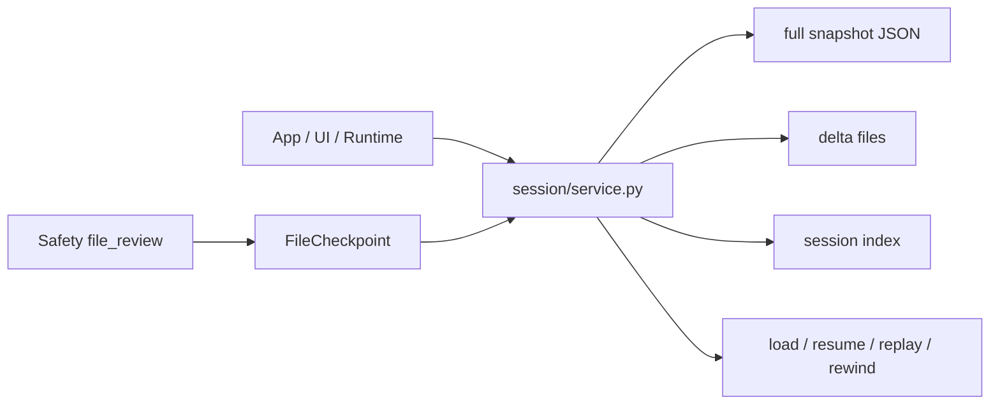

# Session 包架构设计

`repoterm/session/` 负责会话快照、增量保存、恢复和受管文件 checkpoint。它保存“可继续工作的会话状态”，不负责 Agent 决策、TUI 状态或 Memory 的长期知识检索。

## 1. 设计目标与非目标

目标是让一次会话在进程退出、短暂中断或后续启动时可被列出、加载、继续、检查、回放和在受管文件范围内回退。

非目标：

- 不把 Session JSON/Delta 当作 Memory SQLite 真值源。
- 不恢复任意外部命令副作用，也不提供跨机器分布式一致性。
- 不让 UI 直接修改快照结构；UI 通过 service API 更新。

## 2. 模块架构

## 3. 核心文件与对象

| 文件/对象 | 当前职责 |
| --- | --- |
| `service.py` | Session CRUD、全量/增量保存、加载、恢复、检查、回放和 checkpoint 操作 |
| `SessionData` | 消息、transcript、权限摘要、扩展状态、checkpoint 等完整会话状态 |
| `SessionMetadata` | 列表和 UI 使用的轻量摘要、消息/更新时间、workspace 和恢复统计 |
| `FileCheckpoint` | 写入前的文件存在性、旧内容、分组和时间信息 |
| `AutosaveManager` | 按时间/脏状态触发保存，并协调 delta/full save |
| `__init__.py` | 对稳定 Session API 做显式 re-export |

## 4. 保存与恢复流程

创建/加载 Session 后，Runtime 和 UI 更新 `SessionData`。Autosave 根据间隔和脏字段写入 full snapshot 或 delta；delta 达到数量/周期边界时进行 consolidation。加载先恢复 full snapshot，再按顺序应用可用 delta，最后刷新 metadata。

受管文件变更前，Safety 的 `file_review` 请求 `create_file_checkpoint`。`rewind-preview` 计算可回退内容，`rewind` 在权限允许的范围内恢复文件与会话记录；`resume` 重新打开相同 Session 并保持幂等。

## 5. 关键机制与决策

- 全量快照提供恢复基线，Delta 减少频繁保存的序列化开销；达到边界后合并，避免无限增长。
- Metadata 从当前消息、Transcript、checkpoint 和扩展摘要刷新，不作为独立真值。
- Session service 处理损坏/缺失 delta 的有界降级，并保留能加载的基线状态。
- checkpoint 记录文件旧内容和是否存在，使新文件创建、旧文件编辑两类回退都可区分。

## 6. 失败处理与已知边界

- 文件写入、目录权限、JSON 损坏和 Delta 不完整可能导致保存失败；调用方必须展示失败而不能把未保存状态当作已落盘。
- 恢复只覆盖受管文件和 Session 数据，不能撤销网络请求、外部命令或其他进程的副作用。
- Session 文件是本地持久化，不是加密密钥库；敏感信息进入 Session 前仍须遵守 Safety/Memory 的清理边界。
- 旧快照格式兼容由当前 service 的读取逻辑决定，修改字段需同步直接测试。

## 7. 依赖方向

Session 依赖配置、标准库、Contracts 和 Observability 日志；Safety、App、Runtime、UI 调用它。Session 不依赖 TUI 渲染、Provider 适配器或 Benchmark，不把 Memory 数据库内嵌到快照。

## 8. 测试与可观测性

- 生命周期与 delta：[`tests/test_session.py`](../../tests/test_session.py)。
- 包结构与公共出口：[`tests/contracts/test_session_package_contract.py`](../../tests/contracts/test_session_package_contract.py)。
- 运行时恢复场景：[`tests/test_agentops_scenarios.py`](../../tests/test_agentops_scenarios.py)。

Session 事件可以被 Runtime transcript、日志和 UI 摘要消费；完整快照不应被当作日志输出，也不应在渲染层自行复制保存逻辑。

## 9. 阅读与维护

先读 `SessionData`/`FileCheckpoint`，再读 `save/load` 和 delta consolidation，最后读 resume/rewind。新增持久字段时同时考虑旧快照加载、metadata 更新、失败恢复和清理路径；不要直接改保存文件而跳过 service。
