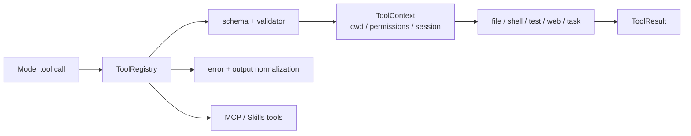

# Tools 包架构设计

`repoterm/tools/` 是工具定义和执行边界。它把文件、搜索、编辑、命令、测试、Git、Web、任务和辅助数据能力包装成 `ToolDefinition`，由 `ToolRegistry` 统一发现、校验、执行、截断和释放资源。

## 1. 设计目标与非目标

目标是让模型只能通过声明过的工具契约请求能力，让每个调用都有 schema/validator、权限上下文和结构化 `ToolResult`，并把失败交回 Runtime。

非目标：不在工具模块实现 Agent Loop、Prompt 路由或模型重试；工具也不能私自写 Session/Memory 或绕过 PermissionManager。

## 2. 模块架构

## 3. 核心文件与对象

| 文件/分类 | 当前职责 |
| --- | --- |
| `registry.py` | `ToolCapability`、`ToolMetadata`、`ToolDefinition`、`ToolContext`、`ToolResult`、注册/执行/释放 |
| 文件读取/检索 | `read_file.py`、`list_files.py`、`grep_files.py`、`file_tree.py` |
| 编辑与批量 | `write_file.py`、`edit_file.py`、`patch_file.py`、`delete_file.py`、`batch_ops.py`、`diff_viewer.py` |
| 命令/测试/Git | `run_command.py`、`test_runner.py`、`git.py`、`code_review.py` |
| Web/数据辅助 | `web_fetch.py`、`web_search.py`、`http_utils.py`、JSON/CSV/编码/压缩/加密/文本工具 |
| 任务与交互 | `ask_user.py`、`todo_write.py`、`task.py`、`background.py`、`load_skill.py` |
| 组合入口 | `__init__.py` 的 core/full profile 与 MCP/Skills 发现 |

## 4. 工具调用流程

`create_default_tool_registry` 按 `core` 或可选 `full` profile 加载工具，再加入 Skills/MCP 工具。Runtime 收到模型工具调用后，Registry 查找定义、验证参数、创建/使用 `ToolContext` 并执行 runner。成功输出和异常都归一化为 `ToolResult`，过长输出使用 head/error/tail 策略，结果回到下一次模型上下文。

后台任务由 `background.py` 管理有限 slot 和状态；释放时 Registry 调用 disposer，MCP 客户端不应遗留在会话结束后。

## 5. 关键机制与决策

- JSON Schema 和 Python validator 分别约束模型参数形状与运行时规则。
- 未知工具、参数错误、超时、非零退出和普通异常进入结构化错误；`KeyboardInterrupt`/`SystemExit` 等控制异常不应被普通错误吞掉。
- 写文件/执行命令的工具从 `ToolContext` 获取 workspace、Permission 和 Session，不创建旁路权限。
- 默认 `delete_file` 仅处理工作区内单个 UTF-8 普通文件，必须获得独立的单次删除确认并持久化可回退 Checkpoint；不复用编辑授权。旧 `batch_delete` 不在默认工具集。
- 默认 core profile 保持较小工具面；full/utility profile 是可选路径，不应把全部辅助工具默认注入每个模型上下文。

## 6. 失败处理与已知边界

- 工具返回 `ok=False` 不等于 Agent 失败终止；Runtime 根据错误、重试预算和验证状态决定下一步。
- 工具不能证明自己完成了任意外部任务；测试/构建结果必须作为可解释证据回到 Turn Kernel。
- `task.py` 仍是工具到 Runtime 的既有跨层委托点，结构审计将它作为边界记录。
- Web/MCP/命令执行受网络、外部服务和本机权限影响，测试不能把偶然成功当作永久能力。

## 7. 依赖方向

Tools 可以依赖 Contracts、Safety、Session、Observability、Integrations 和少量 Runtime 委托；App/Runtime/UI 调用 Tools。工具实现不应依赖 TUI 或具体 Provider，不应把 Benchmark 代码导入生产。

## 8. 测试与可观测性

- Registry/工具行为：[`tests/test_tools.py`](../../tests/test_tools.py)。
- 后台、命令、编码和安全：[`tests/test_background_tasks.py`](../../tests/test_background_tasks.py)、[`tests/test_run_command_encoding.py`](../../tests/test_run_command_encoding.py)、[`tests/test_permissions.py`](../../tests/test_permissions.py)。
- 包结构和导入：[`tests/contracts/test_tool_package_imports.py`](../../tests/contracts/test_tool_package_imports.py)。
- 外部能力：[`tests/test_mcp.py`](../../tests/test_mcp.py)、[`tests/test_skills.py`](../../tests/test_skills.py)。

工具执行可写 Metrics/日志和 Runtime Event；原始输出是否进入上下文由 Context 管理，是否形成长期 Memory 由证据门禁决定。

## 9. 阅读与维护

先读 `registry.py`，再按工具类别读一个读取工具、一个编辑工具和 `run_command.py`，最后读 `__init__.py` 的装配。新增工具必须定义 schema、validator、权限边界、输出上限、异常路径和测试；不要只添加一个 runner 就把它暴露给模型。
