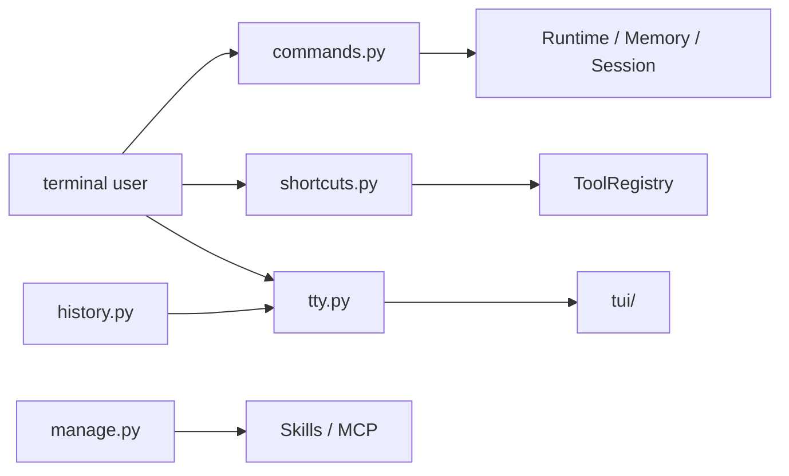

# UI 包架构设计

`repoterm/ui/` 是用户交互适配层，包含 slash command、历史、快捷命令、MCP/Skill 管理和 TTY 生命周期。它负责展示/采集用户输入并把事件交给 Runtime/Tools，不拥有 Agent 的业务决策真值。

## 1. 设计目标与非目标

目标是让交互式终端和无界面入口共享命令语义，同时保证 TTY 终端模式能恢复、输入事件不误分类、Session/Approval 流程可追踪。

非目标：不在 UI 中重新实现 Runtime Loop、Permission 规则、Memory 查询或 Provider 选择；TUI 的 `ScreenState` 也不等于 Runtime/Session 状态。

## 2. 模块架构

详细的输入、渲染和 owner-thread 规则见 [`tui/README.zh-CN.md`](tui/README.zh-CN.md)。

## 3. 核心文件与对象

| 文件 | 当前职责 |
| --- | --- |
| `commands.py` | slash command 的定义/补全，以及 `/memory`、`/user`、`/state` 等适配到服务 API |
| `history.py` | 历史 JSON 文件、TTL 缓存和有界条目管理 |
| `shortcuts.py` | `/read`、`/write`、`/modify`、`/cmd` 等输入转换为 ToolDefinition 参数 |
| `manage.py` | Skills/MCP 列表、添加、删除和配置检查命令 |
| `tty.py` | Session/State 创建或恢复、TTY 主循环、Worker、审批、autosave 和清理 |
| `tui/` | 解析输入、事件归约、Transcript、布局、渲染和终端模式；见上方链接 |

`commands.py` 的 `/user` 写入当前 Memory Service 的 global/preference，旧 `USER.md` 仅用于只读迁移/兼容来源；UI 不直接维护第二套偏好真值。

## 4. 交互流程

TTY 入口准备 Session 与 `ScreenState`，进入终端模式后由主线程解析输入、归约 UI 事件、更新可渲染状态并写帧。Worker 发布事件或等待审批，主线程消费并显示结果。slash command 在 UI 层解析后调用 Runtime/Memory/Session/Integration 服务，普通文本则进入 Agent Loop。

历史读取和保存由 `history.py` 管理；Session autosave 和权限审批分别走 Session/Safety 服务，不在 UI 中复制持久化格式或权限判定。

## 5. 关键机制与决策

- UI 把普通文本、快捷键、审批输入和滚动事件分开；解析器不自动提交 bracketed paste。
- `tty.py` 的 finally 清理覆盖 worker、alternate screen、mouse、paste、focus 和 sync output，且清理可重复执行。
- TUI 主线程拥有可见状态，worker 只发布事件；避免多个线程共同写 Transcript/Frame。
- Slash command 只做语法/路由适配，业务生命周期由 Memory/Session/Runtime 服务决定。

## 6. 失败处理与已知边界

- 输入解析异常、渲染异常、Ctrl+C 和正常退出都要恢复终端；用户粘贴内容不能写入调试日志。
- 终端尺寸不足时 UI 可以缩短可见 Diff/摘要，但不能改变 Permission 选项和完整请求数据。
- UI 显示的 Runtime/Session 摘要可能是快照，不是对底层状态的独立修改入口。
- 真实 Windows CMD/VS Code 终端的编码和 ANSI 行为仍需人工验收，自动化测试主要覆盖协议和状态边界。

## 7. 依赖方向

UI 可以依赖 App 组装的 Runtime、Contracts、Tools、Safety、Session、Memory、Integrations 和 Observability；底层 Runtime/Provider/Context/Contracts 不依赖 UI。TUI 不应调用 Provider 适配器或直接写持久化文件。

## 8. 测试与可观测性

- UI 包契约：[`tests/contracts/test_ui_package_contract.py`](../../tests/contracts/test_ui_package_contract.py)。
- 命令/TTY：[`tests/test_cli_commands.py`](../../tests/test_cli_commands.py)、[`tests/test_tty_app.py`](../../tests/test_tty_app.py)。
- TUI 输入/布局/终端：[`tests/test_tui.py`](../../tests/test_tui.py)、[`tests/test_tui_paste.py`](../../tests/test_tui_paste.py)、[`tests/test_tui_terminal_modes.py`](../../tests/test_tui_terminal_modes.py)。

UI 事件、Runtime Event、Session transcript、日志和 Trace 有不同语义；维护时不要用渲染输出代替结构化事件，也不要让 UI 日志包含用户原文/凭据。

## 9. 阅读与维护

先读 `tty.py` 的生命周期，再读 `commands.py`/`shortcuts.py` 的路由，最后进入 TUI 的解析、事件、布局和渲染。新增交互功能先确定它是 slash command、普通文本还是 KeyEvent，再接入对应服务并补异常/清理测试。
