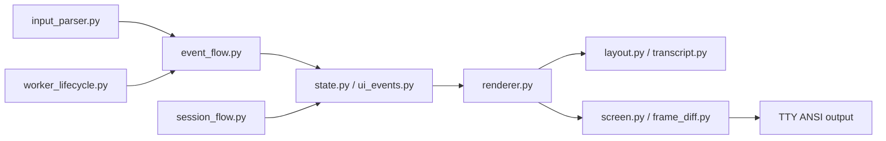

# TUI 包架构设计

`repoterm/ui/tui/` 是终端呈现和输入状态机。它维护 Transcript 的可见窗口、Frame 布局、ANSI 终端模式和 UI 事件队列；它不是 Agent 业务决策器，也不拥有 Runtime、Permission 或 Session 的真值。

## 1. 设计目标与非目标

目标是为 Windows Terminal、VS Code 集成终端等环境提供可恢复的输入、稳定的帧渲染、审批显示、历史/滚动和有限的增量更新。

非目标：不改变 Agent Prompt、Tool、Memory、Session 或 Permission 语义，不用 UI 的显示结果推断任务完成，也不让 worker 线程直接修改可见状态。

## 2. 模块架构

## 3. 核心文件与对象

| 文件/组 | 当前职责 |
| --- | --- |
| `input_parser.py`、`input.py`、`input_handler.py` | TextEvent/KeyEvent/WheelEvent、bracketed paste、CSI/SS3/鼠标和输入缓冲 |
| `event_flow.py`、`ui_events.py` | 主线程归约 UI 事件、审批 ticket、worker 事件队列和有界合并 |
| `state.py`、`types.py` | `ScreenState`、审批/进度对象、TranscriptEntry 和对象池 |
| `transcript.py`、`navigation.py` | ANSI/CJK 行布局、虚拟窗口、滚动和缓存 |
| `renderer.py`、`chrome.py`、`theme.py`、`markdown.py` | Header/Feed/Composer/Footer、审批面板、Markdown 和视觉样式 |
| `screen.py`、`frame_diff.py` | 终端模式、帧写入、宽度安全的 full/incremental 更新 |
| `runtime_control.py`、`session_flow.py`、`tool_lifecycle.py`、`worker_lifecycle.py` | TTY 运行时、Session/工具/worker 生命周期 |

## 4. 事件与渲染流程

输入字节按 chunk 进入 parser；普通可编辑文本形成 `TextEvent`，Ctrl/Alt/方向键/功能键形成 `KeyEvent`，滚轮形成 `WheelEvent`。parser 负责跨 chunk 保存 remainder，bracketed paste 作为一个不自动提交的原子文本事件。

主线程从输入和 worker 队列取事件，经 `event_flow.py` 更新 `ScreenState`、Transcript、审批或滚动位置。Renderer 根据终端尺寸计算 LayoutMetrics 和可见窗口，生成完整逻辑 Frame；Screen 选择安全的 full 或 incremental payload，并一次写入/flush。

## 5. 关键机制与决策

- owner-thread 约束：worker 发布事件，主线程统一修改 UI 状态和调用渲染。
- 帧更新按可见行和终端列宽判断；ANSI 样式未闭合、VS15/VS16 组合无法可靠计算或可能残留旧尾部时回退 full。
- 同步输出只包住一次完整帧写入；退出时关闭 mouse、bracketed paste、focus、sync output 和 alternate screen，清理幂等。
- Feed body 按 LayoutMetrics 补齐，审批在显式预算内保留请求摘要和全部选项，剩余空间才分给 Diff。

## 6. 失败处理与已知边界

- parser/worker/renderer 异常由 TTY 外层 finally 清理，不能留下 alternate screen 或鼠标模式。
- 终端自动换行、宽字符和组合 emoji 会使局部刷新不可靠；frame diff 采用保守 full 回退。
- 终端无法展示完整 Diff 时只缩小可见窗口并保留滚动状态，不能删改 Permission 请求数据。
- ScreenState 的展示快照与 Runtime/Session 的持久状态不同步时，应通过结构化事件刷新，而不是从屏幕文本反解析。

## 7. 依赖方向

TUI 可以依赖 Contracts、UI 外层、Runtime Event、Session、Safety/Approval 和 Tools 的结果类型；不应依赖 Provider、Memory 数据库实现或 Benchmark。渲染器不执行 Agent 工具，Screen 不决定权限。

## 8. 测试与可观测性

- 输入/事件：[`tests/test_tui_paste.py`](../../../tests/test_tui_paste.py)、[`tests/test_tui_keymap.py`](../../../tests/test_tui_keymap.py)。
- 布局/渲染/Frame：[`tests/test_tui_layout.py`](../../../tests/test_tui_layout.py)、[`tests/test_tui_frame_diff.py`](../../../tests/test_tui_frame_diff.py)、[`tests/test_tui_visual_contract.py`](../../../tests/test_tui_visual_contract.py)。
- 生命周期/终端/并发：[`tests/test_tui_terminal_modes.py`](../../../tests/test_tui_terminal_modes.py)、[`tests/test_tui_u32.py`](../../../tests/test_tui_u32.py)、[`tests/test_tui_u33.py`](../../../tests/test_tui_u33.py)。
- 外层 TTY：[`tests/test_tty_app.py`](../../../tests/test_tty_app.py)。

TUI 可把事件和摘要交给 Runtime transcript/Trace，但不应记录用户粘贴原文；Frame payload 是终端协议数据，不是审计事件。

## 9. 阅读与维护

先读 `types.py`/`state.py`，再读 `input_parser.py`→`event_flow.py`，然后读 `transcript.py`/`layout.py`→`renderer.py`→`screen.py`。修改时先写边界测试（跨 chunk、中文/emoji、异常清理、小终端），再调整实现；不要用整屏截图断言掩盖状态机错误。
